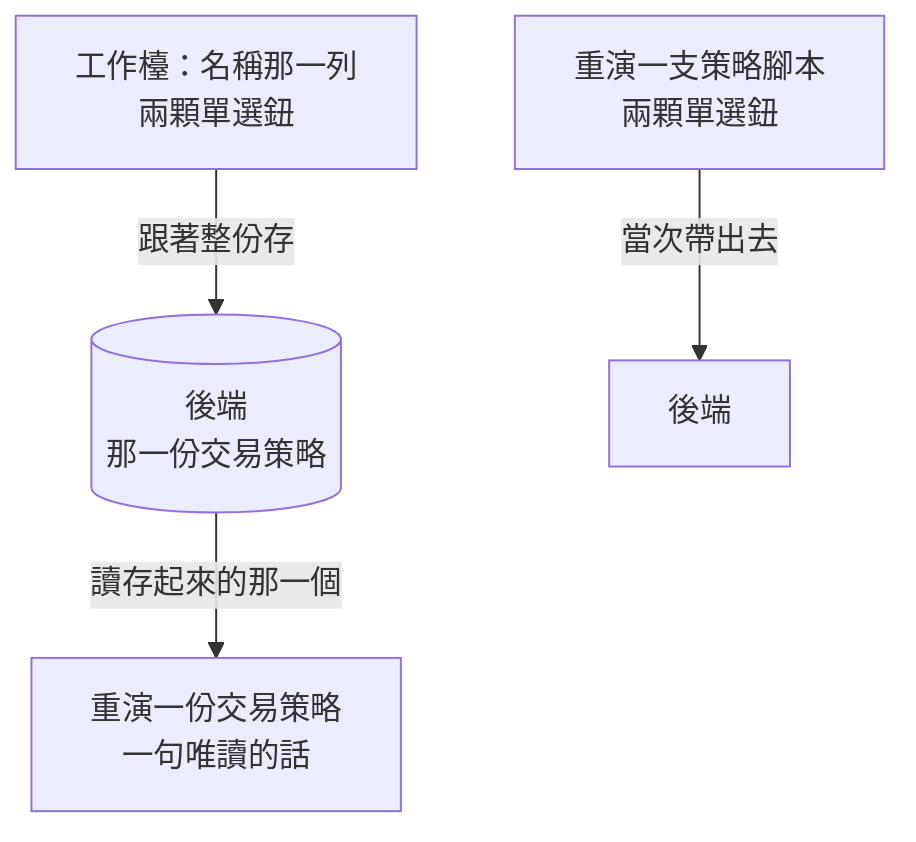

# Product Requirements Document (PRD)

**Status:** Finalized
**Version:** v1.0
**Owner:** James Hsueh
**Stakeholders:** Engineering

---

## 1. Background & Goal (Why & Goal)

### Problem Statement

後端把**交易模式**（`spot` 現貨 / `longShort` 多空反手）從「一次回測的旋鈕」
搬成**一份交易策略記著的欄位**。畫面兩處都跟不上：

**工作檯上沒有那個選項。** 使用者拼出一份交易策略，說不出它是現貨型的，
那一份就落在預設值（多空反手）。他的台股現貨帳戶不能放空，
於是之後每一次重演都照他做不到的操作算。

**重演那一塊還畫著那兩顆按鈕。** 後端那個欄位已經不存在，按了會被安靜地忽略。
使用者會挑「現貨」、按執行、拿到一張多空反手的成績單——**而按鈕還亮著現貨**。
一顆按了沒反應卻看起來有反應的按鈕，比一顆不存在的按鈕糟得多。

### Expected Outcome

- 工作檯的**名稱那一列**多一組交易模式（兩顆並排的單選鈕，各帶一句說明）。
  打開既有的顯示它存著的那一個；新的一份顯示預設值。它跟著整份一起存。
- 重演一份交易策略那一塊的**單選鈕換成一句唯讀的話**，講出**存起來的那一個**模式；
  送出的請求不再帶交易模式。
- 重演一支策略腳本那一塊**一個字都沒變**。
- 兩種模式那一句說明**維持單一來源**，工作檯與回測那一列讀的是同一份。

### Out of Scope

- **在畫面上驗證交易模式**——從兩顆按鈕挑的，挑不出非法值。
- **在畫面上補預設值給後端**——「沒填即多空反手」是後端的規則。
- **交易策略清單那一頁**——它讀同一個 DTO，這一刀不必改它。
- **機器人那一頁**——引用哪一份沒變，訊息措辭是後端的事。
- **兩種模式那一句說明的文字**——原封不動，它已經是單一來源。

---

## 2. User Personas

**Primary Role:** 專案作者本人。他有**兩種帳戶**：能放空的加密貨幣帳戶，
與不能放空的台股現貨帳戶。同一台機器上兩種規則都在跑，
所以「這一份是寫給哪一種的」是他每次拼規則都要回答的問題。

**Usage Context:** 桌面瀏覽器。**拼規則做上半小時，挑模式花兩秒**——
所以它該在名稱旁邊佔一列，而不是在墊子上佔位置。
讀成績單則是「坐下來反覆調」的動作，同一份會被重演很多次，
**每一次都要看得出它是照哪一套算的**。

---

## 3. User Stories & Acceptance Criteria

### US-01 — 工作檯上挑得到交易模式 [priority: P0]

**As a** 使用者，**I want** 拼規則時說得出它是寫給哪一種帳戶的，
**so that** 之後每一次重演都照我真的做得到的操作算。

```gherkin
Scenario: 新的一份預設多空反手
  Given 我要拼一份新的交易策略
  When 工作檯打開
  Then 名稱那一列旁邊有兩顆交易模式單選鈕
  And 選著的是多空反手

Scenario: 打開一份存著現貨的
  Given 一份存著現貨的交易策略
  When 我打開它
  Then 選著的是現貨

Scenario: 挑了現貨再存
  Given 我在拼一份新的交易策略
  When 我挑現貨並按存檔
  Then 送出去的那一份帶著 spot

Scenario: 改掉一份既有的模式
  Given 一份存著現貨的交易策略
  When 我改成多空反手並按存檔
  Then 送出去的那一份帶著 longShort

Scenario: 兩顆按鈕各自說得出它做什麼
  Given 工作檯打開
  When 我讀那兩顆按鈕
  Then 每一顆都帶著一句話說它拿賣出信號做什麼
  And 那兩句與重演那一列讀到的逐字相同

Scenario: 只改交易模式也算改過
  Given 一份存著的交易策略,我什麼都沒動
  When 我只把交易模式改掉
  Then 離開這一頁前會被問「還沒存，確定要離開嗎」
```

### US-02 — 重演一份交易策略時交易模式是一句話 [priority: P0]

**As a** 使用者，**I want** 那一格直接告訴我這一份是照哪一套算的，
**so that** 我不會挑了現貨、拿到多空反手的成績單、而按鈕還亮著現貨。

```gherkin
Scenario: 那一格是一句話而不是按鈕
  Given 一份存著現貨的交易策略
  When 我看重演那一塊的交易模式
  Then 那一格是一句唯讀的話,講出現貨與它那一句說明
  And 那裡沒有任何可以按的單選鈕

Scenario: 多空反手那一份講的是多空反手
  Given 一份存著多空反手的交易策略
  When 我看那一格
  Then 那一句話講的是多空反手

Scenario: 送出的請求不帶交易模式
  Given 一份交易策略
  When 我按執行回測
  Then 送出去的請求裡沒有交易模式

Scenario: 還沒存的改動不會改掉那一句話
  Given 一份存著多空反手的交易策略
  When 我在表單上把它改成現貨,但不按存檔
  Then 重演那一塊仍然講多空反手——重演跑的是伺服器上那一份

Scenario: 存好之後那一句話跟著走
  Given 一份存著多空反手的交易策略
  When 我改成現貨並按存檔
  Then 重演那一塊改講現貨

Scenario: 還沒存過的那一份講預設值
  Given 一份還沒存過的交易策略
  When 我看重演那一塊的交易模式
  Then 那一句話講的是多空反手,與後端對一份沒填的交易策略的讀法一致
```

### US-03 — 重演一支策略腳本那一塊一個字都沒變 [priority: P0]

**As a** 正在試一段剛寫好的算式的使用者，**I want** 那一塊照舊，
**so that** 沒有交易策略可問的時候,我仍然挑得出這一次要照哪一套算。

```gherkin
Scenario: 那一塊仍然是兩顆單選鈕
  Given 重演一支策略腳本那一塊
  When 我看交易模式那一格
  Then 那裡仍然是兩顆單選鈕,選著多空反手

Scenario: 挑了現貨就照現貨送
  Given 重演一支策略腳本那一塊
  When 我挑現貨並按執行
  Then 送出去的請求帶著 spot
```

---

## 4. Business Flow & Logic

### 同一個欄位，兩塊畫面上的兩種角色



**挑得動的地方只有一處。** 它屬於那一份規則，所以在拼規則的地方挑；
重演那一份的時候它已經有答案了，所以在那裡是一句話。
重演一支腳本沒有規則可問，所以那一塊還是挑得動的。

### Core Business Rules

1. **交易模式是工作檯的欄位**，與名稱同一列：兩者都是「這份規則**是**什麼」。
2. **打開既有的顯示它存著的那一個；新的一份顯示預設值。**
3. **跟著整份一起存**，不另外驗證取值（從兩顆按鈕挑的）。
4. **只改交易模式也算改過**——離開前要問。
5. **重演一份交易策略那一格是唯讀的一句話**，內容來自**存起來的那一份**，
   不是表單上正在改的那一份。
6. **重演一份交易策略的請求不帶交易模式。**
7. **重演一支策略腳本那一塊完全不變。**
8. **兩種模式那一句說明維持單一來源**，兩處讀同一份。

### 沿用的既有規則（不生第二套說法）

| 規則 | 與誰相同 |
| :--- | :--- |
| 「這一格不是你決定的」就換成一句唯讀的話 | 重演一份交易策略的**彙總刻度** |
| 兩顆並排的單選鈕、各帶一句說明 | 回測既有的交易模式那一列 |
| 從選單／按鈕挑的值不在畫面上驗證 | 彙總刻度、押注模式 |
| 改過就要問、基準跟著存成功往前走 | 工作檯既有的離開提示 |

### Edge Cases

| 情況 | 行為 |
| :--- | :--- |
| 還沒存過的那一份 | 重演那一塊的那一句話講**預設值**；那一塊本來就另有一則「先存起來」的提示 |
| 表單改了模式但沒存 | 重演那一塊仍然講**存著的那一個** |
| 存成功 | 那一句話跟著換——與成績單被清掉是同一個時機 |
| 後端回來的那一份沒有交易模式（舊版後端） | 讀作**預設值**，與後端自己對一份沒填的讀法一致 |

---

## 5. UI/UX Design & Interaction

### 工作檯

名稱那一列變成**名稱 ＋ 交易模式**。兩顆並排的單選鈕，各自帶著那一句說明——
沿用回測那一列的畫法，**不新增第三種畫交易模式的方式**。

為什麼不是下拉選單：多數人根本不知道現在這一種在幫他放空，
而一個要點開才看得到的選單，救不了一個不知道要去點的人。
（這句話是回測那一列的原話，同一個理由在這裡一樣成立。）

### 重演一份交易策略

交易模式那一格從兩顆按鈕變成**一句唯讀的話**，形狀與彙總刻度那一格**一模一樣**——
比欄位淡一階、沒有邊框，讀起來就不像一個可以動的東西。

**不用停用的按鈕。** 一顆灰掉的按鈕還在說「這裡有兩個選項，只是你現在不能動」，
而真相是這裡已經沒有選項了，答案在別的地方。一句話說得出答案是什麼。

---

## 6. Non-Functional Requirements

- **相容**：重演一支策略腳本那一塊的每一格與每一句話**一字不差**。
- **一致**：兩種模式的名字與說明**不在這個專案裡出現第二份**。
- **可測**：那一句唯讀的話與那兩顆單選鈕各有自己的 `data-testid`，
  測試才問得出「這裡到底是哪一種」。

---

## 7. Dependencies & Risks

- **依賴**：後端的 `POST/PUT /trading-strategies` 收 `tradingMode`、
  `GET` 回 `tradingMode`，而 `POST /trading-strategies/{id}/backtests` 不收
  （見後端的 `.sdd/2026-09-18-trading-strategy-trading-mode/`）。
- **風險**：兩端不同時到位時，工作檯送出的 `tradingMode` 會被忽略。
  緩解——後端多一個不認得的鍵本來就會被忽略，畫面不會壞掉，只是那個選項暫時無效。
- **風險**：那一塊共用的條件元件被兩種受測對象共用，改壞會同時影響兩塊。
  緩解——把「重演一支策略腳本那一塊一個字都沒變」列為驗收項（US-03）。

---

## 8. Appendix

- `.sdd/2026-09-18-trading-strategy-trading-mode/BRIEF.md`
- 後端的 `.sdd/2026-09-18-trading-strategy-trading-mode/PRD.md`——交易模式歸屬的出處
- `.sdd/2026-09-17-backtest-trading-mode/PRD.md`——那兩顆單選鈕與那兩句說明的出處
- `.sdd/2026-09-17-trading-strategy-workbench/PRD.md`——工作檯與名稱那一列的出處
- `.sdd/2026-09-17-trading-strategy-backtest-console/PRD.md`——重演那一塊與彙總刻度那一句話的出處
