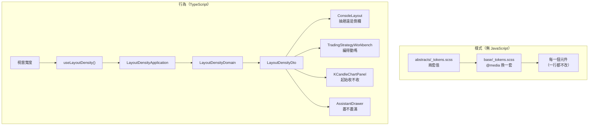

# 讓操作台在小螢幕上也能用 — Architecture Design

**Status:** Confirmed
**Source PRD:** `.sdd/2026-09-19-responsive-console-layout/PRD.md`
**Tech context:** Nuxt 3 · Vue 3 · TypeScript (strict) · SCSS token 中央層 · Clean / Onion（前端版）

---

## 1. Design Goal & Guiding Principle

- **In one sentence:**
  讓「現在這個寬度代表什麼」變成**一個可以問的問題**，而不是散在六十幾個元件裡的
  `@media` 與 `if (width < 768)`。

- **Guiding principle:**
  **把兩種差異分開，各走各的路，不混在一起。**

  1. **純視覺的差異**（鬆緊、版型、捲動）——由**中央 token 在同一道分界上換一套值**解決。
     元件已經一律透過 `spacing()` / `control-height()` 取值，所以在 `base/_tokens.scss`
     的一個 `@media` 裡重新宣告那些 CSS 變數，**全站就換了一套疏密，元件一行不必改**。
     這是「疏密是整站一個選擇」這條業務規則唯一誠實的落地方式：
     它在結構上就不可能讓某個畫面自己決定自己的鬆緊。
     附帶的好處是它**完全不需要 JavaScript**——伺服器端畫出來的那一版就已經是對的，
     沒有補正、沒有閃動。

  2. **真的改變行為的差異**——只有四件：導覽是抽屜還是側欄、積木工作檯能不能編、
     K 線控制項起始收不收、助手蓋不蓋滿畫面。它們進 TypeScript，
     而且**由同一個 domain model 回答全部四個**。

  第二點是這份設計的核心。四件事共用**同一道分界**（1024 那一件除外），
  如果讓四個元件各自去問「我現在多寬」，那道分界就會有四份副本，
  而第五件事出現時會有第五份。`LayoutDensityDomain` 讓它只有一份：
  **呼叫端從來不知道那個數字是多少，它只問「我編得動嗎」。**

---

## 2. Change Scope

| Area | Action | What / Why |
| :--- | :--- | :--- |
| `app/assets/styles/abstracts/_tokens.scss` | **Modify** | 既有的 `$spacings` 成為**寬鬆**那一套（mobile-first 的基準），新增 `$spacings-compact` 與 `$control-heights` / `$control-heights-compact` 兩組對照 |
| `app/assets/styles/abstracts/_functions.scss` | **Modify** | 新增 `control-height($name)` 存取函式（與既有函式同一個檢查機制） |
| `app/assets/styles/abstracts/_breakpoints.scss` | **Modify** | 補上註解說明 768 / 1024 這兩道分界在 TypeScript 那側的同名副本在哪 |
| `app/assets/styles/abstracts/_mixins.scss` | **Modify** | 新增 `tap-target`（可按的東西的最小尺寸）與 `data-table-scroller`（表格自己橫向捲＋第一欄釘住） |
| `app/assets/styles/base/_tokens.scss` | **Modify** | 展開基準那一套，並在 `@media (width >= 768px)` 內重新宣告 compact 那一套。**全站唯一切換疏密的地方** |
| `app/domain/models/domains/layout-density-domain.ts` | **Add** | 一個寬度代表什麼——四個判斷全在這裡 |
| `app/domain/models/dto/layout-density-dto.ts` | **Add** | 那四個判斷交給畫面的唯一形狀 |
| `app/domain/models/vo/layout-density-vo.ts` | **Add** | `roomy`／`compact` 這個有限集合 |
| `app/application/layout-density-application.ts` | **Add** | 用例：給我一個寬度，回我這個寬度代表什麼 |
| `app/composables/use-layout-density.ts` | **Add** | 畫面狀態：目前的寬度（跨元件共用一份）＋ 監看視窗大小改變 |
| `app/components/templates/ConsoleLayout.vue` | **Modify** | 導覽抽屜取代 1024 以下那條橫捲窄帶；新增漢堡鍵與「點外面只收起」 |
| `app/components/atoms/AppPanel.vue` | **Modify** | 新增 `initiallyCollapsed`，讓環境決定起始狀態、使用者一旦動過就以他為準 |
| `app/components/atoms/AppButton / AppInput / AppSelect / AppTextarea / AppRadio` | **Modify** | 高度改走 `control-height()`；可按的東西套 `tap-target` |
| `app/components/organisms/KCandleTable.vue`、`molecules/BacktestTradeTable.vue`、`molecules/StrategyBotRunHistory.vue` | **Modify** | 套 `data-table-scroller`：表格自己捲、第一欄釘住 |
| `app/components/organisms/TradingStrategyWorkbench / Canvas / ConditionMat / PieceShelf` | **Modify** | 收下「編得動嗎」，唯讀時不接手勢、明說原因 |
| `app/components/organisms/TradingStrategyListPanel.vue` | **Modify** | 唯讀寬度下不出現「新增」入口，原地說明 |
| `app/composables/use-piece-drag-gestures.ts` | **Modify** | 唯讀時**不掛**拖曳；不是掛了再擋 |
| `app/components/organisms/KCandleChartPanel.vue` | **Modify** | 把「控制項起始收不收」交給 `AppPanel` |
| `app/components/organisms/AssistantDrawer.vue` | **Modify** | 窄螢幕蓋滿畫面、那條拖曳邊不存在 |
| `app/composables/use-assistant-drawer-width.ts` | **Modify** | 窄螢幕時不進行任何拖寬編排 |
| `app/pages/chat/index.vue` | **Modify** | 窄螢幕上對話清單收在一顆鍵後面 |
| 使用 `AppModal` 的六個對話框 | **Modify** | 拿掉寫死的 `min-width`，改為「想要這麼寬，但螢幕放不下就跟著螢幕」 |
| `app/components/organisms/StrategyScriptMarketplacePanel.vue` | **Modify** | 自己寫死的螢幕寬條件改回共用的斷點機制（既有違規，順手修） |
| `app/plugins/dependencies.ts` | **Modify** | 組裝 `LayoutDensityApplication` 並 provide |
| **Domain service 層** | **Not touched** | 這個切片沒有跨 model 的編排，也沒有任何對外資料存取 |
| **任何 proxy / 對後端的往來** | **Not touched** | 一個字都不改。寬度不是資料 |
| `ConsoleLayout` 的 `railStowed` | **Not touched** | 那是 ≥1024 才成立的既有行為，本切片不動它 |
| 積木的觸控手勢 | **Not built** | 工作檯在窄螢幕唯讀，因此不需要觸控版的拖拉 |
| `AppModal` 本身 | **Not touched** | 它早就是 `width: min(38rem, 100%)` ＋ 內容自捲 ＋ 動作列固定。問題在內容端寫死的最小寬，不在它 |

---

## 3. New Classes / Modules

| Name | Kind | Responsibility (purpose) | Collaborators | Satisfies (PRD scenario) |
| :--- | :--- | :--- | :--- | :--- |
| `LayoutDensityDomain` | Domain Model | **一個寬度代表什麼。** 建構子收一個視窗寬度，對外只回答四個問句：現在是哪一套疏密、導覽是不是抽屜、積木工作檯編不編得動、助手蓋不蓋滿畫面、K 線控制項起不起始收起。分界的數字**只活在這個檔案裡** | — | US-01 全部、US-02 全部、US-04 全部、US-05 前兩則、US-06 前兩則 |
| `LayoutDensityDto` | DTO | 上述判斷交給 application 與畫面的唯一形狀。**畫面看到的是四個布林與一個疏密，不是一個數字**——它因此不可能自己去比大小 | — | 同上 |
| `LayoutDensityVo` | VO | `roomy`／`compact` 這個有限集合，認不得的值退回 `compact` | — | US-02 |
| `LayoutDensityApplication` | Application | 用例：**給我一個寬度，回我這個寬度代表什麼**。一個方法、一個參數、回一份 DTO | `LayoutDensityDomain` | 全部 |
| `useLayoutDensity()` | Composable | 這一次瀏覽的**視窗寬度**這份畫面狀態：跨元件共用一份、監看視窗大小改變、把寬度交給 application 換回 DTO。**唯一碰 `window` 的地方** | `LayoutDensityApplication` | 全部 |
| `tap-target` | SCSS mixin | 可按的東西在寬鬆那一套下的最小尺寸 | — | US-02 happy |
| `data-table-scroller` | SCSS mixin | 一張寬表格在放不下時自己橫向捲、第一欄釘在左邊、放得下時不出現捲動軸 | — | US-03 全部 |

> **為什麼沒有 `LayoutDensityService`。** 這裡只有一個 model、沒有任何 proxy，
> service 會是一個把參數原封轉手的殼——公開介面比實作還大，正是該直接拿掉的那種模組。
> 專案規則本身也只允許 `Service` 後綴用於**跨 model 的編排**，這裡沒有可編排的第二個對象。
> Application 因此直接建構 domain model 並回傳它的 DTO，這是這個切片唯一的分層例外，
> 一旦未來需要第二個對象（例如把使用者手動選的疏密偏好也納入），
> 補上 service 的位置是現成的：application 那一行改成呼叫它。

### `LayoutDensityDomain` 的介面（深度檢查）

```ts
new LayoutDensityDomain(viewportWidthInPixels).toDto()
// → LayoutDensityDto {
//     density: LayoutDensityVo            // roomy | compact
//     usesNavigationDrawer: boolean       // < 1024
//     allowsBlockEditing: boolean         // >= 768
//     startsChartControlsCollapsed: boolean // < 768
//     assistantCoversScreen: boolean      // < 768
//   }
```

- 呼叫端**一次呼叫**就拿到全部答案，不必依序問五次。
- 呼叫端**沒有任何關於「怎麼決定」的條件判斷**——它不知道 768 與 1024 存在。
- 加一件隨寬度改變的事＝這裡多一個 getter、DTO 多一個欄位，**呼叫端不動**。
- 分界要挪＝改這裡一個常數（SCSS 那側有同名的一份，兩處以註解互指）。

---

## 4. Modified Components

| Component | Current role | Change needed |
| :--- | :--- | :--- |
| `base/_tokens.scss` | 把 token map 展開成 CSS 變數 | 展開**寬鬆**那一套當基準，並在 `@media (width >= 768px)` 內重新宣告 compact 的那幾個。全站唯一切換疏密的地方 |
| `abstracts/_tokens.scss` | token 的單一來源 | `$spacings` 成為寬鬆那一套；新增 `$spacings-compact`、`$control-heights`、`$control-heights-compact` |
| `ConsoleLayout.vue` | 全站版面骨架，1024 以下躺平成橫捲窄帶 | 那條窄帶換成**導覽抽屜**：一顆漢堡鍵、一片蓋住畫面的去處清單、選了就收、點外面只收不換頁、Esc 關閉。**同一份去處清單只寫一次**——兩種形狀由樣式決定，不複製第二份標記，否則讀螢幕的人會聽到兩份導覽 |
| `AppPanel.vue` | 面板外框，`collapsible` 時自己持有收合狀態 | 新增 `initiallyCollapsed`：起始跟著環境，**使用者一旦動過就以他為準**（一個 `touched` 旗標）。這樣伺服器端先畫展開、客戶端量到寬度後補正一次，不會與使用者的選擇打架 |
| 五個控制項原子 | 高度寫死在各自的樣式裡 | 改走 `control-height()`；可按的部分套 `tap-target` |
| 三張資料表 | 各自寫一份捲動與表頭 | 改套 `data-table-scroller`（三個使用者，超過「兩個以上才抽共用」的門檻） |
| `TradingStrategyWorkbench` 及其三個子元件 | 永遠可編輯 | 收下一個「編得動嗎」，**唯讀時不掛拖曳**（不是掛了再擋——擋的那一版仍會攔截捲動手勢），並明說原因與出路 |
| `TradingStrategyListPanel.vue` | 永遠顯示「新增」 | 唯讀寬度下不出現該入口，原地說明 |
| `KCandleChartPanel.vue` | `<AppPanel collapsible>` | 傳入 `:initially-collapsed`。**圖的狀態訊息本來就在那塊面板外面**，因此「不跟著被收走」不需要任何改動——既有結構已經滿足 |
| `AssistantDrawer.vue` + `use-assistant-drawer-width.ts` | 固定寬、可拖 | 蓋滿畫面時那條拖曳邊不渲染，拖寬編排整段不啟用。**記住的寬度不動**——回到寬螢幕時仍是他上次拉的那一個 |
| `chat/index.vue` | 固定兩欄，清單寫死 260 | 窄螢幕改為單欄；清單收在一顆鍵後面，挑一段就收 |
| 六個對話框的內容 | 寫死 `min-width: 22rem / 30rem` | 改成「想要這麼寬，但螢幕放不下就跟著螢幕」 |

---

## 5. Component Relationships



---

## 6. Extensibility & Handoff Notes

- **Most likely next requirement:** 「再多一件事要隨寬度改變」——例如某張圖在手機上換一種畫法，
  或某個面板在手機上預設收起。次可能的是「分界要挪」或「多一道分界」。

- **Where it lands:** `LayoutDensityDomain`。它是這個切片唯一知道那兩個數字的地方。

- **How to add it:** 在 `LayoutDensityDomain` 多一個判斷、`LayoutDensityDto` 多一個欄位，
  然後在需要的元件上讀它。**不要**在元件裡寫 `if (width < 768)`，
  也**不要**在元件裡 `@media`——後者是這次要清掉的東西本身。
  純視覺的差異則連 domain 都不必碰：在 `_tokens.scss` 補一個 token 的第二套值即可。

- **Patterns applied & why:**
  - **一個值物件回答一組問題**（不是一組布林參數到處傳）：四件事共用同一道分界，
    分散就會有四份副本。
  - **CSS 變數的 media query 覆寫**作為「整站一個選擇」的落地：
    它在結構上就不允許某個畫面自己決定鬆緊，而這正是那條業務規則的重點。
  - **唯讀＝不掛手勢**，而不是掛了再擋：後者在觸控上仍會攔截頁面捲動。

- **Do not hardcode:**
  - 任何元件裡都不得再出現 `@media`、`px` 形式的斷點或寫死的鬆緊值。
  - 768 / 1024 只有兩份副本（`LayoutDensityDomain` 與 `_breakpoints.scss`），
    兩處互相以註解指名對方。**不得出現第三份。**

- **Known debt / deferred:**
  - **兩份分界副本**是刻意的：樣式的 media query 條件不能讀 CSS 變數，
    要單一來源就得引進建置期的產生步驟，對這個規模不划算。
    專案已有同類先例（條件樹深度上限在前後端各一份）。
    重新檢視的訊號是：第三處需要那個數字時。
  - **伺服器端先畫桌機那一版、量到寬度後補正一次**：只影響那四件行為，
    純視覺的部分由 CSS 直接算對。真正會讓人看見的只有 K 線控制項在手機上
    可能先展開一瞬——可接受；要根除得放棄伺服器端渲染。
  - 積木工作檯的觸控編輯留白。訊號是：有人真的想在手機上組策略。

---

## 7. Traceability

| PRD Scenario | Fulfilled by |
| :--- | :--- |
| US-01 手機上的導覽收在一顆鍵後面 | `ConsoleLayout` ＋ `LayoutDensityDto.usesNavigationDrawer` |
| US-01 螢幕寬 1023 仍然是抽屜 / 1024 回到側欄 | `LayoutDensityDomain`（導覽形狀分界） |
| US-01 點抽屜外面只是把它關起來 | `ConsoleLayout`（收起與導覽是兩件事） |
| US-02 手機上採用好按的那一套 | `base/_tokens.scss` 的 compact 覆寫 ＋ `tap-target` ＋ `control-height()` |
| US-02 767 / 768 兩側 | `base/_tokens.scss` 的 `@media` 條件；行為面由 `LayoutDensityDomain` |
| US-02 換疏密不會弄歪一整欄數字 | 既有的 `numeric` mixin（**不在兩套之間改變**） |
| US-03 表格自己橫向捲、時間欄釘住 | `data-table-scroller` mixin ＋ 三張表 |
| US-03 放得下時不出現橫向捲 / 沒有資料時不出現捲動軸 | 同上（`overflow-x: auto` 的天然行為 ＋ 空狀態不渲染表格） |
| US-04 手機上看得到但改不動 | `TradingStrategyWorkbench` ＋ `LayoutDensityDto.allowsBlockEditing` ＋ `use-piece-drag-gestures`（不掛） |
| US-04 768 恢復完整編輯 | `LayoutDensityDomain`（疏密分界） |
| US-04 不給開空白工作檯 | `TradingStrategyListPanel` |
| US-05 控制項預設收起 / 768 維持展開 | `AppPanel.initiallyCollapsed` ＋ `LayoutDensityDto.startsChartControlsCollapsed` |
| US-05 展開過離開再回來仍然收起 | `AppPanel` 的收合狀態本來就不留存（沿用既有規則，不新增機制） |
| US-05 圖的狀態不跟著被收走 | 既有結構：狀態訊息不在那塊面板內 |
| US-06 助手蓋滿畫面 / 768 回到可拖寬抽屜 | `AssistantDrawer` ＋ `use-assistant-drawer-width` ＋ `LayoutDensityDto.assistantCoversScreen` |
| US-06 對話整頁先給對話本身 | `chat/index.vue` |
| US-07 對話框不被切掉 / 內容自捲 / 手機橫放 | `AppModal`（既有）＋ 六個對話框拿掉寫死的最小寬 |
| US-08 每一頁都不橫向溢出 | 全站清查；`ConsoleLayout` 的工作區與各面板的 `min-width: 0` |
| US-08 表格與圖自己捲 | `data-table-scroller`；K 線圖既有的自捲行為 |

---

## 8. Risks & Open Decisions

- **Risks / trade-offs:**
  1. **換一套疏密會動到每一個畫面。** 這正是它的價值，也是它的風險：
     某些原本剛好排得下的一行會在寬鬆那一套下換行。緩解方式是**分兩步交付**——
     先只換間距與控制項高度並逐頁看過，確認之後才處理各畫面的版型。
  2. **`ConsoleLayout` 是全站唯一的骨架**，改壞它等於改壞每一頁。
     它的既有行為（側欄收合、狀態燈、帳號、時區插槽）必須逐一保住。
  3. **兩份分界副本有漂移的可能。** 以註解互指，並在兩邊都寫明「改一個就要改另一個」。
  4. **伺服器端補正**可能在極慢的裝置上看得見一瞬。已評估為可接受。

- **Open decisions (for implementation):**
  - compact 那一套的實際數值：以**現況即 compact**為起點（桌機外觀不變），
    寬鬆那一套在它之上放大，如此桌機不會有任何回歸。
  - 唯讀工作檯的呈現方式：優先採用「零件不再像可以按的樣子 ＋ 一句說明」，
    而非整片壓暗——後者會讓內容更難讀，而唯讀的重點正是讓他讀得到。
