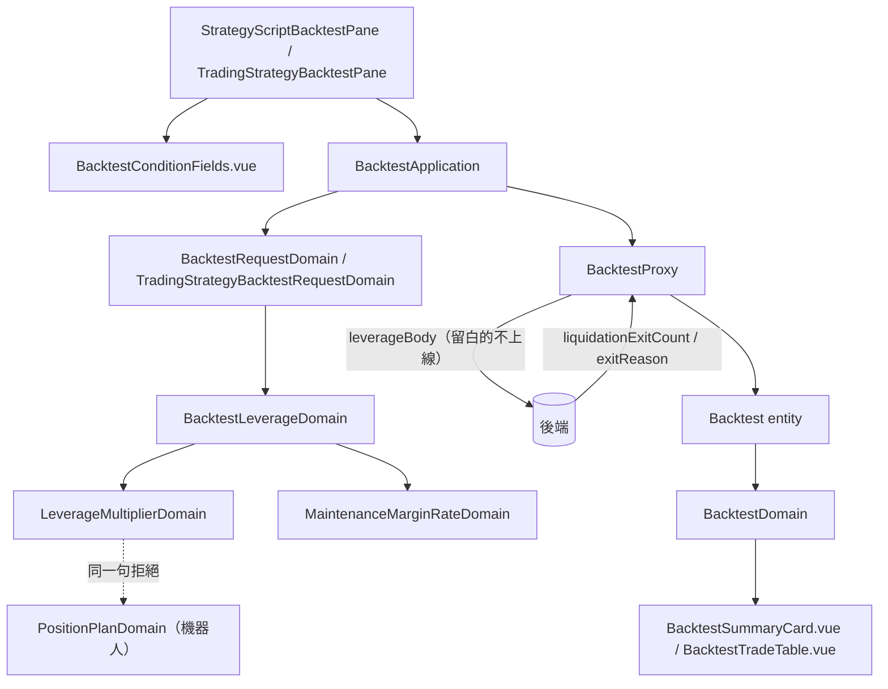

# 回測表單的槓桿與成績單的強平 — Architecture Design

**Status:** Confirmed
**Source PRD:** `.sdd/2026-09-20-leveraged-backtest-liquidation/PRD.md`
**Tech context:** Nuxt 4 · Vue 3 · TypeScript · `decimal.js` · Clean / Onion（前端無 Repository，對外一律 Proxy）

---

## 1. Design Goal & Guiding Principle

**In one sentence:** 讓兩張重演表單問得出槓桿、當場擋下講不通的組合、
讓成績單說得出帳戶歸零過幾次，而整組留白時送出去的請求與這一刀之前逐字相同。

**Guiding principle — 照抄隔壁那兩組的形狀，一個字都不要自創。**

出場價位與交易成本已經把「一組兩格、選填、留白有意思、拒絕指向一組、留白的不上線」
這整套走過兩次了。這一組**在結構上完全比照**：

| | 出場價位 | 交易成本 | 槓桿（本刀） |
| :--- | :--- | :--- | :--- |
| 群組模型 | `BacktestExitLevelsDomain` | `BacktestTransactionCostsDomain` | `BacktestLeverageDomain` |
| 單格驗證 | `ExitDistanceDomain` | `TransactionCostRateDomain` | `LeverageMultiplierDomain`、`MaintenanceMarginRateDomain` |
| 請求那一段 | `exitLevelsBody()` | `transactionCostsBody()` | `leverageBody()` |
| 錯誤欄位 | `'exitLevels'` | `'transactionCosts'` | `'leverage'` |

照抄的價值不是省事，是**下一個人只要認得其中一組就認得全部三組**。
凡是這一組真的與它們不同的地方（兩格的留白規則不一樣、上限是算出來的、
現貨那一條只有一張表單做得到），都用註解明寫，而不是靠結構的差異暗示。

---

## 2. Change Scope

| Area | Action | What / Why |
| :--- | :--- | :--- |
| `domain/models/domains/leverage-multiplier-domain.ts` | **Add** | 一個倍數講不講得通、算不算「有借錢」。**機器人那張表單也用它**。 |
| `domain/models/domains/maintenance-margin-rate-domain.ts` | **Add** | 一個維持保證金率講不講得通；上限由呼叫端給（它與倍數綁在一起）。 |
| `domain/models/domains/backtest-leverage-domain.ts` | **Add** | 這一組的全部規則，含跨格的上限與跨組的現貨衝突。 |
| `domain/models/domains/position-plan-domain.ts` | **Modify** | 那句「不得小於 1 倍」改成**委派**給共用模型，行為一字不變。 |
| `domain/errors/backtest-field-error.ts` | **Modify** | `BacktestField` 多 `'leverage'`。 |
| `domain/models/dto/backtest-request-dto.ts`、`trading-strategy-backtest-request-dto.ts` | **Modify** | 各多兩格。 |
| `domain/models/domains/backtest-request-domain.ts`、`trading-strategy-backtest-request-domain.ts` | **Modify** | 各多兩格＋建構當下驗證；前者傳得出交易模式，後者傳 `null`。 |
| `domain/models/vo/trade-exit-reason-vo.ts` | **Modify** | 多 `'liquidation'`。 |
| `domain/models/entities/backtest.ts` | **Modify** | 成績單多一格強平出場筆數。 |
| `domain/models/dto/backtest-summary-dto.ts` | **Modify** | 多一格。**實作時改為單純的 `number`、零時不顯示**，比照旁邊那兩個出場筆數，而不是交易成本那一格的 `null`：三個都是數字，元件比得動大小，而三格同一種做法比「其中一格特別」好懂。 |
| `domain/models/domains/backtest-domain.ts` | **Modify** | 多一個出場原因的中文、多把那一格算出來。 |
| `infrastructure/proxy/backtest-proxy.ts` | **Modify** | `leverageBody()`、wire 多兩項、欄位翻譯多一筆。 |
| `components/molecules/BacktestConditionFields.vue` | **Modify** | 多一組併排欄位（沿用既有的 `__paired-inputs`）。 |
| `components/molecules/BacktestSummaryCard.vue` | **Modify** | 多一格強平出場。 |
| `components/organisms/StrategyScriptBacktestPane.vue`、`TradingStrategyBacktestPane.vue` | **Modify** | 各多兩個 ref 與一個錯誤插槽。 |
| **`use-strategy-bot-form.ts` 與機器人表單的行為** | **Not touched** | 它早就有槓桿倍數，而且是另一件事（每一輪建議押多少）。只有那句拒絕改成共用。 |
| **資金曲線、強制平倉價的呈現** | **Not touched** | 見 PRD Out of Scope。 |

---

## 3. New Classes / Modules

| Name | Kind | Responsibility | Collaborators | Satisfies |
| :--- | :--- | :--- | :--- | :--- |
| `LeverageMultiplierDomain` | Domain Model | 一個倍數講不講得通（非數字／小於一），以及**有沒有在借錢**（`isSet`＝大於一）。 | — | US-01 三則、US-02 前兩則 |
| `MaintenanceMarginRateDomain` | Domain Model | 一個維持保證金率講不講得通（非數字／負／不小於上限），上限由呼叫端給。 | — | US-02 後四則 |
| `BacktestConditionsDomain` | Domain Model | **兩種重演共有的那六組條件**（期間、初始資金、押注、出場價位、交易成本、槓桿）送不送得出去，一句問完。實作階段加的——見下方。 | 上面六組的模型 | US-01、US-02、US-03（並讓兩個請求模型各少排一次順序） |
| `BacktestLeverageDomain` | Domain Model | 這一組的全部規則：兩格各自的話、**上限＝100÷倍數**、**現貨衝突**，講不通就丟指著 `'leverage'` 的哨兵錯誤。 | 上面兩個 | US-01、US-02、US-03 全部 |

**為什麼會有 `BacktestConditionsDomain`（實作階段加的）。** 這一刀把兩個請求模型裡
那段「依序建六個模型、各叫一次 validate」從五組變成六組——而那段在兩處**一字不差**，
連 import 都各六個。第七組（資金費率）會讓兩邊再各加四行。
收成一個之後兩處各剩一行、import 各剩一個，而順序與欄位對照只剩一份。
它收兩種請求 DTO 的**聯集型別**（兩者在這六組上的欄位名一模一樣），交易模式分開傳——
兩個參數，一個 `validate()`。兩種重演各自獨有的驗證（市場、算式、指標值種類、
交易策略識別碼）**留在原地**，因為那些正是兩者的差別。

**為什麼上限不做在 `MaintenanceMarginRateDomain` 裡。**
它是**跨兩格**的規則：沒有倍數就算不出上限。單格模型只回答「這一格自己講不講得通」，
跨格的由群組回答——與 `BacktestExitLevelsDomain` 只做委派、不做跨格判斷是同一個分工，
只是這一組真的有一條跨格規則。

**為什麼現貨衝突做在 `BacktestLeverageDomain` 而不是請求模型裡。**
「現貨開不了槓桿」是一條**關於槓桿的規則**，不是關於交易模式的規則；
放在請求模型裡，槓桿這個概念就會有一條在別人身上的規則。
交易模式以**`TradingMode | null`** 進建構子：`null` 明寫「這條路問不到模式」，
而不是一個可以忘記傳的選填參數。重演一份交易策略那一條路傳 `null`，
由後端回來的 `'leverage'` 欄位標在同一組旁邊。

---

## 4. Modified Components

| Component | Change |
| :--- | :--- |
| `PositionPlanDomain` | `leverage.lessThan(NO_LEVERAGE)` 那一段改成 `new LeverageMultiplierDomain(...).validationMessage()`。**訊息逐字不變**，這是機器人那張表單不會被這一刀改到的保證。 |
| `BacktestRequestDomain` | 多兩個欄位；建構時 `new BacktestLeverageDomain(倍數, 維持保證金率, this.tradingMode).validate()`。 |
| `TradingStrategyBacktestRequestDomain` | 同上，但第三個參數是 `null`。 |
| `BacktestProxy` | 新增 `leverageBody()`——與另外兩個**各自獨立的函式**，理由與那兩個彼此獨立相同：三條留白規則不一樣，湊成一個只會讓下一個人以為它們一樣。wire 的 `summary.liquidationExitCount?: number` 與欄位翻譯 `leverage: 'leverage'`。 |
| `BacktestDomain` | `TRADE_EXIT_REASON_LABELS` 多 `liquidation: '強平'`；成績單那一格**零時給 `null`**，與交易成本那一格同一個慣例（有才出現由 domain 決定，不由元件比大小）。 |
| `BacktestConditionFields.vue` | 多兩個 `defineModel`、一個 `leverageError` prop、一組併排欄位。**沿用 `__paired-inputs` 與 `grid-column: 1 / -1`**，不新增第二份排版。 |
| `BacktestSummaryCard.vue` | 多一格，`v-if` 條件與交易成本那一格一致（`!== null`）。 |

---

## 5. Component Relationships

---

## 6. Extensibility & Handoff Notes

- **Most likely next requirement：資金費率。** 後端那一刀做完之後，畫面會要第四組。
- **Where it lands：** 第四個群組模型 ＋ 第四個 `xxxBody()` ＋ 第四個 `BacktestField`
  ＋ 表單上第四組併排欄位 ＋ `BacktestConditionsDomain` 裡的一行。
  **三組已經把路踩平了**，第四組不需要任何新結構——而且**兩個請求模型一個字都不必動**，
  那正是實作階段把那六組收成一個的理由。
- **Do not hardcode：**
  - **不要把 0.5 這個預設值寫進畫面。** 它是後端的預設值；畫面只在提示裡**說出**它，
    不在請求裡送它。送了就變成兩邊各有一份預設值，而後端改了畫面不會知道。
  - **強平出場那一格與旁邊兩個出場筆數同一種做法**（數字 ＋ 零時不顯示），不要改成交易成本那一格的 `null`——三格並排，同一種做法比「其中一格特別」好懂。
  - **不要為這一組新開一套排版。** 三組長得一樣是刻意的。
- **Known debt / deferred：** 重演一份交易策略那條路問不到交易模式，所以現貨衝突
  要送出去才知道。要讓它也當場擋，得先讓那張表單讀得到那一份的交易模式——
  它已經為了畫「唯讀的那一句」讀到了，但目前沒有傳進請求模型。那是一次**獨立**的改動。

---

## 7. Traceability

| PRD Scenario | Fulfilled by |
| :--- | :--- |
| US-01 填了槓桿就送得出去 | `BacktestRequestDomain` ＋ `BacktestProxy.leverageBody` |
| US-01 整組留白兩格不出現（三則） | `leverageBody()` ＋ `LeverageMultiplierDomain.isSet` |
| US-01 重演一份交易策略也問得到 | `TradingStrategyBacktestRequestDomain` ＋ 共用分子元件 |
| US-01 提示說得出留白是什麼意思 | `BacktestConditionFields.vue` 的 `hint` |
| US-02 小於一／非數字 | `LeverageMultiplierDomain` |
| US-02 負／上限／剛好開得成／沒借錢不擋 | `MaintenanceMarginRateDomain` ＋ `BacktestLeverageDomain` |
| US-03 現貨當場擋 | `BacktestLeverageDomain`（收到交易模式那一條路） |
| US-03 現貨不填槓桿照常 | 同上（`isSet` 為否即不檢查） |
| US-03 看不到模式的交給後端 | `BacktestProxy` 的欄位翻譯 `leverage` |
| US-04 有強平就顯示／沒有就不佔位置 | `BacktestDomain`（零給 `null`）＋ `BacktestSummaryCard.vue` |
| US-04 交易明細寫得出強平 | `TRADE_EXIT_REASON_LABELS` |
| US-04 舊版後端不會壞 | `BacktestProxy` wire 的選填欄位 |

---

## 8. Risks & Open Decisions

- **風險：** 「留白的不上線」是三組共用的判斷，而 `decimal.js` 把零當成正的——
  這個專案已經為那條差別付過一次代價。新的 `isSet` 一律用 `greaterThan`，
  而且槓桿那一個的門檻是 **1 不是 0**（一倍就是不借錢），註解要寫明這一點與另外兩組不同。
- **Open decision（實作時決定）：** 上限訊息裡 `100 ÷ 倍數` 的小數位怎麼呈現。
  只要**說得出一個使用者照著填就會過的數字**即可。
