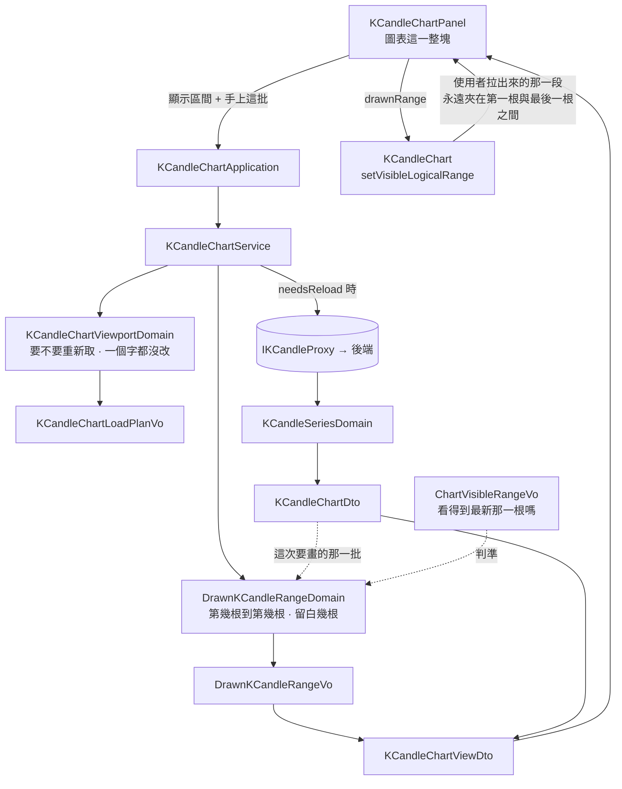

# 圖表右側留白 — Architecture Design

**Status:** Confirmed
**Source PRD:** `.sdd/2026-09-22-chart-right-margin/PRD.md`
**Tech context:** Nuxt · Vue 3 · TypeScript · Clean / Onion（元件 → Application → Domain ← Proxy）

---

## 1. Design Goal & Guiding Principle

- **In one sentence:** 把圖表的定位方式從「兩個時刻」換成「**從第幾根畫到第幾根**」，
  因為留白落在最新那一根之後——那裡沒有一個時刻指得到它。

- **Guiding principle:** **時間說不出空白，根數說得出。**

  這一刀真正的發現只有一句：**繪圖函式庫用兩個時刻定位時，會把落在資料之外的那一端
  往內收回到最後一根身上**（`setVisibleRange` 明說它「無法外推，只會使用現有的資料」）。
  所以現況不是「忘了留白」，而是**留白在這種定位方式下表達不出來**——
  右端無論指到哪一刻，都會收回最後那一根，於是最新一根永遠貼著右緣。

  換成根數就成立了：「畫到第 300 根」在只有 288 根的圖上是合法的，
  多出來的 12 根寬度就是空白。這也是同一個函式庫自己在做的事。

  **推論一：算出那兩個根數的是領域，不是元件。** 「顯示區間落在第幾根到第幾根」
  是一段可以獨立驗證的計算，把它寫在 `.vue` 裡，就只能透過一個替身繪圖函式庫
  間接驗它——而那正是最容易寫出「測了替身、沒測到規則」的地方。

  **推論二：交還出去的那一段永遠是資料的那一段。** 這一點函式庫已經替我們守住了
  （它回報的時間區間一律夾在第一根與最後一根之間），因此 PRD 的 R4
  不需要任何一行程式碼——但需要一個測試站在那裡，因為它是**唯一**會讓畫面
  每動一次就多長一成的破口。

---

## 2. Change Scope

| Area | Action | What / Why |
| :--- | :--- | :--- |
| `domain/models/vo/drawn-k-candle-range-vo.ts` | **Add** | 「畫出來的那一段」：從第幾根到第幾根。`to` 允許超過最後一根，**超出的部分就是留白** |
| `domain/models/domains/drawn-k-candle-range-domain.ts` | **Add** | 把顯示區間換算成上面那個 VO，並決定右邊要不要留、留多少 |
| `domain/models/dto/k-candle-chart-view-dto.ts` | **Modify** | 多帶一個「畫出來的那一段」；一次載入的答案仍然只有一個形狀 |
| `domain/service/k-candle-chart-service.ts` | **Modify** | 兩條分支（重取／不重取）合流之後算一次畫出來的那一段 |
| `components/organisms/KCandleChartPanel.vue` | **Modify** | 多記一份「畫出來的那一段」，往下傳；顯示區間那兩個 ref 照舊（要它們去要資料、去算指標） |
| `components/molecules/KCandleChart.vue` | **Modify** | 兩個時刻 prop → 一個「畫出來的那一段」prop；定位改用根數 |
| `tests/domain/models/domains/drawn-k-candle-range-domain.spec.ts` | **Add** | 這一刀的規則幾乎全部在這裡驗 |
| `tests/domain/service/k-candle-chart-service.spec.ts` · `tests/application/k-candle-chart-application.spec.ts` | **Modify** | 兩條分支都要帶回畫出來的那一段 |
| `tests/components/molecules/KCandleChart.spec.ts` | **Modify** | 定位的斷言換成根數；補「交還出去的那一段不含留白」那一條 |
| `tests/components/organisms/KCandleChartPanel*.spec.ts` | **Modify** | 補上新的 prop（多數只是 fixture 的形狀跟著改） |
| `KCandleChartViewportDomain` · `KCandleChartLoadPlanVo` | **Not touched** | **要不要重新取**那條規則一個字都不動（PRD Out of Scope） |
| `IKCandleProxy` · `k-candle-proxy.ts` · 後端 | **Not touched** | 取的東西完全一樣 |
| `KCandleChartApplication` | **Not touched** | 簽章不變——它本來就只是把 DTO 原樣帶過 |
| 指標、即時更新、快捷區間、粗細選單、時區 | **Not touched** | — |

---

## 3. New Classes / Modules

### `DrawnKCandleRangeVo`（VO · 畫出來的那一段）

| | |
| :--- | :--- |
| **Responsibility** | 說出圖上要從第幾根畫到第幾根。不可變、無行為。 |
| **Shape** | `from: number` · `to: number`（皆為根的序位；`to` 可以是小數，也可以超過最後一根） |
| **Why a VO and not two numbers** | 這兩個數字**只有成對才有意義**，而且會一起穿過 DTO、prop、函式庫呼叫三層。拆開傳，每一層都得自己記住「右邊那個可能超過最後一根」 |
| **Serves** | US-01、US-02、US-03 的每一個場景 |

### `DrawnKCandleRangeDomain`（Domain Model · 換算與留白）

| | |
| :--- | :--- |
| **Responsibility** | 給一批 K 線與一段顯示區間，算出畫出來的那一段——**包含右側留白的決定**。 |
| **Collaborators** | `KCandleChartDto`（那批 K 線，可能是 `null`）、`ChartVisibleRangeVo`（顯示區間） |
| **Public surface** | `toVo(): DrawnKCandleRangeVo \| null` —— `null` 代表沒有東西可畫 |
| **Rules inside** | ① 起點 ＝ 第一根不早於顯示區間起點的 K 線；全都早於它時取最後一根 ② 終點 ＝ 最後一根不晚於顯示區間終點的 K 線；全都晚於它時取第一根 ③ 起點不得晚於終點（資料稀疏時兩端可能交叉） ④ **看得到最新那一根**時，右邊再加上**畫面上那幾根的根數**（終點−起點＋1）× 一成；看不到時加零。**加一不是小數點後的講究**：只剩一根時（休市日按下「一小時」，那一段裡一根都沒有、兩端一起退到最後一根）相減得零，留白會歸零，那一根又貼回右緣 |
| **Serves** | US-01（留白在）、US-02（不留白）、US-03（位置只由這一次決定）、US-04（不重算就不動） |

**Depth check.** 對外只有一個問句（`toVo()`）與一個答案；呼叫端不必知道「看得到最新那一根」
是什麼判準、留白是幾成、資料稀疏時要怎麼收——這四件事全部關在裡面。
它沒有 `and/then` 式的名字，也沒有會長大的參數列：
之後要加的規則（跟著最新一根走、記住上次看的那一段）都是**同一個問句的新答法**。

**為什麼「看得到最新那一根」不在這裡重新定義：** `ChartVisibleRangeVo.showsTheLatestKCandle`
已經是那條判準的唯一出處（指標算到哪一刻也問它）。在這裡寫第二次，
兩條線就會在某次改動後開始說不同的話——而畫面上看起來只是「留白偶爾不見」。

---

## 4. Modified Components

| Component | Current role | Change needed |
| :--- | :--- | :--- |
| `KCandleChartViewDto` | 一次載入的答案 | 多一個 `drawnRange: DrawnKCandleRangeVo \| null`。它與 `visibleStartTime` / `visibleEndTime` **必須併在同一個答案裡**：前者是眼睛看到的，後者是下一次拿去要資料的，分兩次回答就會有一次它們不同步 |
| `KCandleChartService.loadKCandleChart` | 唯一的載入用例 | 兩條分支先合流成「這次要畫的是哪一批」，再算一次畫出來的那一段。不必重取時用手上那批算——**位置照樣要擺**（既有行為） |
| `KCandleChartPanel.vue` | 圖表這一整塊 | 多一個 `drawnRange` ref，於載入成功時與顯示區間一起更新；即時更新那條路**刻意不碰它**（PRD R5／US-04） |
| `KCandleChart.vue` | 唯一認識繪圖函式庫的檔案 | `visibleStartTime` / `visibleEndTime` 兩個 prop 由 `drawnRange` 取代；`applyVisibleRange()` → `applyDrawnRange()`，內容是一次 `setVisibleLogicalRange`。**它因此不再做任何時刻換算**（連時區都不必參與定位） |

**元件為什麼少掉兩個 prop 而不是多一個：** 留著時刻只會讓定位有兩個來源。
畫面該擺哪裡，這一刀之後只有一個答案，而它是領域給的。

---

## 5. Component Relationships

---

## 6. Extensibility & Handoff Notes

- **Most likely next requirement:** **「跟著最新一根走」**——新的一根進來時畫面自己往前推，
  留白維持一成（這一刀刻意不做，見 PRD US-04：讀圖讀到一半被推一下更難受）。
  第二可能的是**記住上次看的那一段**。

- **Where it lands:** 兩者都落在 `DrawnKCandleRangeDomain`——「畫面擺哪裡」
  這一刀之後只有這一個出處。跟著走是「終點改用最後一根，起點往回推同樣的根數」，
  是同一個 `toVo()` 的新答法，不是新的一條路。

- **How to add it:** 給它多一個輸入（上一次畫出來的那一段，或「這一次是不是即時更新造成的」），
  在 `toVo()` 裡多一條分支。**不要**在 `KCandleChart.vue` 裡加——
  那會讓畫面同時有兩個地方決定位置，而它們遲早會不同意。

- **Patterns applied & why:**
  - **以根數定位**：時間的兩端指不到「還沒發生」的那一段；根數指得到。
  - **判準只有一個出處**：「看得到最新那一根」沿用既有的那一個，不另外定義。
  - **一次載入只回答一個形狀**：眼睛看到的那一段與下一次要資料的那一段一起回答。

- **Do not hardcode:** 一成這個比例只寫在 `DrawnKCandleRangeDomain` 裡一次。
  **元件裡不得再出現任何與留白有關的數字**——它一旦出現在那裡，
  以後改比例的人會改到只有一半的畫面。

- **Known assumption:** 根的序位是**那批 K 線在陣列裡的位置**。
  疊上去的指標線與 K 線共用同一條時間軸，因此若某條指標線帶了
  **比第一根更早**的點，序位會整批往後挪一格。實務上不會發生：
  指標算的是使用者正在看的那一段，而那一段永遠落在已取回區間之內。
  真的要防它，做法是**讓指標線也只畫在 K 線有的那些時刻上**，而不是回頭改定位方式。

---

## 7. Traceability

| PRD Scenario | Fulfilled by |
| :--- | :--- |
| US-01 一進畫面就有留白 | `DrawnKCandleRangeDomain`（規則④）＋ `KCandleChart.applyDrawnRange` |
| US-01 右端正好落在最新那一根 | `ChartVisibleRangeVo.showsTheLatestKCandle`（邊界取「含」，既有行為） |
| US-01 留白隨看的那一段等比例 | `DrawnKCandleRangeDomain`（留白 ＝ 根數 × 一成，不是固定幾根） |
| US-01 按下快捷區間之後也有留白 | 同上——快捷區間走的是同一條載入路徑 |
| US-01 圖上一根都沒有 | `DrawnKCandleRangeDomain.toVo()` 回 `null`；`KCandleChart` 不定位 |
| US-02 最新那一根已離開畫面 | `DrawnKCandleRangeDomain`（規則④的另一邊：加零） |
| US-02 拖回來重新碰到最新那一根 | 同上 |
| US-02 連續往回拖十次 | 函式庫回報的區間夾在第一根與最後一根之間（不含留白）＋ `KCandleChart.spec` 的哨兵測試 |
| US-03 拉遠／拉近到需要重新取 | `KCandleChartService`（重取分支以新那批算位置） |
| US-03 手上那批還夠用 | `KCandleChartService`（不重取分支照樣算位置） |
| US-03 拉得比答得出來的還遠 | `KCandleChartViewportDomain`（既有的收回上限）＋ 以收回後的那一段算位置 |
| US-03 位置只由這一次的動作決定 | 同 US-02 第三條 |
| US-04 新的一根長進留白裡 | `KCandleChartPanel`（即時更新那條路不更新 `drawnRange`） |
| US-04 動一下圖之後留白回到一成 | 下一次載入重算 `drawnRange` |
| US-04 看過去的行情時不受影響 | 同上（留白本來就是零） |

---

## 8. Risks & Open Decisions

### Risks / trade-offs

- **最大的風險是一個不會變紅的迴圈：** 若交還出去的那一段含了留白，
  下一次再加一成，畫面就會每動一次多長一成——**十次之後是兩倍半，而且它會順便觸發重新取**。
  函式庫本身已經守住這件事，但這一刀要留一個測試站在那裡，
  否則哪天有人改用「自己算出來的那一段」回報，沒有任何東西會反對。

- **根數與時刻的換算在領域重寫了一次**（函式庫內部也有一份）。
  兩份的取捨若不同（往前對齊或往後對齊），畫面會差一根。
  代價可接受：它換來的是一段**測得到的**規則，而差一根的定位在視覺上無法分辨。

- **留白會被新進來的那幾根慢慢吃掉**（US-04 的代價）。
  一天的圖上留白約二十八根，每五分鐘吃掉一根——使用者下一次動圖表就回來了。

### Open decisions (for implementation)

- **一成寫成什麼型別？** 它是比例，不是金額——依 `code-style.md`，用 `number`，
  不用 `decimal.js`。
