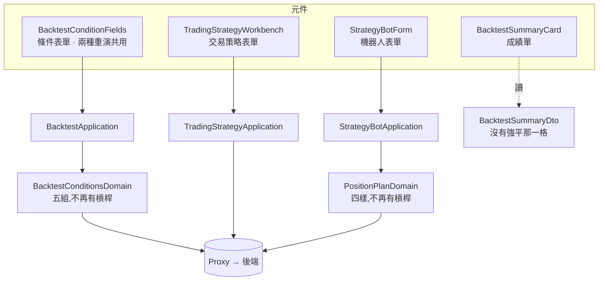

# 畫面只做現貨回測 — Architecture Design

**Status:** Confirmed
**Source PRD:** `.sdd/2026-09-22-spot-only-backtest/PRD.md`
**Tech context:** Nuxt · Vue 3 · TypeScript · Clean / Onion（元件 → Application → Domain ← Proxy）

---

## 1. Design Goal & Guiding Principle

- **In one sentence:** 把三個已經不存在的輸入與一個已經不存在的產出，
  從**四層一起**拿掉——畫面、表單模型、DTO、proxy——並在原本那一組的位置留一句話。

- **Guiding principle:** **由內而外刪，讓型別檢查當嚮導。**

  這一刀最容易犯的錯不是刪太多，是**刪一半**：畫面上那一格拿掉了，
  表單模型還留著、DTO 還帶著、proxy 還送著。那種半成品**編得過、跑得動**，
  只有在後端整份拒絕時才露面——而那時使用者看到的是一句與他剛做的事對不起來的話。

  所以順序是 **VO → domain model → DTO → application/proxy → 元件 → 測試**，
  每一步都讓 `typecheck` 指出下一處。**編譯器沉默即代表這一層乾淨。**

---

## 2. Change Scope

| Area | Action | What / Why |
| :--- | :--- | :--- |
| `domain/models/vo/trading-mode-vo.ts` | **Delete** | 交易模式這個概念整個消失 |
| `domain/models/domains/trading-mode-domain.ts` | **Delete** | 同上 |
| `domain/models/dto/trading-mode-option-dto.ts` | **Delete** | 那四個選項不再有人畫 |
| `domain/models/domains/backtest-leverage-domain.ts` | **Delete** | 借錢與強平整組移出 |
| `domain/models/domains/leverage-multiplier-domain.ts` | **Delete** | 同上 |
| `domain/models/domains/maintenance-margin-rate-domain.ts` | **Delete** | 同上 |
| `domain/models/vo/trade-exit-reason-vo.ts` | **Modify** | 四種變三種，`liquidation` 移除 |
| `domain/models/domains/backtest-conditions-domain.ts` | **Modify** | 六組變五組 |
| `domain/models/domains/backtest-request-domain.ts` · `trading-strategy-backtest-request-domain.ts` | **Modify** | 不再組裝那三個欄位 |
| `domain/models/domains/position-plan-domain.ts` · `strategy-bot-write-domain.ts` | **Modify** | 建議部位五樣變四樣 |
| `domain/models/domains/trading-strategy-domain.ts` · `trading-strategy-write-domain.ts` | **Modify** | 一份交易策略不再記著交易模式 |
| `domain/models/dto/*` · `domain/models/entities/*` | **Modify** | 對應欄位移除 |
| `domain/errors/backtest-field-error.ts` | **Modify** | `leverage`／`tradingMode` 兩個欄位名的對映移除（若它列舉了它們） |
| `domain/service/backtest-service.ts` · `application/backtest-application.ts` | **Modify** | 不再傳遞那三個欄位 |
| `infrastructure/proxy/*.ts` | **Modify** | **送出去的內容裡不再有那三個欄位**（PRD R4 的機械面） |
| `composables/use-strategy-bot-form.ts` · `use-trading-strategy-form.ts` | **Modify** | 表單模型少掉對應的 ref |
| `components/molecules/BacktestConditionFields.vue` | **Modify** | 交易模式那一組換成一句話；槓桿那一組整組移除（含 scoped 樣式） |
| `components/molecules/BacktestSummaryCard.vue` | **Modify** | 強平出場那一格移除 |
| `components/organisms/TradingStrategyWorkbench.vue` | **Modify** | 交易模式那一組移除 |
| `components/organisms/StrategyBotForm.vue` | **Modify** | 建議部位的槓桿輸入框移除 |
| `components/organisms/*BacktestPane.vue` · `templates/TradingStrategyWorkbenchPage.vue` | **Modify** | 不再往下傳那幾個 prop |
| `tests/**` | **Modify** | 改成驗「那幾格不在」「送出去的內容裡沒有它」 |
| **K 線圖、策略腳本、機器人其他設定、帳號、通知** | **Not touched** | 與回測無關 |
| 止損／止盈、交易成本、每次開倉押多少 | **Not touched**（只少掉槓桿那個鄰居） | 現貨一樣用得到 |

---

## 3. New Classes / Modules

**無。** 這一刀不新增任何型別。

它移除四個 domain model、一個 VO、一個 DTO，並在一個元件裡把一組單選鈕換成一段文字。
那段文字是**畫面內容**，不是領域概念——為它開一個 model，
會把一句給人讀的話變成一個要被組裝的物件，而它只有一個讀者、一個出現位置。

> **為什麼不像後端那樣加一個 `SpotOnlyReplayDomain`？**
> 後端那個守門員的工作是**拒絕**一個仍然送得進來的值。
> 這裡沒有值送得進來——欄位從表單模型上就不存在了。
> 前端的對應物是「那一格不存在」本身，而那不需要型別來表達。

---

## 4. Modified Components

| Component | Current role | Change needed |
| :--- | :--- | :--- |
| `BacktestConditionFields.vue` | 兩種回測共用的條件表單 | 交易模式那一組（單選鈕 × 4 ＋ 唯讀提示）→ 一段說明文字，**位置與標題不變**；槓桿那一組（兩個輸入框 ＋ 一則錯誤訊息 ＋ `&__leverage` 樣式）整組移除；`tradingMode`／`leverage`／`maintenanceMarginRate` 三個 `defineModel` 與四個 prop 一併移除 |
| `BacktestSummaryCard.vue` | 成績單 | 強平出場那一格（`v-if="summary.liquidationExitCount > 0"`）移除 |
| `TradingStrategyWorkbench.vue` | 交易策略表單 | 交易模式那一組與 `tradingModeOptions` prop 移除 |
| `StrategyBotForm.vue` | 機器人表單 | 建議部位的槓桿輸入框移除；其餘四格的排版與間距不變 |
| `BacktestConditionsDomain` | 兩種重演共有的條件 | 六組變五組 |
| `PositionPlanDomain` | 建議部位 | 五樣變四樣；讀既有資料時**讀得進一倍槓桿但不再輸出**（PRD R3） |
| `TradeExitReasonVo` | 出場原因 | 四種變三種 |
| `BacktestSummaryDto` | 成績單形狀 | `liquidationExitCount` 移除 |
| 三個 `proxy` | 往後端送的形狀 | **那三個欄位不再出現在送出去的內容裡**——這是 PRD R4 唯一的機械保證 |

---

## 5. Component Relationships

---

## 6. Extensibility & Handoff Notes

- **Most likely next requirement:** **合約的回測畫面。**
  後端那邊會另開一條線（自己的行情、自己的價格基準、自己的借錢成本）。

- **Where it lands:** 那是**一個新的面板**，不是把這幾格加回 `BacktestConditionFields`。
  它會有自己的條件組與自己的成績單格子——正如合約 K 線在後端是獨立的一條線，
  而不是現貨 K 線多一個開關。

- **How to add it:** 與 `BacktestConditionFields` **並排**，
  共用的只有那些與規則無關的東西（期間、資金、押多少）。
  **不要**把槓桿加回這個共用元件——它一旦回去，兩種現貨回測就又開始問一件它們做不到的事。

- **Patterns applied & why:**
  - **由內而外刪**：讓 `typecheck` 當嚮導，而不是靠人眼掃 60 個檔案。
  - **留一句話而不是留一個空位**：一組選項無故消失，使用者會以為畫面壞了。

- **Do not hardcode:** 「這裡只做現貨」那句話只寫在 `BacktestConditionFields` 裡一次。
  兩種回測面板共用同一個元件，所以它天生只有一份——**不要**在兩個面板各寫一次。

- **Known debt / deferred:**
  - **既有機器人存著的一倍槓桿**留在後端資料庫裡沒有人讀。前端不做任何清理——
    清理它需要一次寫回，而那會動到五台正在跑的機器人。
  - **`PositionPlanDomain` 讀得進一倍槓桿但不輸出**：這是相容性的代價，
    撤掉它的訊號是後端那一欄真的被刪掉的那一天。

---

## 7. Traceability

| PRD Scenario | Fulfilled by |
| :--- | :--- |
| US-01 策略腳本回測面板沒有那三格 | `BacktestConditionFields.vue`（兩組移除） |
| US-01 交易策略回測面板沒有那三格 | 同上（兩個面板共用同一個元件） |
| US-01 交易策略工作台不再問交易模式 | `TradingStrategyWorkbench.vue` |
| US-01 機器人的建議部位剩四格 | `StrategyBotForm.vue` + `use-strategy-bot-form.ts` |
| US-02 成績單沒有強平那一格 | `BacktestSummaryCard.vue` + `BacktestSummaryDto` |
| US-02 還在的那幾格照舊 | `BacktestSummaryCard.vue`（未改動的部分） |
| US-03 原本那一組的位置留著一句話 | `BacktestConditionFields.vue` |
| US-03 那句話說得出倉位怎麼走 | 同上 |
| US-03 那句話說得出這裡做不到什麼 | 同上 |
| US-04 既有的交易策略打得開也存得回去 | `TradingStrategyDomain`／`TradingStrategyWriteDomain`（欄位不再被讀或送） |
| US-04 既有的機器人打得開也存得回去 | `PositionPlanDomain`（讀得進、不輸出）+ `strategy-bot-proxy.ts` |
| US-05 保留的那幾格逐字不變 | 無元件——止損／止盈／成本那幾組未改動 |
| US-05 無關的畫面逐字不變 | 無元件——K 線圖、策略腳本、帳號、通知未改動 |

---

## 8. Risks & Open Decisions

### Risks / trade-offs

- **刪一半是這一刀唯一真正的風險。** 畫面乾淨而 proxy 還在送，
  是一個編得過、跑得動、只在後端拒絕時才露面的錯。
  對策是**以「送出去的內容裡沒有它」為斷言**，而不是只驗畫面上看不到。

- **孤兒樣式。** 移除 DOM 之後留下的 scoped 規則不會讓任何測試變紅。
  對策是 `lint:style` 加上人工複查 `&__leverage` 這類具名區塊。

### Open decisions (for implementation)

- **`BacktestFieldError` 是否列舉了 `leverage`／`tradingMode` 兩個欄位名？**
  若有，一併移除；若它是開放字串，則不必動。實作時確認。
