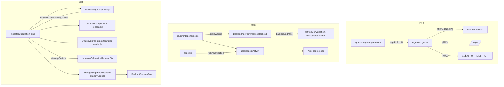

# 操作台的體驗整理 — Architecture Design

**Status:** Confirmed
**Source PRD:** `.sdd/2026-09-23-console-ux-enhancements/PRD.md`
**Tech context:** Nuxt 3（`srcDir: app/`）· Vue 3 `<script setup>` · Clean / Onion（元件 → Application → Domain ← Proxy）· Vitest

---

## 1. Design Goal & Guiding Principle

- **In one sentence:** 讓「我加入的策略腳本」在策略腳本那一頁成為一個**可以跑、不能改的工作區**；
  讓**使用者在等的每一發**都亮起同一條進度條；拿掉「連線狀態」去處並把第一站改成 K 線圖表；
  把整台操作台改成只在瀏覽器裡畫，讓門口在確認身分之前只露出登入畫面的載入。
- **Guiding principle:** **每一件事都只在一個地方決定。**
  - 「算不算使用者在等」由**發請求的那一層**（`BackendApiProxy`）統一計數，預設算；
    背景的那幾發是**在 proxy 方法上宣告**的例外——新增一個 proxy 不必記得任何事就自動被計入，
    新增一個背景輪詢只要在它自己的 proxy 方法上說一聲。
  - 「現在是不是唯讀」只看**工作區裡有沒有一支我加入的策略腳本**（`useStrategyScriptLibrary` 的一個 ref），
    畫面上每一個停用都從這一個判斷衍生，不各自判斷。
  - 「第一站在哪」只有 `HOME_PATH` 這一個常數。

---

## 2. Change Scope

| Area | Action | What / Why |
| :--- | :--- | :--- |
| `nuxt.config.ts` | **Modify** | `ssr: false`。整台操作台本來就只在瀏覽器裡用、以 `nuxt generate` 產出靜態檔交給 nginx（`try_files … /200.html` 已是 SPA fallback），關掉 SSR 就不會再先送出一份「不知道你是誰」的空殼 |
| `app/spa-loading-template.html` | **Add** | 門口的載入：JS 還沒跑起來、身分還沒確認之前 Nuxt 畫的那一份靜態 HTML。長得與登入卡片同一張、同一個位置 |
| `app/middleware/signed-in.global.ts` | **Modify** | 第一次導覽時，確認身分與「門口最短停留」一起等；移除只為 SSR 存在的說明 |
| `app/composables/use-user-session.ts` | **Modify** | `HOME_PATH` 改為 `/k-candles/chart`（第一站） |
| `app/pages/index.vue` | **Modify** | 不再是連線狀態頁；以 `definePageMeta({ redirect })` 導向第一站 |
| `ConsoleLayout.vue` | **Modify** | 去處表拿掉 `/`；`connection` 圖示若無人使用一併移除 |
| `BackendHealthCard.vue` + 其測試 | **Remove** | 只有連線狀態頁用它 |
| `BackendApiProxy` | **Modify** | 每一發在 `requestBackend` 外層向「等待計數」報到與報退；`BackendRequestOptions` 多一個 `background` |
| `BackendHealthProxy` | **Not touched（行為）** | 連線燈**不定期檢查**（打開時一次、按下重新檢查時一次），所以它是使用者在等的，照預設計入 |
| `IAssistantConversationProxy` / `AssistantConversationProxy` / `AssistantConversationService` / `AssistantConversationApplication` | **Modify** | 多一個 `refreshConversation(id)`：回頭詢問走它（背景），挑一段對話仍走 `getConversation`（使用者在等） |
| `use-assistant-conversation.ts` | **Modify** | 回頭詢問那一條改呼叫 `refreshConversation` |
| `IIndicatorCalculationProxy` / `IndicatorCalculationProxy` / `ChartIndicatorService` / `ChartIndicatorApplication` | **Modify** | 多一條「跟著最新那一根重算」的背景路徑 `recalculateIndicator` / `recalculateChartIndicator` |
| `use-chart-indicators.ts` | **Modify** | 一根走完後的重算改走背景那一條 |
| `use-request-activity.ts` | **Add** | 等待計數（跨畫面共用狀態）＋ 0.2 秒門檻＋換頁也算一件 |
| `AppProgressBar.vue` | **Add** | 原子：頂端一條細橫條，`active` 時跑不定進度動畫 |
| `app.vue` | **Modify** | 掛上進度條；登記換頁的開始與結束 |
| `plugins/dependencies.ts` | **Modify** | 把「報到」回呼接給每一個 `BackendApiProxy` |
| `use-strategy-script-library.ts` | **Modify** | 新增 `activeAdoptedStrategyScript`；挑到我加入的那一支時經未儲存確認後**載入它的唯讀內容** |
| `PublishedStrategyScriptDto` | **Modify** | 多一個 `toContent()`：算式為空、種類與參數照實 |
| `IndicatorCalculationPanel.vue` | **Modify** | 唯讀說明、各動作停用、試跑帶 `strategyScriptId`、把唯讀與識別碼往下傳 |
| `IndicatorScriptEditor.vue` | **Modify** | 多一個 `concealed`：算式那一欄換成「這支策略腳本的算式不公開」 |
| `StrategyScriptParameterDialog.vue` / `StrategyScriptParameterList.vue` | **Modify** | 多一個 `readonly`：看得到、改不動、沒有新增與刪除 |
| `StrategyScriptBacktestPane.vue` | **Modify** | 收 `strategyScriptId`，執行時帶上 |
| `BacktestRequestDto` / `BacktestRequestDomain` / `BacktestService` / `BacktestProxy` | **Modify** | 支援「指名一支策略腳本」：有識別碼時只送識別碼（與指標計算同一條規則） |
| `scripts/shots.mjs` | **Modify** | 少一張連線狀態截圖 |
| `.sdd/PROJECT.md` | **Modify** | 「SSR 預設開啟」改為「SPA（`ssr: false`）」 |
| 後端 | **Not touched** | 它早就能指名一支策略腳本來試跑與回測 |
| `LiveKCandleProxy` | **Not touched** | 走 `EventSource`，本來就不經過 `BackendApiProxy`，天然不計入 |
| 各按鈕自己的「進行中」狀態 | **Not touched** | 進度條是額外的一層，不取代它們 |
| K 線圖表上套用市集策略腳本的流程 | **Not touched** | 那裡本來就用識別碼跑 |

---

## 3. New Classes / Modules

| Name | Kind | Responsibility (purpose) | Collaborators | Satisfies (PRD scenario) |
| :--- | :--- | :--- | :--- | :--- |
| `useRequestActivity` | composable（跨畫面共用畫面狀態） | 記著「現在有幾件使用者在等的事」，在第一件開始後 0.2 秒仍未結束時把 `visible` 打開、最後一件結束時收掉。對外只有 `beginWaiting(): () => void`（回傳「這一件結束了」）與 `visible` | `useState`、計時器 | 等一會兒／兩件事／一眨眼／失敗照樣收／換畫面 |
| `AppProgressBar` | atom | 頂端一條細橫條，`active` 為真時淡入並跑不定進度動畫；`position: fixed`、`pointer-events: none`，不佔版面、不擋點擊 | token | 等一會兒／換畫面 |
| `spa-loading-template.html` | 靜態 HTML | 門口的載入：品牌記號＋轉動記號＋「正在確認登入狀態…」，版面對齊登入卡片 | Nuxt SPA 啟動 | 沒登入的人打開／已登入的人打開／重新整理 |

> `useRequestActivity.beginWaiting` 是一個 deep interface：呼叫端不必知道門檻、計數或換頁；
> 回傳的結束函式**冪等**（叫兩次只算一次），所以任何 `finally` 都可以安心呼叫它。

---

## 4. Modified Components

| Component | Current role | Change needed |
| :--- | :--- | :--- |
| `BackendApiProxy` | 所有打 go-trading 的請求執行、身分、錯誤翻譯、過期重試 | 建構子的三個回呼收成一份 `BackendRequestHooks`（`onSignedOut`、`recoverSession`、`beginWaiting`，皆有不做事的預設），由組裝根建一次、每一個 proxy 共用。`requestBackend` 在 `options.background !== true` 時先 `beginWaiting()`，`finally` 結束——**包在外層**，所以「過期→救回→重送」算同一件 |
| `BackendRequestOptions` | 單一請求的選項 | 加 `background?: boolean`：畫面自己定期做、不是使用者在等的那幾發 |
| `AssistantConversationProxy` | 助手對話 | 新方法 `refreshConversation(id)`：與 `getConversation` 同一條路、同一份翻譯，只多 `background: true`（兩者共用私有 `readConversation(id, background)`——兩個公開方法都用它，過得了門檻） |
| `IndicatorCalculationProxy` | 指標計算 | 新方法 `recalculateIndicator(domain)`：與 `calculateIndicator` 同一份請求與翻譯，只多 `background: true`（共用私有 helper） |
| `ChartIndicatorService` / `ChartIndicatorApplication` | 圖上指標計算 | 新 `recalculateChartIndicator(dto)`：與 `calculateChartIndicator` 同一段轉換，只換呼叫 proxy 的那個方法 |
| `use-chart-indicators` | 圖上指標的畫面狀態 | `calculateOne(appliedIndicator, following = false)`；`recalculateAfterKCandleClosed` 傳 `true` |
| `use-assistant-conversation` | 助手畫面狀態 | 回頭詢問（`refreshCurrentConversation`）改呼叫 `refreshConversation` |
| `useStrategyScriptLibrary` | 策略腳本庫的畫面狀態 | `activeAdoptedStrategyScript: Ref<PublishedStrategyScriptDto \| null>`。`selectStrategyScript` 遇到我加入的 → `guardOverwritingDraft(() => { … })`（就地寫在那一個呼叫裡）：`applyContent(adopted.toContent())`、`loadedContent = 同一份`、`activeStrategyScript = null`。另外交出 `readOnly` 與 `namedStrategyScriptId`（畫面不自己判斷）；從清單移除工作區裡那一支時換成一份空白。其餘會換掉工作區的路（載入自己的、開空白、儲存成功）一律把它設回 `null`。`refreshStrategyScripts` 發現它已不在清單上時**不動**（與 `refreshActiveStrategyScript` 同一條規則） |
| `PublishedStrategyScriptDto` | 市集上的一張卡 | `toContent(): StrategyScriptContentDto` → `('', resultType, parameters)` |
| `IndicatorCalculationPanel` | 策略腳本那一頁 | `readOnly = computed(() => library.activeAdoptedStrategyScript.value !== null)`；儲存／另存／改名／分享／帶入範例 `:disabled` 加上 `readOnly`；指標值種類 `AppSelect` 停用；上方 `AppAlert tone="info"` 說明；試跑帶 `strategyScriptId`；原本那句「看不到它的算式」通知移除 |
| `IndicatorScriptEditor` | 算式編輯器外框 | `concealed?: boolean`：為真時不掛 `AppCodeEditor`，改放一行置中說明 |
| `StrategyScriptParameterDialog` / `StrategyScriptParameterList` | 宣告旋鈕 | `readonly?: boolean`：欄位停用、不顯示新增與刪除 |
| `StrategyScriptBacktestPane` | 回測 | `strategyScriptId?: number`，執行時放進 `BacktestRequestDto` |
| `BacktestRequestDto` → `BacktestRequestDomain` → `BacktestProxy` | 回測請求 | 尾端加 `strategyScriptId?: number`；proxy 有識別碼時送 `strategyScriptId`、不送 `script`／`parameters`（`parameterValues` 照送），與 `IndicatorCalculationProxy` 同一條規則 |
| `signed-in.global.ts` | 把關 | 第一次導覽（`useState('door-opened')` 為假）時 `await Promise.all([ensureSessionRestored(), 門口最短停留])`，之後設為真 |
| `app.vue` | 根 | `<AppProgressBar :active="visible" />`；叫一次 `useRequestActivity().followNavigation()`（換頁開始取一件、換完或出錯結束那一件） |

---

## 5. Component Relationships

---

## 6. Extensibility & Handoff Notes

- **Most likely next requirement:** 又多一個背景輪詢（例如機器人執行紀錄自動刷新），或某個畫面要「整塊遮起來等」。
- **Where it lands:** 背景輪詢 → 在那一支 proxy 的那個方法上加 `background: true`（必要時像 `refreshConversation` 那樣分出一個同路徑的背景方法）。整塊遮住 → 讀 `useRequestActivity().visible`，**不另開計數**。
- **How to add it:** 新增的 proxy 繼承 `BackendApiProxy` 就自動被計入，**什麼都不用做**；只有背景的才需要宣告。
- **Patterns applied & why:** 回呼注入（與 `onSignedOut`／`recoverSession` 同一個作法）——發請求的那一層不認識 Vue 狀態，組裝根把兩者接起來。
- **Do not hardcode:** 0.2 秒與 0.6 秒各只寫在一個具名常數裡（`WAITING_VISIBLE_AFTER_MILLISECONDS`、`DOOR_MINIMUM_DWELL_MILLISECONDS`）。
- **Known debt / deferred:**
  - 「挑一段舊的助手對話」會亮進度條，而「回頭詢問」不會——它們是同一個端點，差別靠兩個方法名分開。若未來出現第三種用法，考慮把 `background` 做成那一層的參數而不是方法。
  - `spa-loading-template.html` 在任何樣式表載入之前就要畫出來，所以它的顏色與尺寸是**字面值**——它們抄自 token，改 token 時要一起改（檔內註明）。

---

## 7. Traceability

| PRD Scenario | Fulfilled by |
| :--- | :--- |
| 挑到我加入的那一支就進入唯讀 | `useStrategyScriptLibrary.selectStrategyScript` + `IndicatorCalculationPanel` 的 `AppAlert` |
| 唯讀時看得到它的種類與參數但改不動 | `PublishedStrategyScriptDto.toContent` + `AppSelect disabled` + `StrategyScriptParameterDialog readonly` |
| 唯讀時算式不公開 | `IndicatorScriptEditor concealed` |
| 唯讀時會改動它的動作一律按不下去 | `IndicatorCalculationPanel` 的 `readOnly` |
| 唯讀時照樣試跑得了 | `IndicatorCalculationRequestDto.strategyScriptId` → `IndicatorCalculationProxy`（既有） |
| 唯讀時照樣回測得了 | `StrategyScriptBacktestPane.strategyScriptId` → `BacktestRequestDto/Domain` → `BacktestProxy` |
| 離開唯讀挑自己的一支／開空白不必確認 | `loadedContent = adopted.toContent()` → `StrategyScriptDraftDomain.hasUnsavedChanges` 為假 |
| 有尚未儲存的變更時先確認 | `guardOverwritingDraft` 包住載入唯讀內容的那一段 |
| 自己的一支一切照舊 | `activeAdoptedStrategyScript = null` on `loadStrategyScript` |
| 按了之後要等一會兒／同時兩件／一眨眼／失敗照樣收 | `BackendApiProxy.requestBackend` + `useRequestActivity` |
| 即時更新不算 | `LiveKCandleProxy` 不經過 `BackendApiProxy` + `recalculateIndicator` 背景 |
| 助手作答中的回頭詢問不算 | `refreshConversation` 背景 |
| 按下連線燈的重新檢查也算 | `BackendHealthProxy` 照預設計入 |
| 換畫面時也走一次 | `useRequestActivity.followNavigation()`（`page:loading:start/end`、`vue:error`） |
| 寬螢幕側欄／窄螢幕「更多」 | `ConsoleLayout` 的 `DESTINATIONS` |
| 登入成功沒有原本想去的地方／打開根目錄 | `HOME_PATH` + `pages/index.vue` redirect |
| 沒登入／已登入／重新整理 | `ssr: false` + `spa-loading-template.html` + `signed-in.global` |
| 確認幾乎瞬間完成 | `signed-in.global` 的門口最短停留 |
| 連不上系統 | `useUserSession.restoreOnce`（既有：視同沒登入、留下訊息） |
| 還沒被放行 | `signed-in.global`（既有） |

---

## 8. Risks & Open Decisions

- **Risks / trade-offs:**
  - `ssr: false` 讓第一次打開多等 JS 下載；那段時間由門口的載入承擔，正是需求要的樣子。
  - `nuxt generate` 在 SPA 模式只產出 `index.html` / `200.html`；nginx 已經 fallback 到 `/200.html`，不必改。
  - 背景方法漏標會讓進度條在背景閃；已逐一盤點：助手回頭詢問、圖上指標跟著最新那一根重算、即時 K 線（EventSource）。連線燈不定期檢查，不在此列。
  - 換頁接的是 `page:loading:start` / `page:loading:end` / `vue:error`（Nuxt 3.21 實際的換頁載入 hook），由 `useRequestActivity.followNavigation()` 註冊，`app.vue` 只叫它一次。
- **Open decisions (for implementation):** 無。
