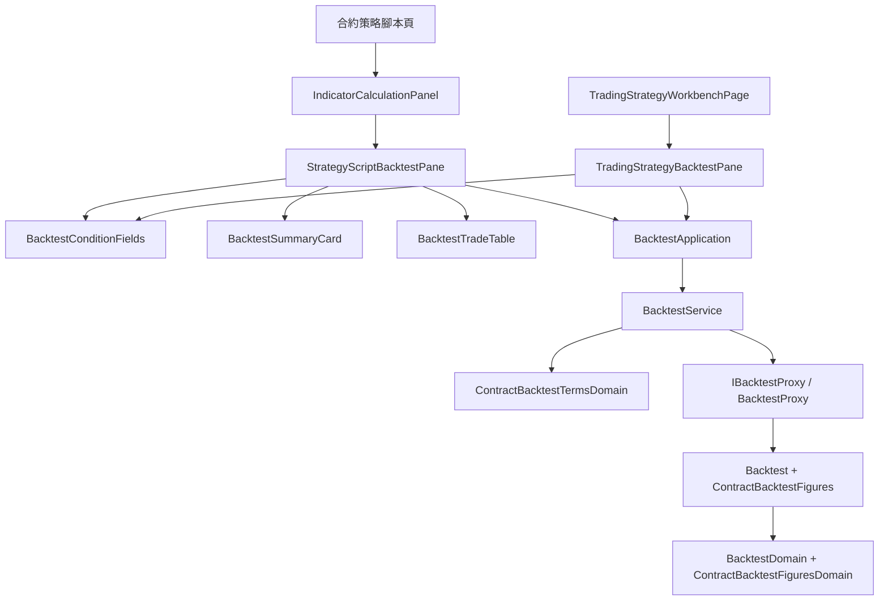

# 合約回測畫面 — Architecture Design

**Status:** Confirmed（使用者授權一律採 best practice）
**Source PRD:** `.sdd/2026-09-23-contract-backtest-console/PRD.md`
**Tech context:** Nuxt · Vue 3 `<script setup>` · TypeScript strict · decimal.js · Clean / Onion（元件只認識 Application 與 DTO）

---

## 1. Design Goal & Guiding Principle

- **In one sentence:** 讓既有的回測條件、成績單、交易明細三塊**多長出合約那幾格**，
  讓策略腳本工作區與交易策略工作台依「這是不是合約帳戶」決定送去哪一個重演，
  並讓交易策略帶著行情種類與交易模式。
- **Guiding principle:** **一個概念一個元件，合約是「有才出現」的那幾格，不是第二套畫面。**
  差異只由 domain 算好的旗標與 DTO 帶出來（`replaysOnContractAccount`、`summary.contract`、`trade.contract`），
  元件裡沒有任何一行比對 `'contractKCandle'`。合約帳戶多問的三格收成一個
  `ContractBacktestTermsDomain`，現貨那五組（`BacktestConditionsDomain`）一行不動。

---

## 2. Change Scope

| Area | Action | What / Why |
| :--- | :--- | :--- |
| `domain/models/vo/contract-trading-mode-vo.ts` · `domains/contract-trading-mode-domain.ts` · `dto/contract-trading-mode-option-dto.ts` | **Add** | 三種交易模式、它們的中文與說明 |
| `domain/models/dto/contract-backtest-terms-dto.ts` · `domains/contract-backtest-terms-domain.ts` | **Add** | 槓桿、滑點、交易模式的輸入與就地把關 |
| `domain/models/entities/backtest.ts` | **Modify** | `Backtest.contractFigures`、`ClosedTrade.contractFigures`（合約才有），新增 `ContractBacktestFigures`、`ContractTradeFigures` 兩個 entity |
| `domain/models/domains/backtest-domain.ts` · `domains/contract-backtest-figures-domain.ts` | **Modify / Add** | 合約那幾格寫成可以直接畫的字；強平的中文 |
| `domain/models/dto/backtest-summary-dto.ts` · `closed-trade-dto.ts` · `contract-backtest-summary-dto.ts` · `contract-closed-trade-dto.ts` | **Modify / Add** | 成績單與明細多一個可為 `null` 的合約段 |
| `domain/models/vo/trade-exit-reason-vo.ts` | **Modify** | 多 `liquidation` |
| `domain/models/vo/backtest-rule-vo.ts` | **Modify** | 多一份 `CONTRACT_BACKTEST_RULES` |
| `domain/errors/backtest-field-error.ts` | **Modify** | 欄位多 `leverage`、`tradingMode`、`slippage` |
| `domain/interface/i-backtest-proxy.ts` · `infrastructure/proxy/backtest-proxy.ts` | **Modify** | 兩個合約重演入口、合約 wire 的正規化、三個欄位名的對照 |
| `domain/service/backtest-service.ts` · `application/backtest-application.ts` | **Modify** | `runContractBacktest`、`runContractTradingStrategyBacktest`、`listContractTradingModeOptions`、`listBacktestRules(kind)` |
| `domain/models/domains/market-data-kind-domain.ts` · `dto/strategy-script-workbench-dto.ts` | **Modify** | 合約那一種也有回測；多 `replaysOnContractAccount` |
| 交易策略：`entities/trading-strategy.ts` · `domains/trading-strategy-domain.ts` · `dto/trading-strategy-dto.ts` · `dto/trading-strategy-write-dto.ts` · `domains/trading-strategy-write-domain.ts` · `infrastructure/proxy/trading-strategy-proxy.ts` | **Modify** | 行情種類與交易模式兩欄；DTO 帶出中文標籤、`replaysOnContractAccount`、`followableByStrategyBot` |
| `composables/use-trading-strategy-form.ts` · `use-trading-strategy-workbench.ts` · `use-strategy-bot-workbench.ts` · `use-backtest-run.ts` · `use-trading-strategy-backtest-run.ts` | **Modify** | 表單的行情種類／交易模式；兩種行情的策略腳本各讀一份；機器人只列 K 線交易策略；兩個 run 各多一個合約的入口 |
| 元件：`BacktestConditionFields` · `BacktestSummaryCard` · `BacktestTradeTable` · `StrategyScriptBacktestPane` · `TradingStrategyBacktestPane` · `TradingStrategyWorkbench` · `TradingStrategyWorkbenchPage` · `TradingStrategyListPanel` · `IndicatorCalculationPanel` · 合約策略腳本頁 | **Modify** | 多出的格子、合約的去處、行情種類與交易模式的選法 |
| K 線圖表、市集、指標預覽 | **Not touched** | 與回測無關 |

---

## 3. New Classes / Modules

| Name | Kind | Responsibility | Satisfies |
| :--- | :--- | :--- | :--- |
| `ContractTradingMode` · `CONTRACT_TRADING_MODES` | VO（字面量 union） | `longShort`／`longOnly`／`shortOnly` | US-01、US-03 |
| `ContractTradingModeDomain` | Domain Model | 讀一個交易模式（認不得→多空反手）；`label()`、`description()`、`toOptionDto()` | US-01、US-03、US-04 |
| `ContractTradingModeOptionDto` | DTO | 選單的一個選項：值、名字、一句說明 | US-01、US-03 |
| `ContractBacktestTermsDto` | DTO | 槓桿、滑點、交易模式（重演交易策略時為 `null`） | US-01、US-04 |
| `ContractBacktestTermsDomain` | Domain Model | 就地把關（槓桿留白或 ≥1、滑點留白或 0–100、交易模式三選一）；`leverageIsSet`／`slippageIsSet` 決定上不上線 | US-01 |
| `ContractBacktestFigures` · `ContractTradeFigures` | Entity | 後端合約那幾格的原樣 | US-02 |
| `ContractBacktestFiguresDomain` | Domain Model | 合約那幾格寫成字：槓桿「5 倍」、資金費用「付出／收到」、勝率「不適用」、維持保證金依據與它的說明 | US-02 |
| `ContractBacktestSummaryDto` · `ContractClosedTradeDto` | DTO | 成績單與明細的合約段 | US-02 |

---

## 4. Modified Components

| Component | Change |
| :--- | :--- |
| `BacktestService` | `runContractBacktest(requestDto, termsDto)`、`runContractTradingStrategyBacktest(requestDto, termsDto)`：驗證兩份 → proxy → `toDomain().toDto()`；`listContractTradingModeOptions()`；`listBacktestRules(marketDataKind)` |
| `BacktestProxy` | `POST /contract-backtests`、`POST /trading-strategies/{id}/contract-backtests`；body＝現貨那一份＋留白不上線的槓桿、滑點（＋腳本重演的交易模式）；合約 wire 的 `margin` 讀進 stake、合約段讀進 `ContractBacktestFigures`；`leverage`／`tradingMode`／`slippage` 三個欄位名對照 |
| `MarketDataKindDomain` | 合約 `offersBacktest: true`、`replaysOnContractAccount: true` |
| `StrategyScriptBacktestPane` | 收 `picksContractTradingSymbol`、`replaysOnContractAccount`；合約時多三格並走 `runContract` |
| `TradingStrategyBacktestPane` | 收 `replaysOnContractAccount`、`tradingModeLabel`；合約時多兩格、交易模式寫成唯讀一句 |
| `BacktestConditionFields` | 合約標的清單的欄位；槓桿、交易模式（選單或唯讀一句）、滑點；合約那一句說明取代「只做現貨」 |
| `BacktestSummaryCard` · `BacktestTradeTable` | `summary.contract`／`trade.contract` 不是 `null` 時多出那幾格 |
| `useTradingStrategyForm` | `marketDataKind`、`tradingMode`、`changeMarketDataKind`（還沒存過才能換，換了清空來源並留一句）；寫入 DTO 帶上兩欄 |
| `useTradingStrategyWorkbench` | 兩種行情的可用策略腳本各讀一次，依表單的行情種類給選項 |
| `TradingStrategyDomain` | DTO 多行情種類與交易模式的值與中文、`replaysOnContractAccount`、`followableByStrategyBot` |
| `useStrategyBotWorkbench` | 只列 `followableByStrategyBot` 的交易策略 |

---

## 5. Component Relationships

---

## 6. Extensibility & Handoff Notes

- **Next likely:** 合約的策略機器人；全倉。
- **Where it lands:** 機器人那一邊只要拿掉 `followableByStrategyBot` 的篩選並在機器人表單上多一組合約條件——
  `ContractBacktestTermsDomain` 與交易模式選單直接可用。全倉是 `ContractBacktestTermsDto` 多一個欄位＋proxy 一行。
- **Do not hardcode:** 交易模式的中文與說明只在 `ContractTradingModeDomain`；合約的規則說明只在 `CONTRACT_BACKTEST_RULES`。
- **Known debt:** 合約重演的說明句與現貨那一句一樣寫在 `BacktestConditionFields` 的樣板裡（沿用既有做法）。

---

## 7. Traceability

| PRD Scenario | Fulfilled by |
| :--- | :--- |
| US-01 回測去處 | `MarketDataKindDomain`（`offersBacktest`） |
| US-01 送出合約重演／留白 | `StrategyScriptBacktestPane` → `BacktestService.runContractBacktest` → `BacktestProxy` |
| US-01 槓桿小於一／滑點為負 | `ContractBacktestTermsDomain` |
| US-01 交易服務指名槓桿 | `BacktestProxy` 欄位對照 + `BacktestConditionFields` |
| US-01 現貨照舊 | `BacktestConditionFields`（非合約時） |
| US-02 全部 | `ContractBacktestFiguresDomain` + `BacktestSummaryCard` + `BacktestTradeTable` + `BacktestDomain`（強平） |
| US-03 全部 | `useTradingStrategyForm` + `useTradingStrategyWorkbench` + `TradingStrategyWorkbench` + `TradingStrategyDomain` + `TradingStrategyProxy` + `TradingStrategyListPanel` |
| US-04 全部 | `TradingStrategyBacktestPane` + `BacktestService.runContractTradingStrategyBacktest` |
| US-05 | `useStrategyBotWorkbench` + `TradingStrategyDomain.followableByStrategyBot` |

---

## 8. Risks & Open Decisions

- 舊版後端不回合約那幾格時，合約段為 `null`，成績單照現貨呈現。
- 交易策略頁面上換行情種類會清空來源：只在還沒存過時允許，並留一句話說明。
