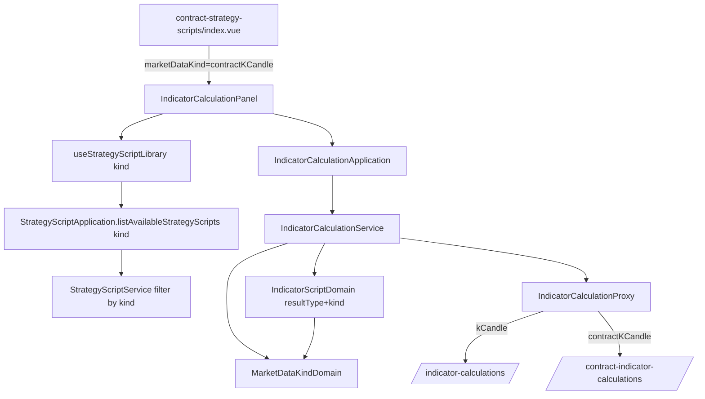

# 合約策略腳本畫面 — Architecture Design

**Status:** Confirmed
**Source PRD:** `.sdd/2026-09-23-contract-strategy-script-page/PRD.md`
**Tech context:** Nuxt 4 · Vue 3 · TypeScript · Clean Architecture（`.vue` → Application → Domain ← Proxy）· Vitest

---

## 1. Design Goal & Guiding Principle

- **In one sentence:** 讓**行情種類**（`kCandle` / `contractKCandle`）成為策略腳本內容的一部分，並讓同一塊工作區
  （`IndicatorCalculationPanel`）以一個 `marketDataKind` prop 切換成合約版：清單、存檔、預填、範例、說明、標的清單、計算端點都跟著走。
- **Guiding principle:** **「這一種行情長什麼樣」只住在 `MarketDataKindDomain`**（進入點型別名、欄位清單、說明、標籤）。
  其餘元件只把種類往下傳，不自己判斷 `if contract`。下一刀（合約回測）要加回測分頁時，只要把「這種行情有沒有回測」問它，
  不必在畫面上再開一個分支。

---

## 2. Change Scope

| Area | Action | What / Why |
| :--- | :--- | :--- |
| 行情種類 VO / Domain | **Add** | `MarketDataKind` 型別與 `MarketDataKindDomain`：正規化（未知／缺漏 → `kCandle`）、標籤、進入點型別名、欄位清單、說明 DTO、有沒有回測 |
| 合約行情格欄位 | **Add** | `CONTRACT_K_CANDLE_FIELDS`（沿用 `KCandleFieldVo`），放在 `k-candle-field-vo.ts` 與現貨那一份並列 |
| 算式說明 DTO | **Add** | `ScriptInputGuideDto`：進入點、段落標題、欄位、額外提醒；交給說明對話框 |
| 策略腳本內容 / 寫入 / entity / DTO / proxy | **Modify** | 內容多帶 `marketDataKind`；proxy 讀（缺漏視為 `kCandle`）與寫這一欄；市集那一支也帶種類與標籤 |
| 策略腳本清單 | **Modify** | `StrategyScriptService.listAvailableStrategyScripts(marketDataKind = 'kCandle')` 只回那一種——預設值讓 K 線圖表與交易策略**不改一行**就只看到 K 線種類 |
| 算式 domain | **Modify** | `IndicatorScriptDomain(resultType, marketDataKind)`：簽章、辨認簽章的樣式、範例都依種類 |
| 指標計算 service / application | **Modify** | 空白、範例、重打簽章、說明都收種類；舊的 `listKCandleFields` 換成 `describeScriptInputGuide(kind)` |
| 指標計算請求 / proxy | **Modify** | 請求帶種類；proxy 依種類選 `/indicator-calculations` 或 `/contract-indicator-calculations`，錯誤翻譯共用 |
| 策略腳本庫 composable | **Modify** | 收一個種類，列清單時帶著它 |
| `IndicatorCalculationPanel` | **Modify** | 新 prop `marketDataKind`（預設 `kCandle`）；合約版換 `ContractSymbolField`、不顯示回測分頁 |
| 說明對話框 | **Modify** | 改收 `ScriptInputGuideDto`，不再寫死 `[]indicator.KCandle` |
| 市集卡片 | **Modify** | 多一個行情種類標記 |
| 頁面 / 導覽 / 圖示 | **Add / Modify** | 新頁 `/contract-strategy-scripts`；既有頁標題改「現貨策略腳本」；`DESTINATIONS` 加一項（非 primary）；`AppIcon` 加一顆新圖示 |
| 回測、交易策略、機器人、K 線圖表 | **Not touched** | 只因清單預設值自然只列 K 線種類；程式不改 |

---

## 3. New Classes / Modules

| Name | Kind | Responsibility (purpose) | Collaborators | Satisfies (PRD scenario) |
| :--- | :--- | :--- | :--- | :--- |
| `MarketDataKind` / `MARKET_DATA_KINDS` | VO (`vo/market-data-kind-vo.ts`) | 兩個合法值 | — | US-02 |
| `MarketDataKindDomain` | Domain Model | 正規化；`label()`（K 線／合約行情）；`scriptInputTypeName()`（`KCandle`／`ContractKCandle`）；`toScriptInputGuideDto()`；`offersBacktest()` | `K_CANDLE_FIELDS`、`CONTRACT_K_CANDLE_FIELDS` | US-02 市集標記、US-03 全部、US-04 沒有回測分頁 |
| `CONTRACT_K_CANDLE_FIELDS` | VO list | 合約行情格的每一項（名稱、型別、標籤） | `KCandleFieldVo` | US-03 說明 |
| `ScriptInputGuideDto` | DTO | 說明對話框的那一段：進入點、標題、欄位、提醒 | — | US-03 說明 |
| `pages/contract-strategy-scripts/index.vue` | Page | 接線：把 `marketDataKind="contractKCandle"` 交給工作區 | `IndicatorCalculationPanel` | US-01 |

---

## 4. Modified Components

| Component | Current role | Change needed |
| :--- | :--- | :--- |
| `StrategyScriptContentDto` | 算式／種類／旋鈕 | 第四個欄位 `marketDataKind`（預設 `'kCandle'`） |
| `StrategyScript` / `StrategyScriptDomain` | 自己的那一支 | entity 帶 `marketDataKind`；轉 DTO 時以 `MarketDataKindDomain` 正規化後放進內容 |
| `PublishedStrategyScript` / `PublishedStrategyScriptDomain` / `PublishedStrategyScriptDto` | 市集那一支 | 帶 `marketDataKind` 與 `marketDataKindLabel`；`toContent()` 帶種類 |
| `StrategyScriptWriteDomain` | 存檔驗證 | 讀內容的種類（正規化） |
| `StrategyScriptProxy` / `StrategyScriptMarketplaceProxy` | 打後端 | 讀 wire `marketDataKind`（缺漏 → `kCandle`）；寫入時送出 |
| `StrategyScriptService.listAvailableStrategyScripts` | 自己的＋加入的 | 收種類（預設 K 線），兩段都只留那一種 |
| `StrategyScriptApplication.listAvailableStrategyScripts` | 同上 | 透傳種類 |
| `IndicatorScriptDomain` | 預填／範例／重打簽章 | 建構子多收 `MarketDataKindDomain`；簽章用它的型別名；辨認簽章的樣式兩種都認；合約有自己的一組範例 |
| `IndicatorCalculationService` / `Application` | 指標計算用例 | `describeBlankStrategyScript(kind)`、`describeExampleScript(resultType, kind)`、`retargetScriptReturnType(script, resultType, kind)`、`describeScriptInputGuide(kind)`（取代 `listKCandleFields`） |
| `IndicatorCalculationRequestDto` / `IndicatorCalculationRequestDomain` | 請求 | 帶種類（預設 K 線） |
| `IndicatorCalculationProxy` | 打 `/indicator-calculations` | 依請求的種類挑端點；其餘（body、錯誤翻譯）不變 |
| `useStrategyScriptLibrary` | 策略腳本庫 | 新參數 `marketDataKind`，列清單時帶著它 |
| `IndicatorCalculationPanel` | 策略腳本工作區 | prop `marketDataKind`；標的欄位二選一；分頁依 `offersBacktest()`；說明對話框收 DTO；內容帶種類 |
| `IndicatorScriptGuideDialog` | 說明 | 收 `guide: ScriptInputGuideDto`，列提醒 |
| `MarketplaceStrategyScriptCard` | 市集卡片 | 多一個種類標記 |
| `pages/strategy-scripts/index.vue` | 現貨頁 | 標題改「現貨策略腳本」 |
| `ConsoleLayout` `DESTINATIONS` / `AppIcon` | 導覽 | 加「合約策略腳本」與新圖示；既有「策略腳本」改名「現貨策略腳本」 |

---

## 5. Component Relationships

---

## 6. Extensibility & Handoff Notes

- **Most likely next requirement:** 合約回測（交易服務下一刀）。
- **Where it lands:** `MarketDataKindDomain.offersBacktest()` 改回 `true`，回測 proxy 依種類挑端點（與指標計算同一個做法）；
  工作區不必改分支。
- **Next field on the contract bar:** 只改 `CONTRACT_K_CANDLE_FIELDS`（與後端 `vo.ContractKCandleVo` 對齊）。
- **Do not hardcode:** 畫面上不得出現 `'contractKCandle'` 以外的判斷字串；一律問 `MarketDataKindDomain`。
- **Known debt:** 欄位清單仍是手抄後端型別的一份（與現貨那份相同的既有取捨）。

---

## 7. Traceability

| PRD Scenario | Fulfilled by |
| :--- | :--- |
| US-01 兩個去處 / 既有畫面只換名字 / 窄螢幕 | `ConsoleLayout` `DESTINATIONS`、兩個 page |
| US-02 合約畫面／現貨畫面只列自己那一種 | `StrategyScriptService.listAvailableStrategyScripts(kind)` + `useStrategyScriptLibrary(kind)` |
| US-02 存下的種類 | `StrategyScriptContentDto.marketDataKind` + `StrategyScriptWriteDomain` + `StrategyScriptProxy` |
| US-02 加入的出現在合約畫面 | 同上（adopted 也依種類過濾） |
| US-02 K 線圖表／交易策略挑不到 | `listAvailableStrategyScripts` 預設 `kCandle` |
| US-02 市集標記 | `PublishedStrategyScriptDomain` + `MarketplaceStrategyScriptCard` |
| US-03 全部 | `IndicatorScriptDomain` + `MarketDataKindDomain` + `IndicatorScriptGuideDialog` |
| US-04 算的是合約 / 錯誤呈現 | `IndicatorCalculationRequestDomain` + `IndicatorCalculationProxy`（端點選擇，錯誤翻譯共用） |
| US-04 合約標的清單 | `IndicatorCalculationPanel` 使用 `ContractSymbolField` |
| US-04 沒有回測分頁 | `MarketDataKindDomain.offersBacktest()` + `IndicatorCalculationPanel` |

---

## 8. Risks & Open Decisions

- **Risks:** 工作區是一個大 organism；加 prop 而不是複製是規則要求（一個 UI 概念一個元件），代價是它多了一個維度——由 `MarketDataKindDomain` 吸收判斷，元件只傳值。
- **Open decisions:** 新圖示的圖形（實作時決定，與其他去處不重複）。
