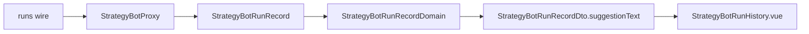

# 合約機器人執行紀錄的方向與倍數 — Architecture Design

**Status:** Confirmed
**Source PRD:** `.sdd/2026-09-24-contract-bot-run-details/PRD.md`
**Tech context:** Nuxt 3 · Vue 3 · TypeScript · decimal.js · Clean architecture（`.vue` = Controller → Application → Domain ← Proxy）

---

## 1. Design Goal & Guiding Principle

- **In one sentence:** proxy 讀進後端執行紀錄上的建議方向、建議槓桿、建議名目；`StrategyBotRunRecordDomain` 把整段建議部位寫成一句話交給畫面。
- **Guiding principle:** **怎麼寫那一段是業務規則，住在 Domain Model**。今天元件自己把「押 X · 停損 … · 停利 …」拼起來；
  合約多一種寫法之後，若仍由元件拼，現貨／合約的分支就漏進元件。改成 domain 交出一句組好的 `suggestionText`，元件只畫它。

---

## 2. Change Scope

| Area | Action | What / Why |
| :--- | :--- | :--- |
| `strategy-bot-proxy.ts`（`StrategyBotRunRecordWire`、`listRunRecords`） | **Modify** | 讀 `suggestedDirection`、`suggestedLeverage`、`suggestedNotional`；金額走 `Decimal`，沒有即 `null` |
| `entities/strategy-bot-run-record.ts` | **Modify** | 多三個欄位：`suggestedDirection: string \| null`、`suggestedLeverage: Decimal \| null`、`suggestedNotional: Decimal \| null` |
| `domains/strategy-bot-run-record-domain.ts` | **Modify** | 新增 `suggestionText`：有方向／槓桿／名目任一 → 合約寫法；否則 → 現貨寫法；沒有開倉金額 → `null` |
| `dto/strategy-bot-run-record-dto.ts` | **Modify** | 三個分散的文字欄位（開倉金額／止損／止盈）改為一個 `suggestionText`；只有元件與 domain 測試讀它們 |
| `StrategyBotRunHistory.vue` | **Modify** | 只畫 `suggestionText`，不再自己拼 |
| 機器人清單、表單、頁面、其他 proxy 方法 | **Not touched** | 與執行紀錄的寫法無關 |

---

## 3. New Classes / Modules

| Name | Kind | Responsibility (purpose) | Collaborators | Satisfies |
| :--- | :--- | :--- | :--- | :--- |
| `StrategyBotRunSuggestionDomain` | Domain Model | 一輪建議過的部位寫成一句話（現貨／合約兩種寫法、方向詞、出場價有才寫） | `StrategyBotRunRecord` | US-01 全部 |

> 改善階段從 `StrategyBotRunRecordDomain` 拆出：句子規則是建議部位自己的一套規則，留在紀錄的 domain 裡只會是一個單一呼叫者的 private getter。

---

## 4. Modified Components

| Component | Current role | Change needed |
| :--- | :--- | :--- |
| `StrategyBotRunRecordDomain.toDto()` | 算結果詞、語氣、三個數字的文字 | 算 `suggestionText`：合約：`[做多\|做空] [N 倍] 保證金 X · 名目 Y · 停損 … · 停利 …`（有才寫，以「 · 」接；方向與倍數之間一個空白）；現貨：`押 X · 停損 … · 停利 …` |
| `StrategyBotRunRecord` | 後端一輪的原樣 | 多三個欄位 |
| `StrategyBotProxy.listRunRecords` | 正規化 wire | 多讀三個欄位（方向原樣字串，數字用既有 `toSuggestedFigure`） |

---

## 5. Component Relationships

---

## 6. Extensibility & Handoff Notes

- **Most likely next requirement:** 執行紀錄也要寫出數量、預估強平價（後端若開始記）。
- **Where it lands:** 只動 `StrategyBotRunRecordDomain` 組句子的那一處與 proxy 讀欄位；元件不變。
- **Do not hardcode:** 方向詞只在 domain（`long`→做多、`short`→做空）；認不得不猜。
- **Known debt:** 無。

---

## 7. Traceability

| PRD Scenario | Fulfilled by |
| :--- | :--- |
| 做空那一輪寫出方向、倍數、保證金、名目與出場價 | proxy 讀欄位 + `StrategyBotRunRecordDomain.suggestionText` + 元件 |
| 沒設止損止盈的做多那一輪 | `suggestionText`（出場價有才寫） |
| 現貨那一輪不變 | `suggestionText` 現貨分支 |
| 交易所不收的那一輪 | `suggestionText` 為 `null`，元件不畫 |
| 認不得的方向不猜 | `suggestionText` 方向詞只認 long／short |

---

## 8. Risks & Open Decisions

- **Risks:** DTO 形狀改變只影響元件與其測試；已確認沒有其他讀者。
- **Open decisions:** 無。
