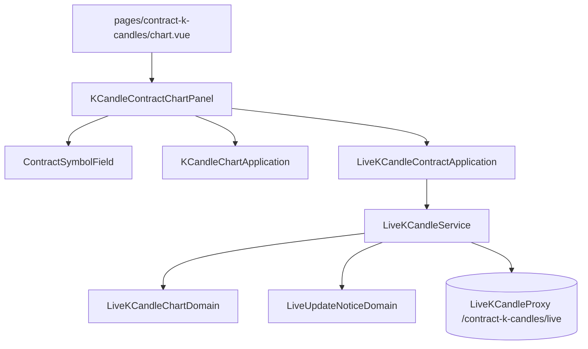

# 合約 K 線圖表的即時跟盤 — Architecture Design

**Status:** Confirmed
**Source PRD:** `.sdd/2026-09-24-contract-chart-live-follow/PRD.md`
**Tech context:** Nuxt 4 · Vue 3 · TypeScript · Clean/Onion（`.claude/rules/`）· decimal.js · Vitest

---

## 1. Design Goal & Guiding Principle

- **In one sentence:** 合約圖表畫出一批 K 線之後，透過一條**合約專屬**的即時通道（`/contract-k-candles/live`）
  把即時更新併進圖上最新那一根；所選合約標的不在合約追蹤名單上時不跟並明說。
- **Guiding principle:** **併入的規則、提示的優先序、通道的讀法全部沿用現貨那一套，只換「跟的是哪一條」。**
  現貨與合約的區隔落在**組裝**：同一個 proxy 類別以不同的路由各建一個實例，各自包成自己的 service 與 application；
  沒有任何一層在執行時問「這是現貨還是合約」。

---

## 2. Change Scope

| Area | Action | What / Why |
| :--- | :--- | :--- |
| `LiveKCandleProxy` | **Modify** | 建構子多收**跟盤路由**（現貨 `/k-candles/live`、合約 `/contract-k-candles/live`）；讀法、狀態、斷線即「已停止」一字不變。同一個後端資源、同一份 wire 形狀，所以不另開一個 proxy 類別 |
| `LiveKCandleService` | **Modify** | 新增 `contractLiveUpdateNotice(contractTradingSymbol, report)`：合約沒有收盤，名額換成「在不在合約追蹤名單上」；沿用 `LiveUpdateNoticeDomain` |
| `LiveKCandleContractApplication` | **Add** | 合約圖表的跟盤用例：`followKCandles`、`liveUpdateNotice(ContractTradingSymbolDto \| null, report)` |
| `ContractSymbolField.vue` | **Modify** | 比照 `SymbolField` 發出 `selected`（目前選著的那一個合約標的的完整樣子，含是否追蹤中） |
| `KCandleContractChartPanel.vue` | **Modify** | 收 `liveKCandleContractApplication`；畫出一批之後跟盤（世代號擋掉舊的）、失敗／換標的／離開時停；提示那一句；常駐說明改成「沒有指標」 |
| `pages/contract-k-candles/chart.vue` | **Modify** | 接線 `$liveKCandleContractApplication` |
| `plugins/dependencies.ts` | **Modify** | 兩個 `LiveKCandleProxy` 實例；提供 `$liveKCandleContractApplication` |
| 現貨圖表、`LiveKCandleChartDomain`、`LiveUpdateNoticeDomain`、`LiveUpdateNoticeVo` | **Not touched** | 行為照舊；合約直接重用 |

---

## 3. New Classes / Modules

| Name | Kind | Responsibility | Collaborators | Satisfies |
| :--- | :--- | :--- | :--- | :--- |
| `LiveKCandleContractApplication` (`app/application/live-k-candle-contract-application.ts`) | Application | 合約圖表的跟盤與提示用例，只碰 DTO | `LiveKCandleService`（以合約通道組成的那一個） | US-01、US-02、US-03 |

---

## 4. Modified Components

| Component | Change |
| :--- | :--- |
| `LiveKCandleProxy` | `constructor(baseUrl, followRoute)`；`EventSource(`${baseUrl}${followRoute}?symbol=…`)` |
| `LiveKCandleService.contractLiveUpdateNotice` | `new LiveUpdateNoticeDomain(true, report?.isTrading \|\| (contractTradingSymbol?.isWatched ?? true), report?.isStalled ?? false).notice()` |
| `ContractSymbolField` | `defineEmits<{ selected: [ContractTradingSymbolDto \| null] }>()`，`watch([symbol, contractTradingSymbols])` 發出 |
| `KCandleContractChartPanel` | `selectedContractTradingSymbol`、`latestLiveReport`、`stopFollowing`、`followGeneration`；`followTheMarket(chart)` 只在所選合約標的不是「確定不在名單上」時才開；`forgetTheChart()` 一起放掉圖、跟盤與最近一則；`onBeforeUnmount` 停；`LIVE_UPDATE_NOTICE_MESSAGES` 合約版措辭 |

跟盤開關：
- 畫出新的一批（`reloadedChart !== null`）→ 重新跟；
- 取圖失敗或清空 → 停；
- 選著的合約標的變成「不在名單上」→ 停（提示由 notice 說）；變成「在名單上」且已有圖 → 開。

---

## 5. Component Relationships

---

## 6. Extensibility & Handoff Notes

- **Most likely next requirement:** 合約圖表的指標（走完一根時重算）或標記價格的即時線。
- **Where it lands:** 指標 — 在 panel 的跟盤回呼裡比照現貨在 `hasClosedAKCandle` 時重算；標記價格 — proxy 多讀一欄、`LiveKCandleChartDomain` 併進去。
- **Do not hardcode:** 路由只寫在組裝根；措辭只寫在 panel 的訊息表。
- **Known debt:** 後端拒絕不在名單上的合約標的時瀏覽器分不出原因，所以先照清單判斷；清單取不到時照常開，最壞情況是說「已停止」。

---

## 7. Traceability

| PRD Scenario | Fulfilled by |
| :--- | :--- |
| US-01 開始跟／還在走／走完一根 | `LiveKCandleProxy`（合約路由）+ `LiveKCandleService.followKCandles` + panel `followTheMarket` |
| US-01 換合約標的 | panel 世代號 + `stopFollowing` |
| US-01 離開就停 | panel `onBeforeUnmount` |
| US-01 圖取不到就不跟 | panel `forgetTheChart` |
| US-02 不在名單上／名單上沒有那一句 | `ContractSymbolField` `selected` + `contractLiveUpdateNotice` + panel 開關 |
| US-03 斷了／重新跟上／沒有收盤中 | `LiveKCandleProxy.onerror` + `contractLiveUpdateNotice`（交易時段恆為真） |
| US-04 常駐說明 | panel 模板 |
| US-05 現貨不變／互不影響 | 組裝根兩個實例；現貨 panel 與測試不動 |

---

## 8. Risks & Open Decisions

- `LiveKCandleProxy` 建構子簽章改變：現貨的組裝與測試同步改成傳 `/k-candles/live`。
- Open decisions: 無。
