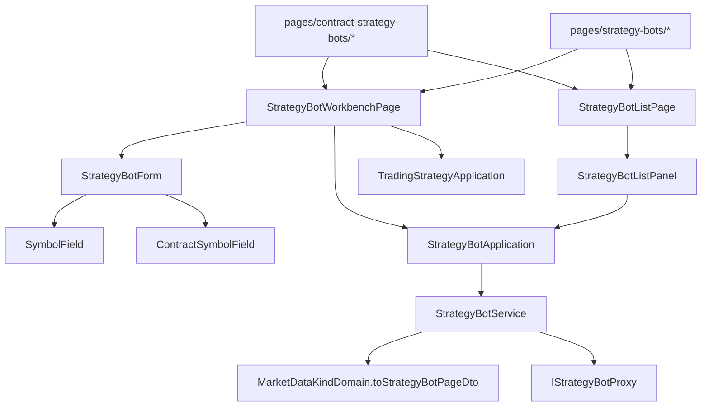

# 合約策略機器人畫面 — Architecture Design

**Status:** Confirmed
**Source PRD:** `.sdd/2026-09-24-contract-strategy-bot-pages/PRD.md`
**Tech context:** Nuxt 3 · TypeScript · Clean/Onion（`.claude/rules/`）· 原子化元件 · Vitest

---

## 1. Design Goal & Guiding Principle

- **In one sentence:** 機器人的清單、工作台、表單都收一個 `MarketDataKind`（畫面的身分），
  由它決定清單向後端要哪一種、表單列哪一種交易策略、標的從哪一份清單挑、有沒有槓桿；兩組路由各自接線。
- **Guiding principle:** **「一種機器人畫面長什麼樣」只有一個答案來源**——`MarketDataKindDomain.toStrategyBotPageDto()`，
  與策略腳本的 `toWorkbenchDto()` 同一個做法；元件與 composable 只讀那份 DTO，不自己比對 `'contractKCandle'`。
  一台已存機器人自己的顯示（永續合約標籤、槓桿、它自己的編輯路徑）由 `StrategyBotDomain.toDto()` 算好。

---

## 2. Change Scope

| Area | Action | What / Why |
| :--- | :--- | :--- |
| `MarketDataKindDomain` | **Modify** | 描述表多幾欄（機器人畫面路徑、標題、說明、空清單、是否挑合約標的、是否收槓桿），新增 `toStrategyBotPageDto()` |
| `StrategyBotPageDto` | **Add** | 一種機器人畫面的全部差異 |
| `StrategyBot` entity / `StrategyBotDomain` / `StrategyBotDto` | **Modify** | 帶 `marketDataKind`；DTO 多 `marketDataKind`、`symbolLabel`、`leverageLabel`、`editPath` |
| `PositionPlanDto` / `PositionPlanDomain` | **Modify** | 多 `leverage: Decimal \| null`（`null`＝現貨，沒有這一格）；小於一的拒絕 |
| `StrategyBotWriteDto` / `StrategyBotWriteDomain` | **Modify** | 帶 `marketDataKind`，`sendable` 原樣帶出 |
| `IStrategyBotProxy` / `StrategyBotProxy` | **Modify** | `listStrategyBots(marketDataKind)` 帶 `?marketDataKind=`；body 帶 `marketDataKind` 與 `positionPlan.leverage`；讀 `marketDataKind`、`positionPlan.leverage`，建議部位讀 camelCase、也容忍舊的 PascalCase |
| `StrategyBotService` / `StrategyBotApplication` | **Modify** | `listStrategyBots(kind)`；`pageFor(kind)` 交出 `StrategyBotPageDto` |
| `TradingStrategyService` / `TradingStrategyApplication` | **Modify** | `listTradingStrategiesFollowableBy(kind)`；拿掉只給機器人用的 `TradingStrategyDto.followableByStrategyBot`（被新方法取代） |
| `ContractTradingSymbolOptionsDomain` / `TradingSymbolService` / `TradingSymbolApplication` / `ContractSymbolField` | **Modify** | 選填 `watchedOnly`：只列合約追蹤名單上的合約，提示改說「只列合約追蹤名單上的」 |
| `useStrategyBots` / `useStrategyBotWorkbench` / `useStrategyBotForm` | **Modify** | 收 `marketDataKind`；工作台讀到另一種的機器人時交出它該去的 `redirectPath`；表單多槓桿那一格 |
| `StrategyBotListPanel` / `StrategyBotForm` / `StrategyBotWorkbenchPage` | **Modify** | 收 `marketDataKind` 或 page DTO；路徑、標題、欄位都讀 DTO |
| `StrategyBotListPage` (template) | **Add** | 清單頁的殼（兩個 index 頁共用，比照 `StrategyBotWorkbenchPage`） |
| `pages/contract-strategy-bots/{index,new,[id]}.vue` | **Add** | 合約那一組路由，只接線 |
| `pages/strategy-bots/index.vue` | **Modify** | 改用 `StrategyBotListPage` |
| `ConsoleLayout` 導覽、`AppIcon` | **Modify** | 「策略機器人」改名「現貨策略機器人」；加「合約策略機器人」（`contract-bot` 圖示，收進「更多」） |
| 執行紀錄、狀態牌子、啟停/刪除/立即運算流程 | **Not touched** | 與種類無關 |

---

## 3. New Classes / Modules

| Name | Kind | Responsibility (purpose) | Collaborators | Satisfies (PRD scenario) |
| :--- | :--- | :--- | :--- | :--- |
| `StrategyBotPageDto` | DTO | 一種機器人畫面的差異：`marketDataKind`、`listPath`、`newPath`、`listTitle`、`listSubtitle`、`createTitle`、`editTitle`、`emptyNotice`、`createLabel`、`picksContractTradingSymbol`、`takesLeverage` | `MarketDataKindDomain` | US-01 全部、US-02「現貨畫面沒有槓桿」、US-03 回到清單 |
| `StrategyBotListPage.vue` | Template | 清單頁殼：ConsoleLayout＋時區＋清單面板，標題由 page DTO 說 | `StrategyBotListPanel` | US-01 |
| `contract-strategy-bots/*.vue` | Pages | 以 `contractKCandle` 接線 | templates | US-01..03 |

---

## 4. Modified Components

| Component | Current role | Change needed |
| :--- | :--- | :--- |
| `StrategyBotDomain.toDto()` | 狀態、名稱 | `symbolLabel`＝合約時「{symbol} 永續合約」；`leverageLabel`＝合約且有建議部位時「N 倍」否則 `null`；`editPath`＝`{listPath}/{id}` |
| `PositionPlanDomain.rejection` | 押多少、兩個距離 | 最後多問：`leverage !== null && leverage < 1` → 「槓桿倍數不得小於 1 倍」 |
| `useStrategyBotForm(editing, page)` | 四格＋部位 | `leverageText`；`buildPositionPlan` 在 `page.takesLeverage` 時帶 `leverage`（留空即 1）否則 `null`；`buildWriteDto` 帶 `page.marketDataKind`（改一台時用它自己的） |
| `useStrategyBotWorkbench(..., marketDataKind)` | 讀一台＋交易策略 | 交易策略改 `listTradingStrategiesFollowableBy`；讀到的機器人種類不同 → `redirectPath = bot.editPath` |
| `StrategyBotProxy.toPositionPlan` | 讀 camelCase（實際讀不到） | camelCase 為主、PascalCase 後備；讀 `leverage` |

---

## 5. Component Relationships

---

## 6. Extensibility & Handoff Notes

- **Most likely next requirement:** 合約機器人列上多顯示交易模式、或表單上預估強平價。
- **Where it lands:** 列上的顯示加在 `StrategyBotDomain.toDto()`；表單差異加在 `StrategyBotPageDto`（描述表多一欄）。
- **How to add it:** 多一種行情＝描述表多一列＋一組接線頁；不在元件裡加 `if`。
- **Do not hardcode:** 路徑與標題只寫在描述表。
- **Known debt / deferred:** PascalCase 後備讀法在後端上線一致拼法之後可移除。

---

## 7. Traceability

| PRD Scenario | Fulfilled by |
| :--- | :--- |
| 現貨／合約畫面只列那一種 | `StrategyBotProxy.listStrategyBots(kind)` + `useStrategyBots(kind)` |
| 標的後面標出永續合約、N 倍 | `StrategyBotDomain.toDto()`（`symbolLabel`、`leverageLabel`）+ `StrategyBotListPanel` |
| 一台都沒有 | `StrategyBotPageDto.emptyNotice`/`newPath` + `StrategyBotListPanel` |
| 導覽兩個去處 | `ConsoleLayout` DESTINATIONS |
| 交易策略選單只列那一種／沒有時的連結 | `TradingStrategyService.listTradingStrategiesFollowableBy` + 既有 `StrategyBotForm` 空狀態 |
| 只列追蹤中的合約／名單空 | `ContractTradingSymbolOptionsDomain(watchedOnly)` + `ContractSymbolField` |
| 以槓桿存下／留空一倍 | `useStrategyBotForm` + `StrategyBotProxy.toBody` |
| 小於一擋下 | `PositionPlanDomain.rejection` |
| 超過上限照交易服務講 | 既有 `useStrategyBotWorkbench.save` failureMessage |
| 現貨沒有槓桿 | `StrategyBotPageDto.takesLeverage=false` + `StrategyBotForm` |
| 建議部位填回表單（含槓桿） | `StrategyBotProxy.toPositionPlan` + `useStrategyBotForm.reset` |
| 從錯的畫面打開 | `useStrategyBotWorkbench.redirectPath` + `StrategyBotWorkbenchPage` watch |
| 存好回到那一種的清單 | `StrategyBotPageDto.listPath` + `StrategyBotWorkbenchPage` |

---

## 8. Risks & Open Decisions

- **Risks:** 後端未上線時，合約清單查詢參數會被舊後端忽略而列出全部——兩者一起上線（PR 順序：後端先）。
- **Open decisions:** 無。
