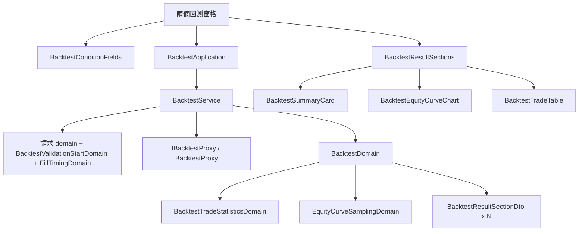

# 短線回測畫面 — Architecture Design

**Status:** Confirmed（使用者授權一律採 best practice）
**Source PRD:** `.sdd/2026-09-24-short-term-backtest-console/PRD.md`
**Tech context:** Nuxt · Vue 3 · TypeScript · Clean / Onion（`.vue` 是 Controller，只認識 Application 與 DTO）

---

## 1. Design Goal & Guiding Principle

- **In one sentence:** 四個回測去處共用同一條「條件 → 請求 → 結果」的路，所以兩格新條件、五格新指標、
  分段結果與長重演的呈現都只做一次，由兩個回測窗格照舊組裝。
- **Guiding principle:** **「結果要畫成哪幾塊」是領域的決定，不是元件的。** 結果 DTO 直接交出一串
  `sections`（驗證段／調參段／整段，或只有一塊），每一塊帶好標題、說明、是否醒目、取樣後的曲線；
  兩個窗格改用同一個新的有機體逐塊畫，不再各自複製「成績單＋曲線＋明細」三個面板。

---

## 2. Change Scope

| Area | Action | What / Why |
| :--- | :--- | :--- |
| `domain/models/vo/fill-timing-vo.ts` · `domains/fill-timing-domain.ts` · `dto/fill-timing-option-dto.ts` | **Add** | 成交時點兩種、標籤與說明、選項 |
| `domains/backtest-validation-start-domain.ts` | **Add** | 驗證起點必須落在期間之內 |
| `domains/backtest-trade-statistics-domain.ts` · `dto/backtest-trade-statistics-dto.ts` | **Add** | 五格的呈現（兩位小數、百分比、持倉時間取最大兩個單位、不適用） |
| `domains/equity-curve-sampling-domain.ts` | **Add** | 保留形狀的曲線取樣（上限兩千點：一千段各留最高最低，頭尾必留） |
| `dto/backtest-result-section-dto.ts` | **Add** | 結果的一塊：標題、說明、是否醒目、起訖、成績單、取樣曲線、明細 |
| `errors/backtest-time-allowance-spent-error.ts` | **Add** | 重演逾時自成一類 |
| `entities/backtest.ts` | **Modify** | 多 `BacktestTradeStatistics`、`fillTiming`、`validationStartTime`、`inSample`、`validation` |
| `domains/backtest-domain.ts` | **Modify** | 成績單帶五格與成交時點；結果帶 `sections` |
| `dto/backtest-request-dto.ts` · `dto/trading-strategy-backtest-request-dto.ts` · 兩個請求 domain · `backtest-conditions-domain.ts` | **Modify** | 多成交時點與驗證起點；驗證起點在條件驗證裡檢查 |
| `errors/backtest-field-error.ts` | **Modify** | 欄位多 `fillTiming`、`validationStartTime` |
| `infrastructure/proxy/backtest-proxy.ts` · `backend-api-proxy.ts` · `errors/backend-request-rejected-error.ts` | **Modify** | 送出兩格（沒動就不上線）；讀新欄位與分段；逾時回覆（422 帶 `timeAllowanceSpent`）轉成逾時錯誤；欄位翻譯多兩個 |
| `service/backtest-service.ts` · `application/backtest-application.ts` | **Modify** | 成交時點選項 |
| `composables/use-latest-run.ts` | **Modify** | 多一種失敗：逾時 |
| `components/molecules/BacktestConditionFields.vue` | **Modify** | 兩格新條件 |
| `components/molecules/BacktestSummaryCard.vue` | **Modify** | 五格與成交時點 |
| `components/molecules/BacktestTradeTable.vue` | **Modify** | 分批顯示（每批兩百） |
| `components/organisms/BacktestResultSections.vue` | **Add** | 逐塊畫結果 |
| `components/organisms/StrategyScriptBacktestPane.vue` · `TradingStrategyBacktestPane.vue` | **Modify** | 兩格新條件、逾時說明、改用 `BacktestResultSections` |
| 指標計算、K 線圖、機器人 | **Not touched** | |

---

## 3. New Classes / Modules

| Name | Kind | Responsibility | Satisfies |
| :--- | :--- | :--- | :--- |
| `FillTimingDomain` | Domain Model | 正規化（認不得即收盤成交）、`label()`、`description()`、`toOptionDto()`、`isDefault` | US-01、US-02 |
| `BacktestValidationStartDomain` | Domain Model | `validate()`：留白放行；不晚於起點或不早於終點即 `BacktestFieldError('validationStartTime', …)` | US-01 |
| `BacktestTradeStatisticsDomain` | Domain Model | 五格實體 → 顯示用 DTO | US-02 |
| `EquityCurveSamplingDomain` | Domain Model | `sample()`：不超過上限原樣回；超過則分段留最高最低、頭尾必留、依時間排序 | US-04 |
| `BacktestResultSectionDto` | DTO | 一塊結果的全部顯示資料 | US-03、US-04 |
| `BacktestTimeAllowanceSpentError` | 哨兵錯誤 | 逾時 | US-04 |
| `BacktestResultSections.vue` | Organism | 逐塊畫：醒目的一塊帶標記；每塊三個面板（成績單、曲線、明細） | US-03 |

---

## 4. Modified Components

| Component | Change |
| :--- | :--- |
| `BacktestDomain.toDto()` | `sections`：有驗證段時依序 [驗證段（醒目）、調參段、整段]；否則 [整段（無標題）]。每塊的曲線經 `EquityCurveSamplingDomain` |
| `BacktestProxy` | body：`fillTiming` 只在下一格開盤成交時送；`validationStartTime` 有才送。wire 的 summary 讀五格（選填，舊後端沒有即不適用／零）；`inSample`／`validation` 遞迴讀成 `Backtest` |
| `useLatestRun` | `timeAllowanceSpentMessage`：與算式失敗、請求被拒分開 |
| `BacktestTradeTable` | 本地的顯示筆數（畫面狀態），「顯示 N 筆，共 M 筆」與「再顯示更多」 |

---

## 5. Component Relationships

---

## 6. Extensibility & Handoff Notes

- **多段驗證：** `BacktestDomain` 產生 `sections` 的那一處加塊即可，元件不必改。
- **更多統計：** `BacktestTradeStatisticsDomain` 與它的 DTO 各加一格，成績單加一格。
- **Known debt：** 逾時的辨認依賴交易服務在 422 回覆帶 `timeAllowanceSpent`；沒有時退回算式失敗的說法。

---

## 7. Traceability

| PRD Scenario | Fulfilled by |
| :--- | :--- |
| US-01 送出／不送兩格 | 窗格 + `BacktestProxy` body |
| US-01 驗證起點不在期間之內 | `BacktestValidationStartDomain`（經 `BacktestConditionsDomain`） |
| US-01 交易服務指名驗證起點 | `BacktestProxy` 欄位翻譯 |
| US-01 合約交易策略也有兩格 | `TradingStrategyBacktestPane` |
| US-02 全部 | `BacktestTradeStatisticsDomain` + `FillTimingDomain.label` + `BacktestSummaryCard` |
| US-03 全部 | `BacktestDomain.sections` + `BacktestResultSections` |
| US-04 取樣 | `EquityCurveSamplingDomain` |
| US-04 分批 | `BacktestTradeTable` |
| US-04 逾時 | `BacktestProxy` → `BacktestTimeAllowanceSpentError` → `useLatestRun` → 窗格 |

---

## 8. Risks & Open Decisions

- 逾時辨認見 Known debt；合併前核對交易服務最終的回覆形狀。
