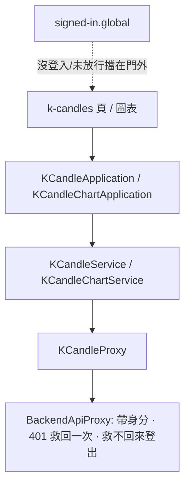

# 行情維護需要登入 — Architecture Design

**Status:** Confirmed
**Source PRD:** `.sdd/2026-09-25-market-data-writes-require-sign-in/PRD.md`
**Tech context:** Nuxt 4 · Vue 3 · TypeScript · Clean Architecture（元件 → Application → Domain ← Proxy）

---

## 1. Design Goal & Guiding Principle

- **In one sentence:** 後端把 `POST/PUT/DELETE /k-candles…`、`POST /k-candles/backfill` 等行情寫入關到已放行的登入之後，
  操作台的 K 線維護與「立刻更新」照常可用。
- **Guiding principle:** **不新增任何路徑。** 身分附加與 401 救回早已集中在 `BackendApiProxy`（每一發都帶、
  `recoverSession` 最多重送一次、救不回來 `clearSession` + `onSignedOut`），而全域中介層 `signed-in.global.ts`
  已讓整個操作台只給登入且已放行的人。這一刀只用測試把「行情寫入也走這條路」釘住，下一個寫入動作
  只要繼承 `BackendApiProxy` 就自動合規。

---

## 2. Change Scope

調查結果：操作台今天會打的受保護端點只有 `KCandleProxy` 的 `saveKCandle`（POST `/k-candles`）、
`updateKCandle`（PUT）、`deleteKCandle`（DELETE）、`catchUpSymbol`（POST `/k-candles/backfill`）。
`KCandleContractProxy` 只讀；追蹤名單與歷史同步在操作台上沒有呼叫端；`LiveKCandleProxy`（EventSource）只讀、維持公開。

| Area | Action | What / Why |
| :--- | :--- | :--- |
| `tests/infrastructure/proxy/k-candle-proxy.spec.ts` | **Modify** | 以 `it.each` 釘住四個寫入都帶 `Authorization`、過期救回後重送、救不回來丟掉登入並登出 |
| `app/infrastructure/proxy/backend-api-proxy.ts` | **Modify（僅註解）** | `identityHeaders` 的註解把「開放的那幾條路（K 線）」改為「看行情的那幾條路」，與新事實一致 |
| `.sdd/UL-MAP.md` | **Modify** | 「把關」列改寫：看行情不問身分、改動行情要已放行的身分 |
| `signed-in.global.ts`、頁面與元件 | **Not touched** | 門已經擋下沒登入與未放行的人；K 線頁沒有「沒登入也看得到」的狀態 |
| `KCandleContractProxy`、`TradingSymbolProxy`、`ContractTradingSymbolProxy`、`LiveKCandleProxy` | **Not touched** | 只讀，後端維持公開 |
| 403（未放行） | **Not touched** | 門不讓未放行的人進到 K 線頁；後端也規定已放行不會變回待開通。萬一遇上，照 `BackendRequestRejectedError` 說出後端的原因 |

---

## 3. New Classes / Modules

無。

---

## 4. Modified Components

| Component | Current role | Change needed |
| :--- | :--- | :--- |
| `BackendApiProxy.identityHeaders` 註解 | 說明沒登入時不帶身分 | 用語改為「看行情」，不再暗示 K 線整個是開放的 |

---

## 5. Component Relationships

---

## 6. Axis of Change

- **最可能的下一個需求：** 操作台加上追蹤名單或歷史同步（含進度查詢）的動作。
- **Seam：** 新的 proxy 繼承 `BackendApiProxy` 即自動帶身分與救回；不需要任何「這一條要登入」的旗標。
  唯一要決定的例外仍是 `refusalMeansSignedOut: false`（只給建立身分的那幾條路）。

---

## 7. Traceability

| PRD scenario | Fulfilled by | Verified by |
| :--- | :--- | :--- |
| 新增／修改／刪除一根 K 線時帶著身分 | `KCandleProxy` → `BackendApiProxy.identityHeaders` | `k-candle-proxy.spec.ts`「行情維護的每一發都帶著身分」 |
| 立刻更新時帶著身分 | `KCandleProxy.catchUpSymbol` → 同上 | 同上 |
| 登入過期但救得回來 | `BackendApiProxy.sendRequest`（`recoverSession` → 重送一次） | `k-candle-proxy.spec.ts`「過期救回再送一次」 |
| 登入過期而且救不回來 | `BackendApiProxy.sendRequest`（`clearSession` + `onSignedOut` → `SignedOutError`） | `k-candle-proxy.spec.ts`「救不回來請人重新登入」 |
| 沒登入的人打開 K 線頁 | `signed-in.global.ts` | 既有 `tests/middleware/signed-in.global.spec.ts` |
| 看行情照舊 | `KCandleProxy.findKCandlesInRange` / `findKCandleSeries`（未改） | 既有 `k-candle-proxy.spec.ts` 讀取案例 |
