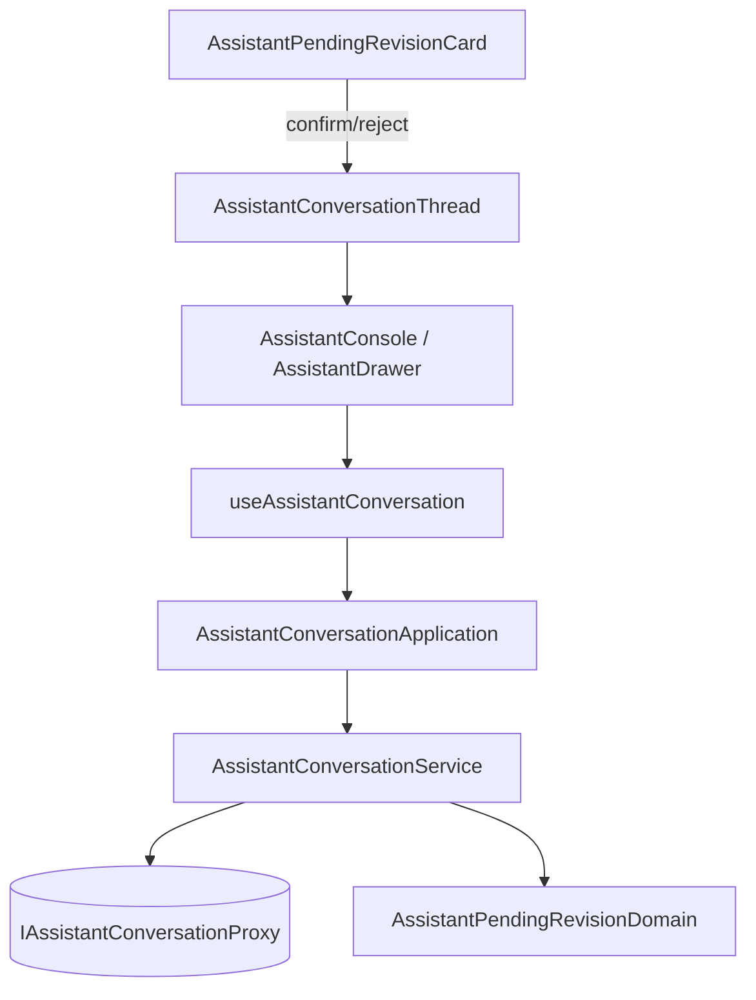

# 助手改你既有的東西，要你在對話裡按確認 — Architecture Design

**Status:** Confirmed
**Source PRD:** `.sdd/2026-09-26-assistant-pending-revisions/PRD.md`
**Tech context:** Nuxt 4 · Vue 3 · TypeScript · Clean Architecture（`.claude/rules/`）

## 1. Design Goal & Guiding Principle

- **In one sentence:** 讀對話時把每則訊息的待確認修改正規化進 domain，交給畫面一份已算好標籤與可否處理的 DTO；確認／拒絕走同一個 Proxy，成功後重讀對話。
- **Guiding principle:** 畫面不知道任何狀態字串或種類字串——「說什麼」「給不給鍵」全在 `AssistantPendingRevisionDomain`，下一種能改的東西只要在那裡多一個標籤。

## 2. Change Scope

| Area | Action | What / Why |
| :--- | :--- | :--- |
| `AssistantConversationProxy` / `IAssistantConversationProxy` | **Modify** | 解析 `pendingRevisions`；新增 `confirmPendingRevision` / `rejectPendingRevision`，404 轉 `AssistantPendingRevisionNotFoundError` |
| `ConversationMessage` entity / `ConversationMessageDto` / `ConversationDomain` | **Modify** | 帶待確認修改 |
| `AssistantConversationService` / `AssistantConversationApplication` | **Modify** | 確認、拒絕兩個用例 |
| `useAssistantConversation` | **Modify** | 處理中的那一筆、每筆的錯誤一句、處理後重讀 |
| `AssistantConversationThread` / `AssistantConsole` / `AssistantDrawer` / `pages/chat` | **Modify** | 把資料與兩個事件接到卡片 |
| 策略腳本工作檯 | **Not touched** | 409 已由既有拒絕路徑顯示後端那一句 |

## 3. New Classes / Modules

| Name | Kind | Responsibility | Satisfies |
| :--- | :--- | :--- | :--- |
| `AssistantPendingRevision` | Entity | 後端那一筆的本體形狀（內容已排版成文字） | US-01 |
| `assistantPendingRevisionStatusOf` / `AssistantPendingRevisionStatus` | Entity 型別 + 正規化 | 認不出來的狀態 → `unknown` | 處理過的只顯示狀態 |
| `AssistantPendingRevisionDomain` | Domain Model | 標題、狀態標籤、可否處理 | US-01 |
| `AssistantPendingRevisionDto` | DTO | 畫面唯一看到的形狀 | US-01 |
| `AssistantPendingRevisionNotFoundError` | 哨兵錯誤 | 找不到那一筆 | US-02 |
| `AssistantPendingRevisionCard.vue` | Molecule | 一筆的卡片：展開內容、兩顆鍵、錯誤一句 | US-01、US-02 |

## 4. Modified Components

見 Change Scope。

## 5. Component Relationships

## 6. Extensibility & Handoff Notes

- **Most likely next requirement:** 顯示修改前後差異。
- **Where it lands:** `AssistantPendingRevisionDomain`（加一個 diff 的 DTO 欄位）與卡片；Proxy 另讀目前內容。
- **Do not hardcode:** 狀態與種類字串只在 entity 正規化與 domain model。

## 7. Traceability

| PRD Scenario | Fulfilled by |
| :--- | :--- |
| US-01 全部 | Proxy 解析 + `ConversationDomain` + `AssistantPendingRevisionDomain` + Card |
| US-02 確認／拒絕 | Service/Application + composable（重讀）+ Card |
| US-02 送出中不能再按 | composable 的處理中那一筆 + Card 的 `busy` |
| US-02 被擋下／連不上 | composable 的每筆錯誤一句 |

## 8. Risks & Open Decisions

- 內容以 `<pre>` 純文字呈現，長內容可捲動。
