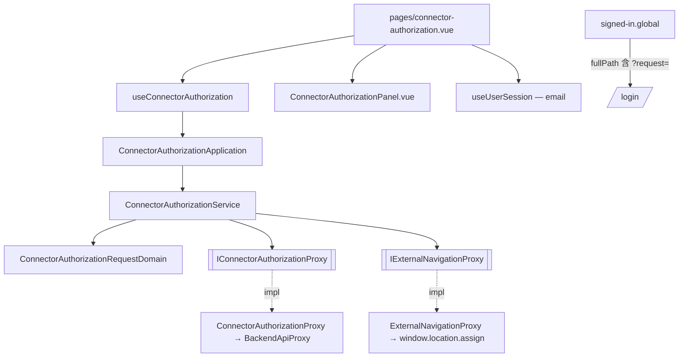

# 外掛授權同意頁 — Architecture Design

**Status:** Confirmed
**Source PRD:** `.sdd/2026-09-27-connector-authorization-consent/PRD.md`
**Tech context:** Nuxt 3 SPA（`ssr: false`）· TypeScript strict · Clean/Onion（`.vue` → Application → Domain ← Infrastructure Proxy）· Vitest

---

## 1. Design Goal & Guiding Principle

- **In one sentence:** 新增 `/connector-authorization?request=<id>` 頁面：讀取交易服務的授權請求（`GET /oauth/authorization-requests/:id`），
  讓已登入且已放行的使用者按「允許」（`POST .../approval`，帶 web bearer）或「拒絕」（`POST .../denial`），
  然後以**整頁導覽**（`window.location.assign`）前往交易服務回覆的 `redirectTo`——先經 `ConnectorReturnAddressVo` 確認是這台電腦上的 `http` 位址（`localhost`／`127.0.0.1`／`[::1]`），否則不導覽。
- **Guiding principle:** 「決定並交回外掛」是**一個**業務動作，由 `ConnectorAuthorizationService` 一次做完
  （送出決定 → 整頁前往外掛位址）；畫面只呼叫 `approve` / `deny`，不自己排「先送出、再導覽」兩步。
  所有 wire 細節（路徑、404、`redirectTo` 欄位）只住在 `ConnectorAuthorizationProxy`；
  所有瀏覽器導覽只住在 `ExternalNavigationProxy`。

---

## 2. Change Scope

| Area | Action | What / Why |
| :--- | :--- | :--- |
| `app/domain/interface/` | **Add** | `IConnectorAuthorizationProxy`（交易服務的授權請求資源）、`IExternalNavigationProxy`（整頁離開操作台前往外部位址） |
| `app/infrastructure/proxy/` | **Add** | `ConnectorAuthorizationProxy`（繼承 `BackendApiProxy`，沿用 bearer、401 救回、錯誤翻譯；404 → `ConnectorAuthorizationRequestExpiredError`）、`ExternalNavigationProxy`（`window.location.assign`） |
| `app/domain/models/` | **Add** | entity `ConnectorAuthorizationRequest`、domain `ConnectorAuthorizationRequestDomain`、dto `ConnectorAuthorizationRequestDto`、vo `ConnectorAuthorizationStageVo`、vo `ConnectorAuthorizationDecisionVo`、vo `ConnectorReturnAddressVo` |
| `app/domain/errors/` | **Add** | `ConnectorAuthorizationRequestExpiredError`（過期、已決定、不存在、網址沒帶識別）、`ConnectorReturnAddressRejectedError`（返回位址缺漏或不在這台電腦上） |
| `app/domain/service/` | **Add** | `ConnectorAuthorizationService` |
| `app/application/` | **Add** | `ConnectorAuthorizationApplication` |
| `app/composables/` | **Add** | `useConnectorAuthorization`：同意頁的畫面狀態（階段、哪一個決定送出中、決定失敗訊息）與錯誤分流 |
| `app/components/organisms/` | **Add** | `ConnectorAuthorizationPanel.vue`：卡片（沿用登入頁／等待開通頁外型），重用 `AppButton`、`AppAlert`、`AppIcon` |
| `app/pages/` | **Add** | `connector-authorization.vue`：讀 `request` query、取目前登入者 email、接線 |
| `app/plugins/dependencies.ts` | **Modify** | 組裝並 provide `connectorAuthorizationApplication` |
| `app/middleware/signed-in.global.ts` | **Not touched（驗證）** | 已用 `to.fullPath` 記下目的地（含 query），`submitCredentials` 以該字串 `navigateTo`——**不需修正**；以測試釘住 query 保留 |
| `useUserSession.signOutBecauseSessionExpired` | **Modify** | 途中登入完全失效（續用也失敗）時記下當下的 `fullPath` 當目的地再回登入，重新登入後回到同一張授權請求；同意頁對 `SignedOutError` 不顯示決定失敗 |
| 等待開通的規則 | **Not touched** | 全域中介層已把待開通者限制在 `/pending-approval`，同意頁不開例外 |
| 環境變數 / `nuxt.config.ts` | **Not touched** | 沿用 `backendBaseUrl`；不新增任何設定 |

---

## 3. New Classes / Modules

| Name | Kind | Responsibility (purpose) | Collaborators | Satisfies (PRD scenario) |
| :--- | :--- | :--- | :--- | :--- |
| `IConnectorAuthorizationProxy` | Interface | 讀一張授權請求、允許它、拒絕它；後兩者回傳已檢查過的外掛位址（`ConnectorReturnAddressVo`）。失效一律拋 `ConnectorAuthorizationRequestExpiredError` | — | US-02、US-03、US-04 |
| `ConnectorAuthorizationProxy` | Proxy | 打端點 4/5/6；只取 `clientName`（缺則空字串；`expiresAt` 不進 domain——畫面不倒數，失效一律以交易服務的回答為準）；`404` → 過期錯誤；`redirectTo` 包成 `ConnectorReturnAddressVo`（缺漏或非本機 → `ConnectorReturnAddressRejectedError`）；其餘錯誤沿用 `BackendApiProxy` 翻譯（連不上 → `BackendUnreachableError`） | `BackendApiProxy` | 同上 |
| `IExternalNavigationProxy` / `ExternalNavigationProxy` | Interface / Proxy | `leaveFor(returnAddress)`：只收 `ConnectorReturnAddressVo`，整頁離開操作台前往外掛的本機回呼，不是路由器換頁 | `window.location` | 允許／拒絕之後交回外掛 |
| `ConnectorAuthorizationRequest` | Entity | 授權請求的欄位：`clientName`；`toDomain()` | — | 同意頁說清楚外掛 |
| `ConnectorAuthorizationRequestDomain` | Domain Model | 建構子正規化外掛名稱（去空白；空白 → `未具名的外掛`，因註冊時名稱為選填）；`toDto()` | — | 同意頁說清楚外掛 |
| `ConnectorAuthorizationRequestDto` | DTO | 畫面看得到的形狀：`clientName` | — | 同上 |
| `ConnectorAuthorizationStageVo` | VO（字面量聯合） | `loading`／`awaitingDecision`／`handedBack`／`expired`／`loadFailed`（連不上或交易服務出錯，給再試一次）／`returnAddressRejected`（返回位址不在這台電腦上，不導覽） | — | US-02、US-03、US-04 |
| `ConnectorAuthorizationDecisionVo` | VO（字面量聯合） | `approve`／`deny`：哪一個決定送出中 | — | 決定送出後不能再按第二次 |
| `ConnectorReturnAddressVo` | VO | 建構子以 `new URL()` 解析，只接受 `http:` 且主機為 `localhost`／`127.0.0.1`／`[::1]`；否則（含缺漏）拋 `ConnectorReturnAddressRejectedError` | — | 允許／拒絕之後交回外掛 |
| `ConnectorReturnAddressRejectedError` | 哨兵錯誤 | 交易服務給的返回位址不可信，同意頁顯示拒絕說明 | — | 允許／拒絕之後交回外掛 |
| `ConnectorAuthorizationRequestExpiredError` | 哨兵錯誤 | 授權請求已失效（對使用者只有一句話） | — | US-04 |
| `ConnectorAuthorizationService` | Domain Service | `readAuthorizationRequest(requestId)`：空白識別直接拋過期錯誤、不打後端；`approve(requestId)` / `deny(requestId)`：送出決定並 `leaveFor(returnAddress)` | 兩個 proxy | 全部 |
| `ConnectorAuthorizationApplication` | Application | 三個用例的薄編排，只交 DTO | Service | 全部 |
| `useConnectorAuthorization` | Composable | 持有階段與 `pendingDecision`（`approve`/`deny`/`null`）；送出中擋第二次；過期 → `expired`；讀取失敗（連不上或其他）→ `loadFailed`，`retry()` 以同一個識別重新讀取；決定失敗（非過期）→ 留在 `awaitingDecision` 並顯示訊息、選擇恢復；成功 → `handedBack` | Application | 全部 |
| `ConnectorAuthorizationPanel.vue` | Organism | 依階段畫出讀取中／同意內容（外掛名稱、帳號、全部功能、允許＋拒絕）／已交回／已失效／讀取失敗＋再試一次；emit `approve`/`deny`/`retry` | `AppButton`、`AppAlert`、`AppIcon` | 全部 |
| `pages/connector-authorization.vue` | Page | 讀 `route.query.request`（取第一個字串，缺則空字串）、`onMounted` 載入、把 email 與狀態接到卡片；不套外框 | composable、`useUserSession` | 全部 |

---

## 4. Modified Components

| Component | Current role | Change needed |
| :--- | :--- | :--- |
| `app/plugins/dependencies.ts` | 組裝根 | `new ConnectorAuthorizationApplication(new ConnectorAuthorizationService(new ConnectorAuthorizationProxy(backendBaseUrl, sessionStorageProxy, backendRequestHooks), new ExternalNavigationProxy()))`，並 provide |
| `tests/middleware/signed-in.global.spec.ts` | 門的行為測試 | 補「沒登入走到同意頁時記下含 query 的完整目的地」 |
| `tests/composables/use-user-session.spec.ts` | 登入後導回 | 補「記下的目的地含 query 時，登入後原樣回到那裡」 |

---

## 5. Component Relationships

---

## 6. Extensibility & Handoff Notes

- **Most likely next requirement:** 列出／撤銷已授權的外掛；或授權範圍（scope）不再是「全部功能」而要在同意頁逐項列出。
- **Where it lands:** 撤銷是同一個後端資源 → 加在 `IConnectorAuthorizationProxy` 與 `ConnectorAuthorizationService`（新用例），設定畫面加一張卡。
  範圍 → `ConnectorAuthorizationRequest` 加欄位，`ConnectorAuthorizationRequestDomain` 把它翻成可讀清單放進 DTO，卡片照畫；wire 變動只改 proxy。
- **How to add it:** 新增方法／欄位，不改既有階段機；新的結局就是 `ConnectorAuthorizationStageVo` 多一個值、卡片多一個分支。
- **Patterns applied & why:** Proxy（兩種外部資源：交易服務、瀏覽器位址列）；Domain Model 建構子正規化（不信任選填的外掛名稱）。
- **Do not hardcode:** 交易服務位址（沿用 runtime config）；外掛回呼位址一律照交易服務給的 `redirectTo`，操作台不自己拼。
- **Known debt / deferred:** 無。途中登入完全失效時由 `signOutBecauseSessionExpired` 記下目前 `fullPath`，重新登入後回到同一張請求。

---

## 7. Traceability

| PRD Scenario | Fulfilled by |
| :--- | :--- |
| 沒登入時先登入，登入後回到同一張授權請求 | `signed-in.global`（`to.fullPath`）+ `useUserSession.submitCredentials`（`navigateTo(takeRedirectTo())`） |
| 已登入且已放行時直接看到同意頁 | 頁面 + `useConnectorAuthorization.load` + `ConnectorAuthorizationPanel` |
| 待開通的人看不到同意頁 | `signed-in.global`（既有待開通規則） |
| 同意頁說清楚外掛、帳號與授權範圍 | `ConnectorAuthorizationRequestDomain.toDto` + `ConnectorAuthorizationPanel`（email 由頁面自 `useUserSession` 傳入） |
| 什麼都不按就什麼都不會被決定 | `useConnectorAuthorization.load` 只讀取；只有 `approve`/`deny` 會送出 |
| 允許之後交回外掛 | `ConnectorAuthorizationService.approve` → proxy approval → `leaveFor`；composable → `handedBack` |
| 拒絕之後交回外掛 | `ConnectorAuthorizationService.deny` → proxy denial → `leaveFor`；composable → `handedBack` |
| 決定送出後不能再按第二次 | composable `pendingDecision` 守門 + 卡片停用兩顆鍵 |
| 過期或已被決定過的請求 | proxy 404 → `ConnectorAuthorizationRequestExpiredError` → `expired` |
| 網址上沒有授權請求 | service 空白識別 → 過期錯誤（不打後端）→ `expired` |
| 停在頁面上太久才按允許 | approval 404 → 過期錯誤，`leaveFor` 未被呼叫 → `expired` |
| 打開頁面時連不上交易服務 | `BackendUnreachableError` → `loadFailed` + 再試一次（`retry` → 同一識別重新 `load`） |
| 按下允許時連不上交易服務 | composable 留在 `awaitingDecision`、設定 `decisionErrorMessage`、`pendingDecision` 復原；`leaveFor` 未被呼叫 |

---

## 8. Risks & Open Decisions

- **Risks / trade-offs:**
  - 拒絕端點不需身分，但 `BackendApiProxy` 仍會附上 bearer——後端忽略它，無害；換來全部請求共用同一條錯誤翻譯。
  - `window.location.assign` 之後頁面可能仍短暫存在（或被 bfcache 還原），所以在呼叫前先進入 `handedBack` 不可行（會先閃「已交回」再失敗）；改為 service 回傳後才設 `handedBack`——導覽本身不會失敗。
- **Open decisions:** 無。
