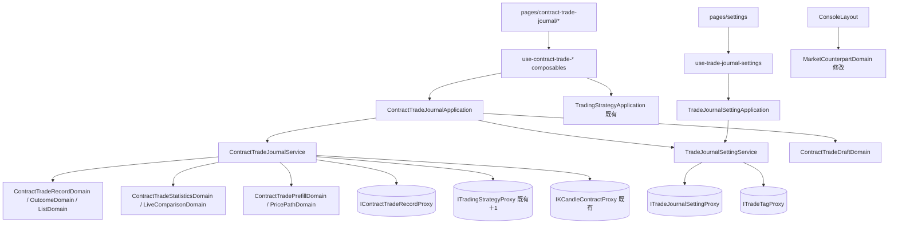

# 合約交易日誌（操作台）— Architecture Design

**Status:** Confirmed
**Source PRD:** `.sdd/2026-09-27-contract-trade-journal/PRD.md`
**Backend contract:** `go-trading/.sdd/2026-09-27-contract-trade-journal/ARCH.md`（路由、回傳形狀、錯誤狀態碼以它為準）
**Tech context:** Nuxt 3（`ssr: false`）· Vue 3 · TypeScript strict · decimal.js · lightweight-charts · SCSS token · Vitest · Clean / Onion（`.vue` 元件＝Controller、Application 純 TS、Domain 充血、Proxy 為唯一資料入口）

---

## 1. Design Goal & Guiding Principle

- **In one sentence:** 在操作台加上合約交易日誌的列表、記一筆（含從連結預填、加成交）、交易詳情（含價格路徑圖與檢討）、績效統計、實盤 vs 回測、手續費率與標籤設定；
  所有數字以交易服務回傳為準，畫面只負責把「可用／估算／不適用／算不出／已刪除」講清楚。
- **Guiding principle:** **「畫面自己算」只留在一個地方**——`ContractTradeDraftDomain`（記一筆的即時預覽與預填狀態）。
  其餘所有數字一律是交易服務算好的，由 `ContractTradeOutcomeDomain` / `ContractTradeStatisticsDomain` 把「值＋可用與否＋原因」轉成一句話與一種語氣。
  元件因此只綁 DTO 的 `text` 與 `tone`，永遠不判斷「這個數字要不要顯示成算不出」；後端改規則時，只有 proxy 與這兩個 domain 要動。

---

## 2. Change Scope

| Area | Action | What / Why |
| :--- | :--- | :--- |
| `pages/contract-trade-journal/`（`index`、`new`、`[id]`、`statistics`） | **Add** | 列表、記一筆（`?journalLink=` 預填）、詳情、統計＋實盤 vs 回測 |
| `components/organisms/ContractTrade*`、`TradeJournalSettingsPanel` | **Add** | 各頁的整塊區域 |
| `components/molecules/ContractTrade*`、`TradeTagPicker` | **Add** | 成交編輯、摘要、價格路徑圖、R 圖、預填說明、狀態徽章 |
| `application/contract-trade-journal-application.ts`、`trade-journal-setting-application.ts` | **Add** | 用例入口 |
| `domain/service/contract-trade-journal-service.ts`、`trade-journal-setting-service.ts` | **Add** | 編排 proxy、轉 DTO |
| `domain/models/{entities,domains,dto,vo}/…contract-trade…`、`trade-tag…`、`trade-journal-setting…` | **Add** | 資料與行為 |
| `domain/interface/i-contract-trade-record-proxy.ts`、`i-trade-journal-setting-proxy.ts`、`i-trade-tag-proxy.ts` ＋ 實作 | **Add** | 一個後端資源群一個 proxy |
| `domain/errors/contract-trade-*-error.ts`、`trade-tag-*-error.ts`、`journal-link-not-found-error.ts` | **Add** | 元件據以分流 |
| `composables/use-contract-trade-*.ts`、`use-trade-journal-settings.ts` | **Add** | 各頁畫面狀態（只呼叫 Application） |
| `components/templates/ConsoleLayout.vue` | **Modify** | `DESTINATIONS` 加「交易日誌」（`/contract-trade-journal`，nested）；`MORE_DESTINATIONS` 加入它；底部分頁列不動 |
| `domain/models/domains/market-counterpart-domain.ts` | **Modify** | 新增「只有一邊的去處」表：`/contract-trade-journal`（含更深一層）→ `side = contract`、`counterpartPath = null`、說明「交易日誌目前只有合約」→ 開關停在合約、按不動 |
| `domain/interface/i-trading-strategy-proxy.ts` ＋ `trading-strategy-proxy.ts` | **Modify** | 新增 `findContractTradeComparison(tradingStrategyId)`——路由掛在交易策略底下，屬同一個資源群 |
| `pages/settings/index.vue` | **Modify** | 多一段「交易日誌」（`TradeJournalSettingsPanel`），段落導覽多一格 |
| `plugins/dependencies.ts` | **Modify** | 組裝並 provide `$contractTradeJournalApplication`、`$tradeJournalSettingApplication` |
| `IKCandleContractProxy.findKCandleContractSeries` | **Not touched（重用）** | 價格路徑圖直接用既有合約彙總序列，不新增端點 |
| `KCandleChart.vue` | **Not touched** | 它要跟盤、要回報區間；價格路徑圖另立一個小分子，比照 `BacktestEquityCurveChart` 共用函式庫不共用元件 |
| 現貨任何頁面、機器人頁、助手 | **Not touched** | 日誌只有合約；助手不讀日誌 |
| `signed-in.global.ts` | **Not touched** | 既有「記下本來要去哪、登入後放回去」已涵蓋連結帶 query 的完整路徑（`to.fullPath`） |

---

## 3. New Classes / Modules

### 3.1 Proxy（`domain/interface/` 介面 ＋ `infrastructure/proxy/` 實作）

| Interface / 實作 | Methods | 端點 |
| :--- | :--- | :--- |
| `IContractTradeRecordProxy` / `ContractTradeRecordProxy` | `recordTrade`、`listTrades(query)`、`findTrade(id)`、`deleteTrade`、`addFill`、`amendFill`、`removeFill`、`amendPlan`、`addNote`、`writeReview`、`assignSetupTags`、`findStatistics(period)`、`findJournalLink(identifier)` | `/contract-trade-records/**` |
| `ITradeJournalSettingProxy` / `TradeJournalSettingProxy` | `findSetting`、`saveFeeRates` | `/users/me/trade-journal-settings` |
| `ITradeTagProxy` / `TradeTagProxy` | `listTags`、`createTag`、`renameTag`、`deleteTag` | `/users/me/trade-tags` |
| `ITradingStrategyProxy`（既有，加一個） | `findContractTradeComparison(tradingStrategyId)` | `/trading-strategies/:id/contract-trade-comparison` |

- 全部建在既有 `BackendApiProxy` 上；wire 型別（`ContractTradeRecordWire`、`ContractTradeOutcomeWire`…）只住在 proxy 檔內，數字字串→`Decimal`、時間字串→`Date`、缺欄位→`undefined`。
- 狀態碼對映（只在 proxy 內）：404→`ContractTradeNotFoundError` / `JournalLinkNotFoundError` / `TradeTagNotFoundError`；409→`ContractTradeOpenPositionExistsError`（帶既有交易 ID）、`TradeTagNameConflictError`、`TradeTagInUseError`（帶筆數）；400→`ContractTradeRejectedError`（帶交易服務原話與對應欄位）；其餘沿用 `BackendUnreachableError` / `BackendServerError`。
- Request 形狀（`ContractTradeRecordRequest`、`ContractTradeFillRequest`、`ContractTradePlanRequest`、`ContractTradeReviewRequest`、`TradeJournalSettingRequest`、`TradeTagRequest`）放 proxy 同層，由 write domain 的 `toRequest()` 產生。

### 3.2 Entities（`models/entities/`，只有欄位）

`ContractTradeRecord`（含 `fills`、`notes`、`tags`、`source`、`outcome`、`tradingStrategyName`、`tradingStrategyDeleted`）、`ContractTradeFill`、`ContractTradeNote`、`ContractTradeSource`、`ContractTradeOutcome`（每個數字＋`available`＋`unavailableReason`）、`ContractTradeRecordSummary`、`ContractTradeStatistics`、`ContractTradePrefill`、`ContractTradeLiveComparison`（列＋每列回測結果或失敗原因）、`TradeJournalSetting`、`TradeTag`。各帶 `toDomain()`。

### 3.3 VO（`models/vo/`）

`ContractTradeDirectionVo`（`long`/`short`）、`ContractTradeStatusVo`（`open`/`closed`/`reviewed`）、`ContractTradeFillKindVo`、`TradeFillLiquidityVo`、`TradeTagKindVo`、`ContractTradeStatisticsPeriodVo`（`7d`/`30d`/`90d`/`all`）、`ContractTradeSourceFilterVo`（`all`/`linked`/`selfJudged`）、`ContractTradeFigureVo`（`text`、`tone: 'success' | 'danger' | 'neutral' | 'muted'`、`note?`——一個呈現用數字）。

### 3.4 Domain Models（`models/domains/`）

| Name | Responsibility | Satisfies |
| :--- | :--- | :--- |
| `ContractTradeDraftDomain` | 記一筆／加成交表單的唯一計算處：成交列 → 持倉、進場均價、止損往上／往下幾個百分點、計畫風險、依費率自動帶出的手續費（手動填的優先、未設定費率時為 0 並附提示）；知道哪些欄位是**預填**的、進場價與數量是否「請改成實際成交」；`isDirty()`；`toRecordRequest()` / `toFillRequests()`。**不做業務拒絕判斷**（出場超過持倉、止損放錯邊交給交易服務原話） | US-03 即時預覽、預填、未儲存離開 |
| `ContractTradePrefillDomain` | 把交易服務的預填內容轉成 `ContractTradePrefillDto`：`mode = newTrade | addEntryFill`、要去哪一頁（新增或 `/contract-trade-journal/{id}?addFill=entry`）、上方說明（哪台機器人第幾輪、何時、參考價）、舊輪次沒有參考價時的原因 | US-04 |
| `ContractTradeRecordDomain` | 一筆交易的呈現行為：方向與槓桿標籤及語氣、狀態徽章語氣、來源文字（策略名／自行判斷／策略已刪除）、`planLocked`、`canWriteReview`、`canEditFills`、成交依時間排序、附註依時間排序 → `ContractTradeRecordDto` | US-02 每一筆、US-05 鎖定／關聯已刪除 |
| `ContractTradeOutcomeDomain` | 交易服務的結果 → 一組 `ContractTradeFigureVo`：淨損益語氣、「未設止損，算不出」「沒有結算資料，無法計算」「沒有行情資料，無法計算」「沒有最新價，無法估算」「還沒有交易規格，估不出」「估算」標註、淨損益未含資金費用的說明、滑點（只在有來源時） | US-05 結果區每一則 |
| `ContractTradeListDomain` | 摘要（期間、淨損益、勝率、平均 R、獲利因子、費用佔毛利；0 筆不顯示數字）、依狀態／來源／合約標的篩選、待檢討筆數、空狀態文字 | US-02 |
| `ContractTradeStatisticsDomain` | 統計 → `ContractTradeStatisticsDto`：每個數字的 figure（不適用寫「不適用」）、排除筆數說明、累積 R 點列、R 分布長條、失誤成本列、兩組比較、平均滑點（0 筆寫「沒有來自連結的交易」）、空狀態 | US-07 |
| `ContractTradeLiveComparisonDomain` | 每列：標的、實盤與回測的筆數與三種勝率、回測失敗原因、實盤勝率低於回測時的語氣與「低 N 個百分點」、策略已刪除／沒有已平倉實單的說明 | US-08 |
| `ContractTradePricePathDomain` | 由持倉期間與成交 → 取回計畫（`KCandleChartLoadPlanVo`，涵蓋第一筆進場到平倉或現在，前後留白）；由序列＋成交＋計畫 → 圖上要畫的蠟燭、進出場標記、止損止盈線、最大不利／最大有利位置；沒有行情時的說明 | US-05 價格路徑圖 |
| `TradeJournalSettingDomain` | 手續費率表單（不得為負的即時提示；送出仍以交易服務為準）、「未設定費率」提示文字 | US-09 |
| `TradeTagDomain` | 兩類分組、預設標籤標示、刪除被拒時的句子（含筆數） | US-06、US-09 |

### 3.5 DTOs（`models/dto/`）

`ContractTradeRecordDto`、`ContractTradeRecordSummaryDto`、`ContractTradeListDto`（摘要＋列＋待檢討數）、`ContractTradeOutcomeDto`、`ContractTradeDraftDto`（預覽）、`ContractTradePrefillDto`、`ContractTradeStatisticsDto`、`ContractTradeLiveComparisonDto`、`ContractTradePricePathDto`、`TradeJournalSettingDto`、`TradeTagDto`；輸入用 `ContractTradeListQueryDto`、`ContractTradeFillWriteDto`、`ContractTradePlanWriteDto`、`ContractTradeReviewWriteDto`、`TradeTagWriteDto`、`TradeFeeRatesWriteDto`。

### 3.6 Services / Applications

| Name | Public methods | Collaborators |
| :--- | :--- | :--- |
| `ContractTradeJournalService` | `listTrades`、`getTrade`、`recordTrade`、`addFill`、`amendFill`、`removeFill`、`amendPlan`、`addNote`、`writeReview`、`assignSetupTags`、`deleteTrade`、`openJournalLink`、`getStatistics`、`getLiveComparison`、`getPricePath` | `IContractTradeRecordProxy`、`ITradingStrategyProxy`、`IKCandleContractProxy` |
| `TradeJournalSettingService` | `getSetting`、`saveFeeRates`、`listTags`、`createTag`、`renameTag`、`deleteTag` | `ITradeJournalSettingProxy`、`ITradeTagProxy` |
| `ContractTradeJournalApplication` | 上述一對一；另 `startDraft(feeSetting, prefill?)` 回傳 `ContractTradeDraftDomain` 的 DTO 投影與更新入口（純 TS，不碰 ref） | `ContractTradeJournalService`、`TradeJournalSettingService` |
| `TradeJournalSettingApplication` | 上述一對一 | `TradeJournalSettingService` |

- `getTrade` 與 `getPricePath` 分開：詳情先呈現結果，圖在後面自己讀，讀不到只影響圖。
- `getLiveComparison` 由頁面在實盤區塊呈現後才呼叫，讓「重演中」只落在回測欄。

### 3.7 Composables（只呼叫 Application，持有畫面狀態）

| Name | 用途 |
| :--- | :--- |
| `use-contract-trade-journal.ts` | 列表：讀取中／連不上／空／篩選 |
| `use-contract-trade-draft.ts` | 記一筆與加成交：草稿、即時預覽、預填、儲存中、交易服務拒絕（欄位旁或表單上方）、`dirty` |
| `use-contract-trade-detail.ts` | 詳情：結果、計畫修改、附註、檢討、標籤、刪除、價格路徑 |
| `use-contract-trade-statistics.ts` | 期間切換、統計、實盤 vs 回測（策略從既有 `TradingStrategyApplication` 的合約交易策略清單挑） |
| `use-trade-journal-settings.ts` | 手續費率與標籤管理 |

### 3.8 Components

| 層 | Name | Responsibility |
| :--- | :--- | :--- |
| organism | `ContractTradeListPanel` | 摘要、篩選、列表（窄螢幕表格自己捲）、待檢討入口、空／讀取中／連不上 |
| organism | `ContractTradeForm` | 記一筆與加一筆成交共用（`mode` prop）：欄位、`ContractTradeFillEditor`、即時預覽、預填說明、拒絕原話、儲存 |
| organism | `ContractTradeOutcomePanel` | 結果區（figure 列表）＋ `ContractTradePricePathChart` 並排（窄螢幕上下） |
| organism | `ContractTradePlanPanel` | 計畫（鎖定時只讀並標示）＋附註 |
| organism | `ContractTradeReviewPanel` | 檢討與失誤標籤；持倉中顯示「平倉後才能檢討」 |
| organism | `ContractTradeStatisticsPanel` | 期間、摘要、累積 R、R 分布、失誤成本、兩組比較 |
| organism | `ContractTradeLiveComparisonPanel` | 策略挑選、每標的一列、重演中／失敗／策略已刪除／沒有已平倉實單 |
| organism | `TradeJournalSettingsPanel` | 手續費率、失誤與型態標籤管理（設定頁一段） |
| molecule | `ContractTradeFillEditor` | 多筆成交輸入；寬螢幕列、窄螢幕成交小卡；`＋ 加一筆成交` |
| molecule | `ContractTradeSummaryStrip` | 摘要一排 figure |
| molecule | `ContractTradePrefillBanner` | 預填說明（第幾輪、參考價、不在紀錄中、沒有參考價） |
| molecule | `ContractTradeStatusBadge` | 狀態／方向徽章（接 `AppBadge` 的 variant） |
| molecule | `ContractTradePricePathChart` | lightweight-charts：蠟燭、進出場標記、止損止盈線、MAE／MFE 標記；掛載後動態載入，比照 `BacktestEquityCurveChart` |
| molecule | `ContractTradeRMultipleChart` | 累積 R 線與 R 分布長條（同一函式庫；`drawing: 'cumulative' | 'distribution'`） |
| molecule | `TradeTagPicker` | 挑標籤、就地新增自訂標籤（名稱衝突原話呈現） |
| molecule | `ConfirmDialog`（既有） | 刪除與未儲存離開的頁面內確認 |

未儲存離開：頁面以 `onBeforeRouteLeave` 攔下 → 先取消這次換頁、打開 `ConfirmDialog` → 確認後以記下的目的地再 `navigateTo`（放行旗標避免再次攔截）。**不用 `window.confirm`**（PRD 要求頁面內確認；既有機器人頁仍用 `window.confirm`，不在此刀改）。

### 3.9 Pages

| Path | 內容 |
| :--- | :--- |
| `/contract-trade-journal` | `ContractTradeListPanel`；「記一筆」、「績效統計」入口 |
| `/contract-trade-journal/new` | `ContractTradeForm mode=newTrade`；有 `?journalLink=` 時先 `openJournalLink`：`addEntryFill` → `navigateTo('/contract-trade-journal/{id}?addFill=entry', { replace: true })`；找不到 → 空白表單＋說明；連不上 → 說明＋重試（不給空白表單） |
| `/contract-trade-journal/[id]` | 結果＋圖、計畫＋附註、檢討、成交（持倉中可改）、刪除；`?addFill=entry` 時直接展開加成交表單並帶入預填 |
| `/contract-trade-journal/statistics` | `ContractTradeStatisticsPanel` ＋ `ContractTradeLiveComparisonPanel` |

所有頁面 `layout: 'console'`，`consoleTitle` 為「合約交易日誌」系列。

---

## 4. Modified Components

| Component | Current role | Change needed |
| :--- | :--- | :--- |
| `ConsoleLayout.vue` | 導覽三份清單 | `DESTINATIONS` 加 `{ to: '/contract-trade-journal', label: '交易日誌', icon: 'journal', paths: ['/contract-trade-journal'], nested: true }`；`MORE_DESTINATIONS` 加入；需要時在 `AppIcon` 補 `journal` 圖示 |
| `MarketCounterpartDomain` | 有兩邊的去處對照 | 新增 `SINGLE_SIDED_DESTINATIONS = [{ path: '/contract-trade-journal', side: 'contract', label: '交易日誌目前只有合約' }]`：路徑相同或更深一層 → `new MarketCounterpartDto('contract', null, label)`；`MarketSwitch` 已會在 `counterpartPath = null` 時停用並顯示說明，不必改 |
| `ITradingStrategyProxy` / `TradingStrategyProxy` | 交易策略資源群 | 加 `findContractTradeComparison` |
| `pages/settings/index.vue` | 設定各段 | 多「交易日誌」一段與段落導覽一格 |
| `plugins/dependencies.ts` | 組裝根 | 新 proxy → service → application，provide 兩個 application |

---

## 5. Component Relationships

---

## 6. Extensibility & Handoff Notes

- **Most likely next requirement:** 現貨交易日誌。
- **Where it lands:** `MarketCounterpartDomain` 把 `/contract-trade-journal` 從「只有一邊」搬進 `COUNTERPART_PAIRS`（`spot: '/trade-journal'`），開關自動解鎖；
  `ContractTradeDraftDomain` 的帳本預覽（持倉、均價、手續費）不含合約概念，現貨 draft 可以同樣形狀另立；organisms 以 DTO 為輸入，現貨頁可重用列表、檢討、統計三塊。
- **How to add it:** 新 proxy（現貨端點群）→ 新 service → 新 application；頁面放 `/trade-journal`；**不要**在合約元件裡加市場種類開關。
- **Second likely:** 列表多一種篩選（依標籤）→ `ContractTradeListDomain` 加一個條件與 `ContractTradeListQueryDto` 一欄。
- **Third likely:** 交易服務新增一個「算不出」原因 → proxy 認得新原因碼、`ContractTradeOutcomeDomain` 加一句話；元件不動。
- **Patterns applied & why:** 呈現用 figure VO（值＋語氣＋說明）讓「估算／不適用／算不出」成為資料而不是元件裡的 `v-if` 分支；單一 draft domain 集中畫面自算；proxy 內對映錯誤，元件以哨兵錯誤分流。
- **Do not hardcode:** 期間選項、原因句子、預設失誤標籤名稱（以交易服務回傳為準，不寫死在畫面）。
- **Known debt / deferred:** 既有機器人頁仍用 `window.confirm`，與本刀的頁面內確認不一致——之後可抽成共用的離開確認 composable；實盤 vs 回測的策略挑選要使用者自己挑（交易服務目前不回「哪些策略有已平倉實單」），若常挑到空的，再請交易服務在統計裡帶出清單。

---

## 7. Traceability

| PRD Scenario | Fulfilled by |
| :--- | :--- |
| US-01 寬螢幕側欄有交易日誌／窄螢幕在「更多」裡 | `ConsoleLayout` `DESTINATIONS` / `MORE_DESTINATIONS` |
| US-01 交易日誌上的現貨／合約開關 | `MarketCounterpartDomain` 只有一邊的去處 ＋ 既有 `MarketSwitch` |
| US-02 列表上方的摘要 | `ContractTradeListDomain` ＋ `ContractTradeSummaryStrip` |
| US-02 每一筆呈現的內容／自行判斷的來源 | `ContractTradeRecordDomain`（summary）＋ `ContractTradeListPanel` |
| US-02 持倉中的浮動損益 | `ContractTradeOutcomeDomain`（估算標註） |
| US-02 待檢討一眼看得到／依狀態、來源與合約標的篩選 | `ContractTradeListDomain` |
| US-02 一筆都沒有／讀取中／連不上交易服務 | `use-contract-trade-journal` ＋ `ContractTradeListPanel` 三種狀態 |
| US-02 窄螢幕上的列表 | `ContractTradeListPanel`（表格自己捲） |
| US-03 多筆進場即時算出均價／填了止損即時顯示距離與計畫風險 | `ContractTradeDraftDomain` |
| US-03 手續費依費率自動帶出／尚未設定費率 | `ContractTradeDraftDomain` ＋ `TradeJournalSettingService.getSetting` |
| US-03 關聯交易策略只列出自己的合約交易策略 | 既有 `TradingStrategyApplication` 合約清單 ＋ `ContractTradeForm` |
| US-03 出場讓持倉歸零 | `use-contract-trade-draft` 儲存後依回傳狀態 `closed` 呈現「已平倉，可以寫檢討」 |
| US-03 出場超過持倉／止損放錯邊 | `ContractTradeRejectedError`（欄位＋原話）→ `ContractTradeForm` 欄位旁 |
| US-03 同一標的同一方向已有持倉中 | `ContractTradeOpenPositionExistsError`（帶 ID）→ 表單上方＋前往那一筆 |
| US-03 窄螢幕上的成交輸入 | `ContractTradeFillEditor` 成交小卡 |
| US-03 未儲存就離開要先確認 | `onBeforeRouteLeave` ＋ `ConfirmDialog` ＋ `ContractTradeDraftDomain.isDirty` |
| US-03 儲存中 | `use-contract-trade-draft.saving` → 儲存鍵停用 |
| US-04 預填那一輪的建議／改實際成交後儲存 | `ContractTradePrefillDomain` ＋ `ContractTradeDraftDomain` 預填標示 ＋ `ContractTradePrefillBanner` |
| US-04 改過內容但沒儲存就離開 | 同 US-03 離開確認 |
| US-04 已有持倉中時改為加成交 | `ContractTradePrefillDomain.mode = addEntryFill` → `[id]?addFill=entry` |
| US-04 那一輪已不在紀錄中／別人的機器人 | `JournalLinkNotFoundError`（交易服務兩者同回找不到）→ 空白表單＋說明；別人的不預填任何值 |
| US-04 舊的一輪沒有參考價 | `ContractTradePrefillDomain` 留白＋原因 |
| US-04 還沒登入 | 既有 `signed-in.global.ts`（`rememberRedirectTo(to.fullPath)` 保留 `journalLink`） |
| US-04 讀取預填內容中 | `use-contract-trade-draft` 預填讀取中狀態 |
| US-05 已平倉的詳情／來自連結的交易多呈現滑點與建議 | `ContractTradeOutcomeDomain` ＋ `ContractTradeRecordDomain.source` ＋ `ContractTradeOutcomePanel` |
| US-05 沒設止損／沒有結算資料／沒有行情資料／估不出強平價／沒有最新價 | `ContractTradeOutcomeDomain` 原因句子 |
| US-05 價格路徑圖 | `ContractTradePricePathDomain` ＋ `IKCandleContractProxy.findKCandleContractSeries` ＋ `ContractTradePricePathChart` |
| US-05 持倉中的浮動損益與預估強平價 | `ContractTradeOutcomeDomain`（估算） |
| US-05 平倉後計畫鎖定／持倉中可以修改計畫與成交 | `ContractTradeRecordDomain.planLocked / canEditFills` ＋ `ContractTradePlanPanel` |
| US-05 持倉中不能寫檢討 | `ContractTradeRecordDomain.canWriteReview` ＋ `ContractTradeReviewPanel` |
| US-05 關聯的策略已刪除 | `ContractTradeRecordDomain` 來源文字 |
| US-05 刪除要先確認 | `ConfirmDialog` ＋ `deleteTrade` → 回列表並公告 |
| US-05 別人的或已刪除的交易 | `ContractTradeNotFoundError` → 說找不到並回列表 |
| US-06 寫完檢討變成已檢討／執行評分只能 1 到 5 | `writeReview` ＋ `ContractTradeRejectedError` 原話 |
| US-06 在交易上新增一個型態標籤／標籤重名 | `TradeTagPicker` ＋ `TradeJournalSettingService.createTag` ＋ `TradeTagNameConflictError` |
| US-07 預設最近 30 天／統計頁的內容／有交易被排除在 R 之外／期間內沒有已平倉交易／不適用的數字／沒有來自連結的交易 | `ContractTradeStatisticsDomain` ＋ `ContractTradeStatisticsPanel` ＋ `ContractTradeRMultipleChart` |
| US-08 每個標的一列／重演中／其中一列重演失敗／策略已刪除／沒有已平倉實單／勝率偏離一眼看得出 | `ContractTradeLiveComparisonDomain` ＋ `ContractTradeLiveComparisonPanel` ＋ `ITradingStrategyProxy.findContractTradeComparison` |
| US-09 設定手續費率／還沒設定手續費率 | `TradeJournalSettingDomain` ＋ `TradeJournalSettingsPanel` |
| US-09 預設失誤標籤／改名 | `TradeTagDomain` ＋ `TradeJournalSettingService.listTags / renameTag` |
| US-09 刪除使用中的標籤 | `TradeTagInUseError`（帶筆數）→ `TradeTagDomain` 句子 |

---

## 8. Risks & Open Decisions

- **Risks / trade-offs:**
  - 實盤 vs 回測是一個請求同時回實盤與重演結果；「實盤先呈現、回測欄重演中」只能在交易服務回應前先顯示實盤欄的讀取樣式。若要真的先顯示實盤數字，需交易服務拆成兩段——目前接受「整列等重演、回測欄標重演中」的近似。
  - 價格路徑圖對長持倉會取彙總序列（刻度由系統決定），進出場標記落在最近的一根；可接受的近似。
  - 交易服務錯誤回應目前只有 `message`；「欄位旁」呈現需要知道是哪個欄位——先以訊息關鍵字對映欄位（比照 `strategy-bot-proxy` 的 hint 做法），對映不到時放表單上方。
- **Open decisions (for implementation):**
  - `AppIcon` 是否已有合適的日誌圖示（TBD，沒有就補一個）。
  - 統計頁的實盤 vs 回測預設選哪一份策略（TBD：預設不選、請使用者挑）。

---

## Appendix — 與後端 ARCH 定稿對齊

後端 ARCH 在本草稿之後補了三點，實作時以後端為準：

- 新增交易的請求把第一筆成交放在巢狀的 `firstEntryFill`。
- 成交時間可省略，省略時由交易服務以現在時刻記下並在回覆帶出；表單仍預設帶入現在時刻讓使用者看得到、改得動。
- 列出交易預設 20 筆、最多 200，回覆附總筆數；列表頁需要更多時明確帶 `limit`。

---

## Appendix — 實作時的調整

- **記一筆表單自己持有草稿狀態**：`ContractTradeForm` 在元件內呼叫 `useContractTradeDraft`，三個 Application 由頁面以 props 傳入（比照 `StrategyBotForm`）；表單交出 `saved`、`dirtyChange`、`redirect`（連結遇到已有持倉中時轉去 `[id]?addFill=entry&journalLink=`）。
- **詳情的計畫、檢討、成交修正由面板持有編輯中的值**，以事件把值交給 `useContractTradeDetail`（它的方法改收參數），避免在子元件裡改寫上層的狀態。
- **錯誤句子集中在 `ContractTradeFailureDomain`**（經兩個 Application 的 `describeFailure` 取得），畫面不再各自翻譯。
- **R 分布改以 CSS 長條呈現**（寬度比例由 `ContractTradeStatisticsDomain` 算好），`ContractTradeRMultipleChart` 只畫累積 R。
- **預填找不到時的說明合併**：交易服務對「那一輪已不在紀錄中」與「別人的機器人」都回找不到，畫面一律寫「找不到這一輪的建議（可能已不在紀錄中），請手動填寫。」並給空白表單。
- **未儲存離開的確認**由 `useLeaveConfirmation` 管理，頁面以 `onBeforeRouteLeave` ＋ `ConfirmDialog` 呈現。
- **列表篩選每次重讀**交易服務（篩選規則仍在 `ContractTradeListDomain`）。
- **同標的同方向衝突的交易編號**：優先讀交易服務回傳的 `openTradeId`，沒有時從訊息裡的 `#27` 讀出。
- **回傳形狀以交易服務實作為準**：新增交易的計畫巢狀在 `plan`；交易回應的計畫在 `plan`、標籤分 `setupTags`／`mistakeTags`、均價與持倉在頂層；`outcome` 的資金費用、最大不利／最大有利、浮動損益、強平價各是一組帶 `available` 與原因的物件，由 `ContractTradeRecordProxy` 收成各自的數字與原因（列表的極值與強平價一律「暫時算不出」，只在詳情呈現）；統計、預填（進場價即那一輪的參考價）、實盤 vs 回測的欄位名同樣只在 proxy 內對映。

---

## Appendix — 畫面對齊規劃草稿

四個畫面照規劃草稿（列表、記一筆、交易詳情、績效統計）的版面調整，元件層級因此多了幾個：

- **Atoms**：`AppRating`（一排點點選 1–N，信心與執行評分共用）；`AppInput`／`AppSelect` 多一個 `highlighted` 開關（框線換成強調色，用來標出預填的欄位），取代先前以 class 覆寫框線的做法。
- **Organisms**：原本的 `ContractTradePlanPanel` 拆成三塊，各自對應詳情頁上的一張卡——`ContractTradePlanPanel`（進場時的我：理由、計畫、信心、型態標籤，平倉後標示已鎖定）、`ContractTradeFillLedgerPanel`（成交，持倉中可修正與刪除）、`ContractTradeNotesPanel`（附註）。動作失敗的訊息改由頁面統一呈現。
- **Domain**：`ContractTradeEntrySlippageDomain`（記一筆時的「比參考價高／低 x%（滑點）」）、`ContractTradeHoldingDurationDomain`（詳情頁的持倉時長）；結果改成三組（費用、風險、極值）交給結果卡分段呈現；價格路徑多一條「進場均價」線，圖下列出每一條價位線與價格。
- **讀取欄位**：列表的來源欄在交易帶著來源快照時寫「機器人名 #第幾輪」，因此列表摘要多讀 `source`；統計多讀 `winCount` 以寫出「N 勝 M 敗」。

實盤 vs 回測另讀交易服務回傳的平均進場滑點（整份策略一個數字，每列的實盤也各一個，回測沒有），表格在實盤欄位旁多「實盤平均滑點」一欄，上方寫整份策略的平均滑點與筆數；沒有來自連結的實單時寫「不適用」。

草稿裡刻意沒做的：信號處置（照做／改了做／略過）與「存成計畫」、略過的信號與「若照做」、統計的四組處置比較——這些已移出範圍；實盤 vs 回測的平均 R、建議保證金、「提早出場留下多少 R」——交易服務沒有提供。
