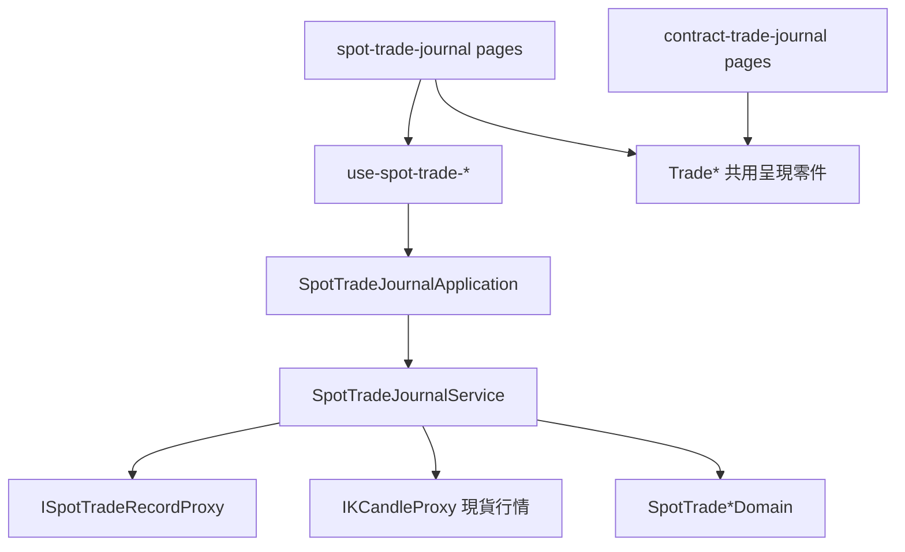

# 現貨交易日誌（操作台）— Architecture Design

**Status:** Confirmed
**Source PRD:** `.sdd/2026-09-27-spot-trade-journal/PRD.md`
**Tech context:** Nuxt 4 · Vue 3 · TypeScript · decimal.js · lightweight-charts · Vitest；Controller（.vue）→ Application → Domain ← Infrastructure（Proxy）

---

## 1. Design Goal & Guiding Principle

- **In one sentence:** 在合約交易日誌旁邊加一本現貨交易日誌（`/spot-trade-journal`），由頂列開關在兩本之間切換，並把合約日誌的畫面文字改成開倉／加倉／減倉／平倉。
- **Guiding principle:** **兩條線各自一套「資料與規則」，共用一套「呈現零件」。**
  現貨與合約的資料形狀與規則不同（方向、槓桿、費率、資金費用、強平 vs 市場、幣別、報酬率），所以各自有自己的 entity／Domain Model／Proxy／Service／Application；
  但「一格數字＋算不出的原因」、價格路徑圖、累積曲線、狀態徽章、附註、檢討、錯誤訊息這些**與市場無關的呈現**只有一份，改名為 `Trade*` 讓兩邊共用。
  下一本日誌（例如期權）只需要再做一套資料與規則，呈現零件直接拿來用。

---

## 2. Change Scope

| Area | Action | What / Why |
| :--- | :--- | :--- |
| 共用呈現零件（由 `ContractTrade*` 改名為 `Trade*`） | **Modify（rename）** | `TradeSummaryStrip`、`TradePricePathChart`、`TradeCumulativeChart`（原 R 曲線）、`TradeStatusBadge`、`TradeNotesPanel`、`TradeReviewPanel`；VO/DTO：`TradeFigureVo`、`TradeBadgeTone`、`TradeChartPointDto`、`TradeDistributionBarDto`、`TradePricePath*Dto`、`TradeNoteDto`、`TradeReviewDto`、`TradeMeasure`/`TradeUnavailableReason`/`TradeMeasureDomain`、`TradeNote`/`TradeReview`/`TradeSource` entity、`TradeHoldingDurationDomain`、`TradeLinkedStrategyDomain`、`TradeStatisticsPeriod`（vo＋domain）、`TradeFormField(Vo)`；錯誤 `TradeRecordNotFoundError`、`TradeAlreadyOpenError`、`TradeRejectedError`、`TradeFailureDomain/Dto` |
| `TradeNotesPanel`、`TradeReviewPanel` | **Modify** | props 由「整筆合約交易 DTO」收窄為它們真正用到的欄位（附註清單；檢討、能否檢討、不能檢討的原因、已貼的失誤標籤），兩本日誌都能用 |
| 合約日誌文字 | **Modify** | `ContractTradeRecordDomain` 依順序與持倉把每一筆標成開倉／加倉／減倉／平倉；表單、表格、價格路徑線、說明文字改用開倉價／平倉價、開倉均價／平倉均價，不再出現「成交」 |
| `MarketCounterpartDomain` | **Modify** | 交易日誌從「只有一邊」移到「兩邊都有」：`/spot-trade-journal` ↔ `/contract-trade-journal`；明細頁（`/…/:id`、`new`、`statistics`）的對應畫面是另一邊的列表 |
| `ConsoleLayout` | **Modify** | 側欄的交易日誌依目前那一邊指路（加入可兩邊切換的去處） |
| 設定頁 | **Modify** | 手續費率說明標明只用於合約日誌 |
| 現貨日誌 | **Add** | entity、Domain Model、DTO、VO、Proxy、Service、Application、composables、organisms、molecules、四個頁面（見 §3） |
| `TradeJournalSettingService/Application` | **Not touched** | 標籤兩本共用，沿用 |
| 合約日誌的資料與規則 | **Not touched** | 只改文字，不改 API 對接與計算 |

---

## 3. New Classes / Modules

| Name | Kind | Responsibility | Satisfies |
| :--- | :--- | :--- | :--- |
| `SpotTradeRecord`、`SpotTradeFill`、`SpotTradeOutcome`、`SpotTradeRecordSummary`、`SpotTradeRecordPage`、`SpotTradePrefill`、`SpotTradeStatistics`（含 `SpotTradeMarketStatistics`）、`SpotTradeLiveComparison`（含 row） | Entity | 交易服務回來的現貨資料；每個 entity 帶 `toDomain()` | 全部 |
| `SpotTradeMarket`（vo）＋`SpotTradeMarketDomain` | VO / Domain | 台股／加密貨幣的顯示名、幣別、數量是否必須是整數股 | US-02、US-04 |
| `SpotTradeStatusDomain` | Domain | 持有中／已平倉／已檢討的文字與語氣 | US-03 |
| `SpotTradeRecordDomain` | Domain | 一筆現貨交易的呈現：標題、狀態、市場、買進／賣出每一筆、鎖定、能否檢討、來源、結果 | US-02、US-03 |
| `SpotTradeOutcomeDomain` | Domain | 結果卡的數字與原因：淨損益、報酬率、手續費、R（算不出寫原因）、最大不利／有利、浮動損益；**沒有資金費用與強平** | US-03 |
| `SpotTradeDraftDomain` | Domain | 記一筆的即時預覽（持有、買進均價、止損往下幾個百分點、計畫風險、滑點）、台股整數股提示、轉成送出形狀、預填欄位辨識、是否改過 | US-02、US-05 |
| `SpotTradePrefillDomain` | Domain | 連結的四種情況（新增、加買進、加賣出、沒有持有中）與說明句 | US-05 |
| `SpotTradeListDomain`、`SpotTradeRecordSummaryDomain` | Domain | 列表摘要（依市場兩組）、篩選（狀態、來源、市場、標的）、待檢討數 | US-02 |
| `SpotTradeStatisticsDomain` | Domain | 依市場兩組的統計呈現、報酬率分布、失誤成本、兩組比較、平均 R 以幾筆計、不適用 | US-04 |
| `SpotTradeLiveComparisonDomain` | Domain | 現貨實盤 vs 回測的列與判讀、說明重演不計成本 | US-06 |
| `SpotTradePricePathDomain` | Domain | 取現貨行情的範圍與畫線（買進均價、止損、止盈、最大不利／有利） | US-03 |
| `ISpotTradeRecordProxy`／`SpotTradeRecordProxy` | Interface / Proxy | 對接 `/spot-trade-records` 全部路由與 `/trading-strategies/:id/spot-trade-comparison`，把 wire 正規化成 entity、把 400/404/409 轉成具名錯誤 | 全部 |
| `SpotTradeJournalService` | Service | 用例編排（同合約日誌的形狀） | 全部 |
| `SpotTradeJournalApplication` | Application | 入口 | 全部 |
| `use-spot-trade-journal`／`use-spot-trade-detail`／`use-spot-trade-statistics` | Composable | 畫面狀態 | 全部 |
| `SpotTradeListPanel`、`SpotTradeForm`、`SpotTradeFillLedgerPanel`、`SpotTradeOutcomePanel`、`SpotTradePlanPanel`、`SpotTradeStatisticsPanel`、`SpotTradeLiveComparisonPanel` | Organism | 現貨畫面區塊，版面沿用合約日誌 | 全部 |
| `SpotTradeFillEditor`、`SpotTradePrefillBanner` | Molecule | 買進／賣出輸入列（手續費自己填、台股整數股）；連結預填說明 | US-02、US-05 |
| `pages/spot-trade-journal/{index,new,[id],statistics}.vue` | Page | 四個頁面 | 全部 |

---

## 4. Modified Components

| Component | Current role | Change needed |
| :--- | :--- | :--- |
| `ContractTradeRecordDomain` | 每筆標「進場／出場」 | 依時間順序與累積持倉標「開倉／加倉／減倉／平倉」 |
| `ContractTradeFillEditor`、`ContractTradeForm`、`ContractTradeListPanel`、`ContractTradePricePathDomain`、`ContractTradeDraftDomain`、`ContractTradeFillLedgerPanel`、合約頁面 | 文字用「成交／進場均價」 | 改為開倉／平倉說法 |
| `MarketCounterpartDomain` | 日誌只有合約 | 日誌兩邊都有 |
| `plugins/dependencies.ts` | 組裝 | 加 `SpotTradeJournalApplication` |

---

## 5. Component Relationships

---

## 6. Extensibility & Handoff Notes

- **Most likely next requirement:** 現貨也要手續費率、或再多一本日誌。
- **Where it lands:** 新的一本只做自己的資料與規則；呈現一律用 `Trade*` 零件。
- **Do not hardcode:** 市場的整數股規則集中在 `SpotTradeMarketDomain`。
- **Known debt:** 現貨與合約的 Form／ListPanel 版面相似但各自一份（資料形狀不同，硬合會讓一個元件到處判斷市場）。

---

## 7. Traceability

| PRD Scenario | Fulfilled by |
| :--- | :--- |
| US-01 全部 | `MarketCounterpartDomain`、`ConsoleLayout` |
| US-02 記一筆（台股／加密／沒有方向槓桿／整數股／手續費留白／證交稅提示／已有持有中） | `SpotTradeForm`、`SpotTradeFillEditor`、`SpotTradeDraftDomain`、`SpotTradeMarketDomain`、`SpotTradeRecordProxy`（409→`TradeAlreadyOpenError`） |
| US-03 分批買賣、結果、止損邊、鎖定 | `SpotTradeRecordDomain`、`SpotTradeOutcomeDomain`、`SpotTradeOutcomePanel`、`SpotTradePlanPanel`、`SpotTradeFillLedgerPanel` |
| US-04 統計 | `SpotTradeStatisticsDomain`、`SpotTradeStatisticsPanel` |
| US-05 連結 | `SpotTradePrefillDomain`、`SpotTradePrefillBanner`、`SpotTradeForm` |
| US-06 對照 | `SpotTradeLiveComparisonDomain`、`SpotTradeLiveComparisonPanel` |
| US-07 合約用語 | `ContractTradeRecordDomain` 與合約元件文字 |

---

## 8. Risks & Open Decisions

- 後端同時開發中；欄位以 `spot-api-contract` 為準，數字欄位同時接受字串與數字。
- 改名範圍大，以型別檢查與既有測試保證沒漏。

---

## 9. Implementation Notes（實作與設計的差異）

- **共用零件比原設計多兩個**：`TradePlanPanel`、`TradeOutcomePanel` 也改成吃各自欄位的共用零件（原本只列附註與檢討），因此現貨沒有另寫計畫與結果面板；`TradePlanWriteDto`／`TradePlanInputDto`／`TradeReviewWriteDto`／`TradeSourceDto`／`TradeOutcomeDto`／`TradeStatus`／`TradeStatusFilter`／`TradeSourceFilter` 一併改為市場中立名稱。
- **價格路徑標記的種類**改用 `TradePricePathMarkerKind`（`entry`／`exit`），現貨把買進對到 `entry`、賣出對到 `exit`，圖表元件不必認識兩本日誌的名詞。
- **持有時長**：`TradeHoldingDurationDomain` 多一個「持倉／持有」用字參數，現貨寫「持有 N 天」。
- **報酬率帶正負號**：`JournalNumberDomain.signedPercentage` 讓正的報酬率寫成 `+6.47%`。
- **只有一邊的去處機制移除**：交易日誌改成兩邊都有之後已沒有任何只有一邊的畫面，`MarketCounterpartDomain` 的那段判斷一併拿掉；「更深一層也算那一邊」的規則擴充到 `-journal` 結尾的去處。
- **現貨實盤 vs 回測**沿用既有做法放在 `ITradingStrategyProxy.findSpotTradeComparison`（端點掛在交易策略底下）。
- `SpotTradeDraftDomain.toRecordSubmission` 裡「找不到第一筆買進」的防呆在規則上已被缺欄位檢查先擋下，保留它只為了讓型別完整。
