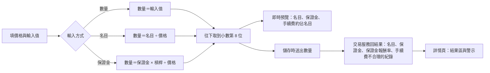

# Product Requirements Document (PRD) — 合約交易的部位大小（操作台）

**Status:** Finalized
**Version:** v1.0
**Owner:** James Hsueh
**Stakeholders:** Engineering

---

## 1. Background & Goal (Why & Goal)

- **Problem Statement:** 合約交易日誌的數量欄沒有單位，使用者用「一份」或「押多少 USDT」的心態填了 1，系統當成 1 顆 BTC，淨損益被放大約 750 倍。結果區只有損益，看不出部位大小；手續費明明對不上，也沒有任何提示。
- **Expected Outcome:**
  - 記一筆時看得到數量的單位，以及這一筆與整筆交易的名目、保證金。
  - 可以直接輸入名目或保證金，由操作台換算成數量。
  - 交易服務指出手續費與數量對不上時，詳情頁說出是哪幾筆。
  - 結果區有名目、保證金與保證金報酬率。
- **Out of Scope:** 現貨日誌；依交易規格的數量步進取整；修正已平倉交易的數量（仍是加附註或刪除重記）；統計頁。

交易服務端的規則見 `go-trading/.sdd/2026-09-28-contract-trade-position-sizing/PRD.md`。

---

## 2. User Personas

- **交易者**：在交易所手動下合約單後，回操作台記下這筆交易的人。

---

## 3. User Stories & Acceptance Criteria

### US-01 — 數量有單位，輸入時說出名目與保證金 [priority: P0]
**As a** 交易者, **I want** 數量欄寫出單位並即時算出名目與保證金, **so that** 填錯單位當場就看得出來。

```gherkin
Scenario: 數量欄寫出基礎資產
  Given 我在記一筆，合約標的填 BTCUSDT
  Then 數量欄的標籤是「數量（BTC）」

Scenario: 還沒填標的只寫數量
  Given 我在記一筆，合約標的留白
  Then 數量欄的標籤是「數量」

Scenario: 小卡預覽說出這一筆的名目與保證金
  Given 槓桿 2，第 1 筆開倉價 84,780.9、數量 1
  Then 第 1 張小卡的預覽是「名目 84,780.90・保證金 42,390.45」

Scenario: 填了手續費時說出它佔名目多少
  Given 第 1 筆開倉價 84,780.9、數量 1、手續費 0.05
  Then 第 1 張小卡另顯示「手續費約佔名目 0.000059%」

Scenario: 底部預覽有整筆交易的名目與保證金
  Given 槓桿留白，第 1 筆開倉價 100、數量 2
  Then 底部預覽顯示名目 200.00 與保證金 200.00
```

### US-02 — 用名目或保證金輸入 [priority: P0]
**As a** 交易者, **I want** 直接填我押的 USDT, **so that** 不必自己換算成幾顆 BTC。

```gherkin
Scenario: 用保證金輸入會換算成數量送出
  Given 槓桿 2，第 1 筆選「保證金 USDT」，填 56.40、開倉價 84,780.9
  When 我儲存
  Then 送出的開倉數量是 0.00133048

Scenario: 用名目輸入時預覽說出換算的數量
  Given 第 1 筆選「名目 USDT」，填 112.80、開倉價 84,780.9
  Then 第 1 張小卡的預覽以「≈ 0.00133048 BTC」開頭

Scenario: 換算需要價格
  Given 第 1 筆選「保證金 USDT」、填 56.40，開倉價留白
  When 我儲存
  Then 被拒絕：「第 1 筆的價格與數量要填大於零的數字」

Scenario: 加倉到既有交易時用那筆交易的槓桿
  Given 一筆槓桿 5 的持倉中交易
  And 我加一筆開倉，選「保證金 USDT」，填 20、開倉價 100
  When 我儲存
  Then 送出的開倉數量是 1
```

### US-03 — 手續費與數量對不上時說出來 [priority: P0]
**As a** 交易者, **I want** 詳情頁指出手續費對不上的那幾筆, **so that** 我知道數量可能記錯了。

```gherkin
Scenario: 交易服務指出的紀錄出現在警示與清單上
  Given 交易服務指出這筆交易的第 1 筆與第 2 筆手續費不合理
  When 我打開這筆交易
  Then 結果區上方警示「第 1、2 筆的手續費與數量對不上，數量可能記錯了（數量的單位是 BTC）」
  And 開平倉紀錄清單裡那兩筆標示「手續費與數量對不上」

Scenario: 沒有被指出時不警示
  Given 交易服務沒有指出任何一筆
  When 我打開這筆交易
  Then 不顯示手續費警示
```

### US-04 — 結果區有名目、保證金與保證金報酬率 [priority: P0]

```gherkin
Scenario: 已平倉的交易有保證金報酬率
  Given 一筆已平倉交易，保證金報酬率 −0.33
  When 我看結果區
  Then 保證金報酬率顯示「−0.33%」，以虧損色呈現
  And 毛損益之前有名目與保證金

Scenario: 持倉中不適用
  Given 一筆持倉中交易
  When 我看結果區
  Then 保證金報酬率顯示「持倉中不適用」
```

---

## 4. Business Flow



---

## 5. Non-Functional Requirements

- 輸入方式只存在畫面上，不送給交易服務、不記住；每一張新小卡都從「數量」開始。
- 即時預覽照舊是畫面唯一自己算的數字，儲存後一律以交易服務回來的為準。
