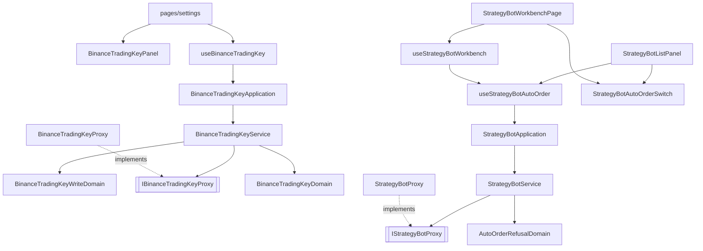

# 幣安自動下單設定（網頁）— Architecture Design

**Status:** Confirmed（自主決定）
**Source PRD:** `.sdd/2026-10-01-binance-auto-order-setup/PRD.md`
**Tech context:** Nuxt 4 · Vue 3 `<script setup>` · TypeScript strict · Clean/Onion（`.vue` → Application → Domain ← Infrastructure Proxy）· Vitest

---

## 1. Design Goal & Guiding Principle

- **In one sentence:** 設定畫面多一段讀寫幣安交易金鑰的卡片（照 Telegram 投遞那一段的形狀），現貨與合約機器人多一顆只反映交易服務狀態的自動下單開關，兩者的每一種拒絕都照交易服務原話呈現。
- **Guiding principle:** **交易服務說了算，畫面不猜。** 開關是受控元件（`AppSwitch` 的值永遠綁伺服器回來的 `autoOrderEnabled`，按下只發請求），拒絕原因以交易服務帶的 `reason`／`failureReason` 值分辨（不讀措辭），金鑰變動後的狀態靠每次掛載重讀。開關的狀態與拒絕翻譯收在**一個** composable + **一個** molecule，清單與編輯頁共用，下一刀「真的下單」只改一處。

---

## 2. Change Scope

| Area | Action | What / Why |
| :--- | :--- | :--- |
| `BackendApiProxy` / `BackendRequestRejectedError` / `BackendServerError` | **Modify** | 把回應裡的 `reason`（或 `failureReason`）帶上錯誤物件的 `reason` 欄位。幣安確認失敗的 502/504 是伺服器端狀態碼，連同 409 的自動下單拒絕，都要靠這個值分辨，不能讀措辭 |
| 幣安交易金鑰（entity / VO / domain / DTO / proxy / service / application / composable / organism） | **Add** | 照 Telegram 投遞那一條線長一條平行的線 |
| `pages/settings/index.vue` | **Modify** | 接上新的一段與段落導覽一格 |
| `StrategyBot` entity / `StrategyBotDto` / `StrategyBotDomain` / `StrategyBotProxy` / `IStrategyBotProxy` | **Modify** | 多一個 `autoOrderEnabled` 欄位；proxy 多 `enableAutoOrder` / `disableAutoOrder` 兩條路與 409 的拒絕翻譯 |
| `StrategyBotService` / `StrategyBotApplication` | **Modify** | 多兩個用例：`enableAutoOrder`（回結果 DTO，拒絕是答案不是例外）、`disableAutoOrder` |
| `useStrategyBotAutoOrder` + `StrategyBotAutoOrderSwitch` | **Add** | 開關的狀態與畫面，清單與編輯頁共用 |
| `StrategyBotListPanel` | **Modify** | 開著的那幾列掛「自動下單」標記；選中那一台展開的那一塊（側欄與手機內嵌）放開關 |
| `StrategyBotWorkbenchPage` / `useStrategyBotWorkbench` | **Modify** | 編輯既有機器人時在表單上方放開關（獨立於表單、不需儲存）；新建時不出現 |
| `StrategyBotForm` / `StrategyBotWriteDomain` | **Not touched** | 自動下單不是表單的一格——它有自己的子資源，新機器人一律關閉 |
| `TelegramDeliveryPanel` / `useTelegramDelivery` | **Not touched** | 只照抄形狀，不抽共用（兩段的欄位、等待狀態與確認文字都不同，硬抽會得到一個布林旗標滿天飛的元件） |
| 機器人清單的快取 / store | **Not touched** | 沒有快取：清單與編輯頁都在 `onMounted` 重讀，因此金鑰變動後打開機器人畫面必然是最新狀態 |

---

## 3. New Classes / Modules

| Name | Kind | Responsibility (purpose) | Collaborators | Satisfies |
| :--- | :--- | :--- | :--- | :--- |
| `BinanceTradingKey` | Entity | 交易服務交出的那一份金鑰設定：`configured`、`apiKeyTail`、`tradableMarkets`、`configuredAt`。**沒有 Secret Key 的位置** | — | US-01 全部 |
| `TradableMarketVo` + `TRADABLE_MARKETS` | VO | `'spot' \| 'contract'` 與其正規順序 | — | 例 1、例 11 |
| `BinanceTradingKeyDomain` | Domain Model | 已設定時的 API Key 句子（「結尾 a1b2」／空白時「已設定」）、可交易市場標籤（依現貨、合約排序並丟掉認不得的值）、未設定時的 `configuredAt = null` | `BinanceTradingKeyDto` | 例 1、例 3 |
| `BinanceTradingKeyDto` | DTO | 畫面看得到的那一份 | — | US-01、US-02 |
| `BinanceTradingKeyWriteDto` | DTO | 要送出去的兩格，只往外走 | — | 例 1 |
| `BinanceTradingKeyWriteDomain` | Domain Model | 兩格去前後空白；哪一格空白（先 API Key 再 Secret Key，與交易服務同序）與那一句話 | `BinanceTradingKeyFieldError` | 例 2、API Key 空白 |
| `BinanceTradingKeyField` | VO | `'apiKey' \| 'secretKey'` | — | 例 2 |
| `BinanceTradingKeyFieldError` | 哨兵錯誤 | 某一格不合規則（畫面先擋的空白，與交易服務 400 的那幾句）；帶 `field` 讓畫面掛在那一格 | — | 例 2 |
| `BinanceTradingKeyVerificationError` | 哨兵錯誤 | 幣安確認沒過：帶交易服務原話與 `reason`（`TradingKeyVerificationFailureVo`）。與「連不上交易服務」分開 | — | 例 3、例 4、連不上幣安／等太久 |
| `TradingKeyVerificationFailureVo` | VO | `keyRejected / noTradingPermission / unreachable / timedOut` | — | 同上 |
| `IBinanceTradingKeyProxy` / `BinanceTradingKeyProxy` | 介面 / Proxy | `fetchTradingKey` / `saveTradingKey` / `removeTradingKey`；400 → `BinanceTradingKeyFieldError`（依原話指名哪一格，認不出就不指名）、422/502/504 帶 `failureReason` → `BinanceTradingKeyVerificationError`、503 → `SecretSealUnavailableError`（沿用） | `BackendApiProxy` | US-01、US-02 |
| `BinanceTradingKeyService` | Domain Service | 讀、存（先過 `BinanceTradingKeyWriteDomain`，空白不送出）、移除 | proxy | US-01、US-02 |
| `BinanceTradingKeyApplication` | Application | 三個用例的入口 | service | — |
| `useBinanceTradingKey` | Composable | 那一段的畫面狀態：讀取中／讀不到、兩格、換一組／取消、存入中、兩格各自的錯誤、段落錯誤、移除；失敗時 `setting` 不動 | application、哨兵錯誤 | US-01、US-02 |
| `BinanceTradingKeyPanel` | Organism | 那一段的畫面（照 `TelegramDeliveryPanel` 的版型），含移除確認與「可交易市場只記存入當下」說明 | `SettingsSection`、`FormField`、`AppInput`、`ConfirmDialog` | US-01、US-02 |
| `AutoOrderRefusalReasonVo` | VO | `binanceTradingKeyNotConfigured / tradableMarketNotCovered / binanceTradingKeyChanged` | — | 例 7、例 8 |
| `AutoOrderRefusedError` | 哨兵錯誤 | proxy 認出的 409 自動下單拒絕，帶原話與 `reason` | — | 例 7、例 8 |
| `AutoOrderRefusalDomain` | Domain Model | 一次拒絕在畫面上是什麼：原話、是哪一台、要不要附「去設定」的路（只有缺金鑰那一種） | `AutoOrderRefusalDto` | 例 7、例 8、金鑰剛被換過 |
| `AutoOrderRefusalDto` | DTO | `strategyBotId`、`message`、`offersBinanceTradingKeySettings` | — | 同上 |
| `AutoOrderSwitchResultDto` | DTO | 打開的結果：成功時是那一台（`StrategyBotDto`），被拒時是 `AutoOrderRefusalDto`；二者恰有一個 | — | 例 7、例 8、例 9 |
| `useStrategyBotAutoOrder` | Composable | 開關的唯一編排：哪一台在送、被拒那一句、其他失敗；`switchAutoOrder(id, enabled)` 回新的那一台或 `null` | `StrategyBotApplication` | US-03 |
| `StrategyBotAutoOrderSwitch` | Molecule | 受控的 `AppSwitch`（值綁伺服器狀態）、旁邊一行「尚未生效：目前機器人仍只送 Telegram 通知，不會下單」、拒絕訊息與缺金鑰時的「去設定」連結 | `AppSwitch`、`AppAlert` | US-03 |

---

## 4. Modified Components

| Component | Current role | Change needed |
| :--- | :--- | :--- |
| `BackendApiProxy.sendRequest` | 把失敗翻成 `BackendRequestRejectedError` / `BackendServerError` | `BackendFailure.data` 多讀 `reason`、`failureReason`，以 `reason ?? failureReason` 交給兩種錯誤的新欄位 `reason` |
| `BackendRequestRejectedError`、`BackendServerError` | 帶狀態碼等 | 多一個 `reason: string \| undefined` |
| `StrategyBot`（entity） | 機器人原樣 | 建構子尾端多 `autoOrderEnabled = false` |
| `StrategyBotProxy` | 七條路與失敗翻譯 | wire 多 `autoOrderEnabled?`；`enableAutoOrder(id)`（POST）/`disableAutoOrder(id)`（DELETE）打 `/strategy-bots/:id/auto-order`（合約機器人同一條路，交易服務分支已核對）；`strategyBotFailureOf` 在既有 409 分流之前先認 `reason` 是不是自動下單拒絕 |
| `StrategyBotDomain` / `StrategyBotDto` | 機器人畫面形狀 | DTO 多 `autoOrderEnabled`（預設 false，排在既有預設參數之後） |
| `StrategyBotService` / `StrategyBotApplication` | 機器人用例 | `enableAutoOrder(id): AutoOrderSwitchResultDto`（捕捉 `AutoOrderRefusedError` 轉成結果）、`disableAutoOrder(id): StrategyBotDto` |
| `StrategyBotListPanel` | 清單 | 開著的列掛 `AppBadge`「自動下單」；側欄 detail 與手機內嵌那一塊在紀錄之上放 `StrategyBotAutoOrderSwitch`；成功後重讀清單 |
| `useStrategyBotWorkbench` / `StrategyBotWorkbenchPage` | 編輯頁 | 讀到一台時記下 `autoOrderEnabled`；編輯既有機器人才畫開關；成功後只更新那個值（**不換 `editing`**，免得洗掉表單上沒存的字） |
| `pages/settings/index.vue` | 設定頁接線 | 加 `useBinanceTradingKey()`、段落導覽「幣安交易金鑰」（錨點 `settings-binance-trading-key`）、`BinanceTradingKeyPanel` |
| `plugins/dependencies.ts` | 組裝根 | 組 `BinanceTradingKeyApplication` 並 provide |

---

## 5. Component Relationships

---

## 6. Extensibility & Handoff Notes

- **Most likely next requirement:** 下一刀真的開始下單——「尚未生效」那一句要拿掉，開關旁可能要顯示下單結果；或交易服務開始交出「被自動關掉的機器人」名單。
- **Where it lands:** 開關的一切都在 `StrategyBotAutoOrderSwitch`（畫面）與 `useStrategyBotAutoOrder`（狀態）；拿掉那一句只改 molecule 一處。新拒絕原因只加進 `AutoOrderRefusalReasonVo` 的清單，`AutoOrderRefusalDomain` 決定它要不要附路。被關掉的名單會出現在 `BinanceTradingKey` entity 與 `BinanceTradingKeyDomain`，panel 多畫一塊。
- **How to add it:** 新原因 → 加一個字面值；新的「附什麼路」→ 在 `AutoOrderRefusalDomain` 多一個布林，molecule 畫它。
- **Patterns applied & why:** 結果 DTO（比照「試送一則訊息」）——拒絕是預期中的業務答案，不讓每個呼叫端自己從例外堆裡挑；受控開關——畫面永遠不先翻面，避免「看起來開了其實沒開」。
- **Do not hardcode:** 拒絕原因的分辨一律靠 `reason`／`failureReason` 值；只有 400 的「哪一格」因交易服務沒給欄位名而從原話認（認不出就掛在段落上）。
- **Known debt / deferred:** 交易服務的幾句拒絕帶英文內部前綴，畫面照原話顯示；若交易服務拿掉前綴，畫面不必改。

---

## 7. Traceability

| PRD Scenario | Fulfilled by |
| :--- | :--- |
| 第一次存入（例 1） | `BinanceTradingKeyService.saveTradingKey` + `BinanceTradingKeyDomain`（結尾、可交易市場標籤）+ `useBinanceTradingKey.saving` + `BinanceTradingKeyPanel`（確認中、按不下去） |
| Secret Key / API Key 留空（例 2） | `BinanceTradingKeyWriteDomain` + `BinanceTradingKeyFieldError` + panel 的欄位錯誤 |
| 沒有任何交易權限（例 4）、連不上幣安／等太久 | `BinanceTradingKeyProxy` → `BinanceTradingKeyVerificationError` + `useBinanceTradingKey` 照原話 |
| 系統目前存不了 | proxy → `SecretSealUnavailableError` + composable 補一句不是你填錯 |
| 讀不到不假裝未設定 | `useBinanceTradingKey.loadErrorMessage` |
| 換一組被拒仍是原本那一組（例 3） | `useBinanceTradingKey.save`（失敗不動 `setting`） |
| 換一組兩格空的（例 5）／取消 | `useBinanceTradingKey.startEditing` / `cancelEditing` |
| 移除並確認（例 6）／取消確認 | `BinanceTradingKeyPanel` 的 `ConfirmDialog` + `useBinanceTradingKey.remove`；機器人畫面掛載重讀 |
| 換存只開現貨（例 11） | 交易服務關掉甲；`useStrategyBots.load` / `useStrategyBotWorkbench.load` 掛載重讀 |
| 執行中打開（例 9） | `StrategyBotService.enableAutoOrder` + `StrategyBotAutoOrderSwitch`（不因執行狀態停用、尚未生效那一句） |
| 沒有金鑰被拒（例 7） | `StrategyBotProxy` → `AutoOrderRefusedError` → `AutoOrderRefusalDomain`（附去設定） + molecule 連結 |
| 沒有合約權限（例 8） | 同上，不附連結 |
| 金鑰剛被換過 | 同上；開關仍綁伺服器狀態，可再按 |
| 關掉永遠可以（例 10） | `StrategyBotService.disableAutoOrder` + `useStrategyBotAutoOrder`（關掉不經任何確認） |
| 清單看得出哪幾台開著 | `StrategyBotDto.autoOrderEnabled` + `StrategyBotListPanel` 標記 |
| 新建沒有開關 | `StrategyBotWorkbenchPage`（`strategyBotId === null` 不畫） |

---

## 8. Risks & Open Decisions

- **Risks / trade-offs:** 開關放兩處（編輯頁與清單上選中那一塊）——為了讓執行中的機器人也碰得到；兩處共用同一個 composable 與 molecule，所以不會漂移。400 的「哪一格」靠原話認，是交易服務沒給欄位名的權宜。
- **Open decisions (for implementation):** 無。
