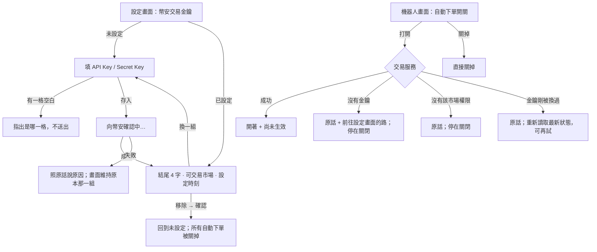

# Product Requirements Document (PRD)

**Feature:** 幣安自動下單設定（網頁）
**Status:** Draft
**Version:** v1.0
**Owner:** James Hsueh
**Stakeholders:** Engineering

---

## 1. Background & Goal (Why & Goal)

- **Problem Statement:**
  交易服務這一輪多了兩件「真的下單之前要先準備好」的事：使用者自己的一組**幣安交易金鑰**，
  以及每台策略機器人身上的**自動下單**開關。操作台上一顆鍵都沒有——
  使用者無從存入金鑰、無從看見目前存的是哪一組、也無從打開或關掉任何一台機器人的自動下單。
  更要緊的是：這一刀**還不下任何一張單**。開關打開之後機器人仍然只送 Telegram，
  若畫面沒有講清楚，使用者會以為機器人已經在用他的錢交易。

- **Expected Outcome:** 可驗證的結果有六項：
  1. 設定畫面多一段**幣安交易金鑰**：存得進去、看得到結尾 4 個字與**可交易市場**與設定時刻、換得掉、移除得掉；**Secret Key 一個字都不顯示**。
  2. 存入時畫面明說**正在向幣安確認**，確認期間存入鍵按不下去。
  3. 存不成時照交易服務的原話說出原因，且**畫面上仍是原本那一組**；兩格空白時指出是哪一格。
  4. 現貨與合約機器人都能**打開或關掉自動下單**，不論它正在執行還是已停止；**關掉永遠沒有前提**。
  5. 打開被拒時照原話說出原因；缺金鑰時**給一條到設定畫面的路**；開關停在關閉。
  6. 每一個自動下單開關旁都寫著「**尚未生效：目前機器人仍只送 Telegram 通知，不會下單**」；
     清單上看得出哪幾台開著；換掉或移除金鑰之後，機器人畫面照交易服務的最新狀態呈現。

- **Out of Scope:**
  - 真的下單、顯示下單結果或成交紀錄。
  - 一位使用者多組金鑰，或不同機器人選不同金鑰。
  - 「不要開提現權限」以外的權限稽核。
  - 被自動關掉的機器人的通知或記號，以及在設定畫面上列出「哪幾台被關掉」（交易服務沒有交出這份名單）。
  - 在新建機器人的畫面上放開關——新機器人一律關閉，建好之後再開。

---

## 2. User Personas

- **Primary Role(s):** 已登入的操作台使用者（也是機器人的主人）。只有他自己在瀏覽器裡看得到、改得動自己的幣安交易金鑰；助手對話碰不到它。
- **Usage Context:** 桌機或手機瀏覽器。通常是先在幣安開好一組 API 金鑰、複製貼上進設定畫面，接著去機器人畫面挑幾台打開自動下單。

---

## 3. User Stories & Acceptance Criteria

### US-01 — 存入並查看幣安交易金鑰 [priority: P0]
**As a** 使用者, **I want** 在設定畫面存入一組幣安交易金鑰並看見它目前的樣子,
**so that** 之後的機器人能用它，而且我認得出存的是哪一組。

```gherkin
Scenario: 第一次存入，幣安確認只可交易現貨（例 1）
  Given 尚未設定幣安交易金鑰
  When 使用者填入 API Key 與 Secret Key 並按下存入
  And 幣安確認這組金鑰有效、可交易：現貨
  Then 等待期間畫面顯示「向幣安確認中」且存入鍵按不下去
  And 完成後顯示 API Key 結尾 4 個字、可交易市場「現貨」與設定時刻
  And 畫面上沒有任何一段 Secret Key

Scenario: Secret Key 留空就按存入（例 2）
  Given 尚未設定幣安交易金鑰
  When 使用者只填 API Key、Secret Key 留空就按下存入
  Then 在 Secret Key 那一格指出「必須給 Secret Key」
  And 沒有向交易服務送出任何東西

Scenario: API Key 留空就按存入
  Given 尚未設定幣安交易金鑰
  When 使用者只填 Secret Key、API Key 留空就按下存入
  Then 在 API Key 那一格指出「必須給 API Key」

Scenario: 幣安說兩種交易權限都沒開（例 4）
  Given 任何狀態
  When 使用者存入一組金鑰，幣安說它沒有任何交易權限
  Then 照原話顯示交易服務說的「這組金鑰沒有任何交易權限」那一句

Scenario: 連不上幣安或等太久
  Given 任何狀態
  When 使用者存入一組金鑰，交易服務說連不上幣安（或等幣安等太久）
  Then 照原話顯示那一句，且說得出是「連不上幣安」還是「等太久」

Scenario: 系統目前存不了
  Given 任何狀態
  When 使用者存入一組金鑰，交易服務說它目前無法安全保存金鑰
  Then 照原話顯示那一句，並說明這不是使用者填錯了什麼

Scenario: 讀不到目前設定時不假裝未設定
  Given 交易服務暫時連不上
  When 使用者打開設定畫面
  Then 幣安交易金鑰那一段說讀不到，而不是顯示「尚未設定」
```

### US-02 — 換一組或移除幣安交易金鑰 [priority: P0]
**As a** 使用者, **I want** 換掉或移除已存的那一組,
**so that** 金鑰外洩或權限改了時，我能立刻處理。

```gherkin
Scenario: 換一組被幣安拒絕，畫面仍是原本那一組（例 3）
  Given 已存一組結尾 a1b2 的金鑰
  When 使用者點「換一組」，填入新的一組並存入，幣安說金鑰不被接受
  Then 照原話顯示「金鑰不被接受」那一句
  And 畫面仍顯示結尾 a1b2 那一組，而不是「尚未設定」

Scenario: 換一組時兩格都是空的（例 5）
  Given 已存一組金鑰
  When 使用者點「換一組」
  Then API Key 與 Secret Key 兩格都是空的，沒有預填任何舊值

Scenario: 換一組時取消
  Given 已存一組金鑰，使用者點了「換一組」並填了一半
  When 使用者按取消
  Then 畫面回到已存那一組的樣子，填了一半的字被丟掉

Scenario: 移除並確認，所有自動下單一併關掉（例 6）
  Given 已存一組金鑰，且兩台機器人開著自動下單
  When 使用者點移除
  Then 先跳出確認，說明所有開著自動下單的機器人會一併被關掉
  When 使用者確認
  Then 設定段落回到「尚未設定」
  And 之後打開機器人畫面，那兩台的開關都顯示關閉

Scenario: 移除時取消確認
  Given 已存一組金鑰
  When 使用者點移除，然後在確認時取消
  Then 什麼都沒有改變，仍顯示已存那一組

Scenario: 換存只開現貨的新金鑰（例 11）
  Given 舊金鑰可交易現貨與合約，合約機器人甲與現貨機器人乙都開著自動下單
  When 使用者換存一組只可交易現貨的新金鑰，存入成功
  Then 之後打開合約機器人畫面，甲顯示關閉
  And 打開現貨機器人畫面，乙顯示開著
```

### US-03 — 在機器人上打開或關掉自動下單 [priority: P0]
**As a** 使用者, **I want** 在每一台現貨與合約機器人上打開或關掉自動下單,
**so that** 我先準備好哪幾台將來要替我下單，又不會誤以為它們已經在下單。

```gherkin
Scenario: 執行中的現貨機器人打開自動下單（例 9）
  Given 金鑰可交易：現貨，現貨機器人正在執行
  When 使用者在那一台的畫面上打開自動下單
  Then 開關顯示開著
  And 開關旁標示「尚未生效：目前機器人仍只送 Telegram 通知，不會下單」

Scenario: 沒有金鑰時打開被拒（例 7）
  Given 沒有幣安交易金鑰
  When 使用者在現貨機器人畫面上打開自動下單
  Then 照原話顯示要先完成幣安交易金鑰設定，並給一條前往設定畫面的路
  And 開關停在關閉

Scenario: 金鑰沒有合約交易權限時打開合約機器人被拒（例 8）
  Given 金鑰可交易：現貨
  When 使用者在合約機器人畫面上打開自動下單
  Then 照原話顯示這組金鑰沒有合約交易權限
  And 開關停在關閉

Scenario: 確認期間金鑰剛好被換掉
  Given 使用者按下打開的同時，金鑰被換掉了
  When 交易服務說金鑰剛被換過、請再試一次
  Then 照原話顯示那一句，開關照交易服務的最新狀態呈現，使用者可以再按一次

Scenario: 關掉永遠可以（例 10）
  Given 任何情況（有沒有金鑰、執行中或已停止）
  When 使用者關掉自動下單
  Then 直接關掉，沒有任何確認或前提擋住
  And 開關顯示關閉

Scenario: 清單看得出哪幾台開著
  Given 清單上有三台，其中一台開著自動下單
  When 使用者打開機器人清單
  Then 只有那一台標出「自動下單」

Scenario: 新建機器人的畫面沒有開關
  Given 使用者正在新建一台機器人
  When 他看著那張表單
  Then 畫面上沒有自動下單開關
```

---

## 4. Business Flow & Logic



- **Core Business Rules:**
  - **Secret Key 永遠讀不回來**：已設定時畫面只呈現 API Key 結尾 4 個字（交易服務給什麼就照抄；它給空白時只說「已設定」）、可交易市場與設定時刻。
  - **可交易市場**依「現貨、合約」的順序呈現：只有現貨 →「現貨」、只有合約 →「合約」、兩者 →「現貨、合約」。
  - 此段旁說明：**可交易市場只記存入當下的狀態**，在幣安那邊改了權限要回來重存一次。
  - 兩格去掉前後空白後仍空白，就在**畫面上**先擋，指出是哪一格，不送出；其他規則（中間有空白或換行等）照交易服務的原話呈現在對應那一格或段落上。
  - 存入期間存入鍵按不下去、兩格也不能再改，並顯示「向幣安確認中…」（交易服務最多可能等約 10 秒）。
  - 存入成功後兩格清空；**失敗時已存的那一組維持原樣**。
  - 移除前一定先確認，確認文字明說「所有開著自動下單的機器人會一併被關掉」。移除一份不存在的設定不算失敗。
  - 自動下單開關**只反映交易服務說的狀態**：按下去不會先自己翻面，交易服務答應了才顯示開著；被拒就停在原狀。
  - 開關不因機器人執行中或已停止而停用；只在那一次請求進行中暫時按不下去。
  - **關掉不附任何確認或前提。**
  - 每一個自動下單開關旁一律寫「尚未生效：目前機器人仍只送 Telegram 通知，不會下單」。
  - 金鑰變動之後，機器人畫面每次打開都向交易服務重新讀取，不沿用操作前的開關狀態。
  - 交易服務給的拒絕原因**一律照原話顯示**，畫面不自行改寫。

- **Edge Cases:**
  - 讀不到設定 → 說讀不到，不顯示「尚未設定」。
  - 連不上交易服務 → 說連不上交易服務（與「連不上幣安」是兩件事）。
  - 打開時金鑰剛被換過 → 原話＋重新讀取那一台，讓使用者再試。
  - 登入過期 → 沿用操作台既有的處理（帶回登入畫面）。

---

## 5. UI/UX Design & Interaction

- **Prototype Link:** N/A（沿用設定畫面 Telegram 投遞那一段的版型與互動）。
- **Key Interactions & Decisions（自主決定，取代 BRIEF 的 Open Decisions）：**
  - **設定畫面**多一段「幣安交易金鑰」，排在 Telegram 投遞之後；左側段落導覽多一格。標題列在已設定時掛一個「已設定」標記。
  - 已設定時讀起來是幾列紀錄：**API Key**（結尾＋「換一組」）、**可交易市場**、**設定時刻**（以操作台選定的時區呈現）、**移除**（安靜的危險鍵，與「換一組」分開）。
  - 未設定時明說「還沒有設定」，不像錯誤；兩格攤開。Secret Key 那一格以遮蔽方式輸入。
  - **「尚未生效」放在開關旁一行小字**（不做整區橫幅）——它屬於那一顆開關，離開關最近才不會被略過。
  - **清單上用一個標記「自動下單」**掛在狀態標記旁，只在開著時出現；關著不顯示任何東西，避免整份清單多一欄重複的「關」。
  - **自動下單開關的位置**：
    1. 那一台機器人自己的頁面（從清單「編輯」進去的那一頁；只在既有機器人上，新建不出現），獨立於表單之外，不需要按儲存。
    2. 清單上選中那一台時展開的那一塊（寬螢幕在清單旁、手機在那一台底下），放在執行紀錄之上。
       理由：執行中的機器人在清單上不能編輯，若開關只在它自己的頁面，執行中的那幾台就碰不到開關——而開關必須「隨時可操作」。
  - 打開被拒時的訊息掛在開關下方；缺金鑰那一種附「去設定」連結到設定畫面的幣安交易金鑰段落。
  - 換存或移除之後**不在設定畫面列出被關掉的機器人**（交易服務沒有交出這份名單）；改由機器人畫面每次打開重新讀取來呈現最新狀態。
- **Loading / Empty / Error states:** 讀取中說「讀取目前的設定…」；未設定是正常空狀態；讀不到是錯誤狀態；存入中顯示「向幣安確認中…」。

---

## 6. Non-Functional Requirements

- **Performance:** 存入的等待可能長達約 10 秒，必須有等待狀態且不能重複送出。
- **Security:** Secret Key 只在送出那一刻存在於畫面；存入後（不論成敗）不在任何地方回顯；畫面上沒有任何位置顯示整串 API Key 或 Secret Key。
- **Compatibility:** 與操作台其他畫面相同（桌機與手機瀏覽器，淺色與深色）。
- **Analytics / Tracking:** N/A。

---

## 7. Dependencies & Risks

- **External Dependencies:** 交易服務的「幣安自動下單設定」那一刀（尚未合併）。
- **Known Risks:**
  - 交易服務部分拒絕句子前面帶有一段英文的內部前綴（例如自動下單被拒、兩格必填），畫面照原話顯示時會連前綴一起顯示——這是交易服務的措辭問題，畫面不自行裁切。
  - 開關目前不會真的下單；「尚未生效」那一句要在下一刀真的開始下單時拿掉。

---

## 8. Appendix

- 交易服務規格：`go-trading/.sdd/2026-10-01-binance-auto-order-setup/`（BRIEF / PRD / ARCH）。
- 前一刀：`.sdd/2026-09-10-account-settings/`（Telegram 投遞設定段落的互動）。
