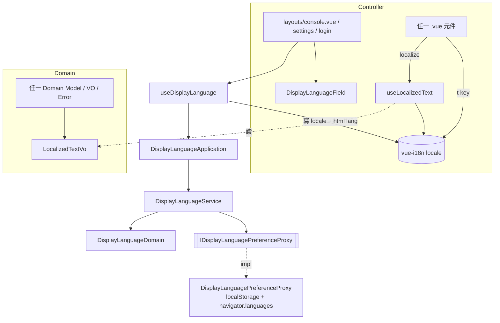

# 顯示語言與布里斯本時區 — Architecture Design

**Status:** Confirmed
**Source PRD:** `.sdd/2026-10-01-display-language-and-brisbane-time-zone/PRD.md`
**Tech context:** Nuxt 3（`ssr: false`）· Vue 3 · TypeScript（strict）· Clean Architecture 前端版（元件 → Application → Domain ← Proxy）· vue-i18n 11（Composition API 模式）

---

## 1. Design Goal & Guiding Principle

- **In one sentence:**
  讓操作台自己寫的每一句話都有繁體中文與英文兩種說法、照一個可選且會被記住的「顯示語言」挑一種說，
  並在可選的顯示時區加上 `Australia/Brisbane`。

- **Guiding principle — 說法住在說出它的那一層：**
  操作台的話有兩個出處，各自用最貼近它的方式帶兩種說法：
  1. **畫面自己寫的字**（按鈕、欄位名、標題、提示、空狀態）住在**語言目錄**（`app/locales/`），
     元件以 vue-i18n 的 `t('key')` 取用。這是 Vue 生態的標準作法，元件不需要認識任何領域物件就能說話。
  2. **領域規則說出來的話**（輸入錯誤、拒絕的解釋、規則說明、選項名稱、裁決說明）由 domain 產生，
     但 domain 不得認識 vue-i18n。這類話一律是 **`LocalizedTextVo`**——同時帶著繁體中文與英文兩種說法的值物件，
     **說法寫在規則旁邊**，改規則時兩種說法一起改；畫面在渲染時才照目前語言挑一種（`localize(text)`）。

  兩種說法都**在渲染當下才挑**，所以換語言只是改一個 reactive 的 locale：已經顯示的錯誤、已經查到的資料、
  填到一半的表單全部留在原地，只有字換掉（US-02）。

  **不是操作台寫的話**（後端拒絕原文、助手回答、使用者輸入）從頭到尾都是普通字串，不進語言目錄、不包成
  `LocalizedTextVo`——型別本身就把「要翻」與「不翻」分開了（US-03）。

- **為什麼不選 `@nuxtjs/i18n`：** 它的價值在路由策略（`/en/...` 前綴）、伺服器端語言偵測與 SEO 標頭；
  本專案 `ssr: false`、PRD 明定不以網址區分語言，這些全用不到，反而多一層模組設定與 Nuxt runtime 依賴——
  而元件測試（happy-dom，不啟動 Nuxt）需要的是一個能直接 `app.use()` 的 i18n 實例。
  直接用 vue-i18n，由一支 Nuxt plugin 安裝、測試以同一份設定全域安裝，兩邊一模一樣。

---

## 2. Change Scope

| Area | Action | What / Why |
| :--- | :--- | :--- |
| `package.json` | **Modify** | 加入 `vue-i18n` 為 runtime dependency |
| `app/domain/models/vo/localized-text-vo.ts` | **Add** | 雙語說法：`traditionalChinese`、`english` 兩欄 + `in(language)` 挑一種 |
| `app/domain/models/vo/untranslated-text-vo.ts` | **Add** | 不分語言的字（後端原文、使用者取的名字、數字、連接用的空白）：兩種說法是同一段字，畫面仍只認得一種「要說的話」 |
| `app/domain/models/vo/display-language-code-vo.ts` | **Add** | `DisplayLanguageCodeVo = 'zh-TW' \| 'en'` 有限 union 與清單常數 |
| `app/domain/models/entities/display-language.ts` | **Add** | 一個可選語言的本體形狀：代碼與自己語言寫的名字 |
| `app/domain/models/domains/display-language-domain.ts` | **Add** | 行為：判斷一組瀏覽器偏好語言標籤是否「偏好它」、轉 DTO |
| `app/domain/models/dto/display-language-dto.ts` | **Add** | 交給畫面的形狀：代碼、自稱名字 |
| `app/domain/interface/i-display-language-preference-proxy.ts` | **Add** | 能力：記住／讀回這台瀏覽器選的語言，讀出瀏覽器偏好的語言標籤 |
| `app/infrastructure/proxy/display-language-preference-proxy.ts` | **Add** | 實作：`localStorage` + `navigator.languages`（全站唯二碰這兩個 API 的地方之一） |
| `app/domain/service/display-language-service.ts` | **Add** | 三個用例：列出可選語言、讀回（記住的 → 瀏覽器偏好 → 繁中）、選定並記住 |
| `app/application/display-language-application.ts` | **Add** | 元件唯一認識的下層 |
| `app/plugins/i18n.ts` | **Add** | 建立 vue-i18n 實例（`legacy: false`、預設 `zh-TW`、`fallbackLocale: 'zh-TW'`）並 `vueApp.use()`；全域 composer 以 `$globalTranslation` provide 給元件以外的切換語言 composable |
| `app/locales/create-display-language-i18n.ts` | **Add** | 建立 vue-i18n 實例的唯一入口（兩份語言目錄、預設語言），plugin 與測試共用同一份 |
| `app/locales/traditional-chinese-messages.ts`、`app/locales/english-messages.ts` | **Add** | 兩份語言目錄的根，各自組合 `app/locales/{traditional-chinese,english}/<area>.ts` |
| `app/locales/{traditional-chinese,english}/<area>.ts` | **Add** | 依畫面區域拆開的語言目錄（`common`、`shell`、`settings`、`marketData`、`strategyScript`、`backtest`、`tradingStrategy`、`strategyBot`、`tradeJournal`、`contractTradeJournal`、`assistant`）。英文那一份以 `typeof` 繁中那一份為型別——**少一個鍵、多一個鍵都過不了型別檢查** |
| `app/composables/use-display-language.ts` | **Add** | 跨畫面共用的選定語言：還原、選定、同步到 vue-i18n 的 `locale` 與 `<html lang>` |
| `app/composables/use-localized-text.ts` | **Add** | 畫面層說話的唯一入口：`localize(text)` 在渲染當下照目前語言挑說法（`null` 即空字串）；`translatedText(key, named)` 把語言目錄裡的一句話取成兩種說法都帶著的 `LocalizedTextVo`，給要留在狀態裡稍後才畫的話（公告、錯誤說明、預設值）；`currentLanguage` 是目前的語言代碼。在元件 setup 內用 vue-i18n，元件以外用組裝根 provide 的 `$globalTranslation` |
| `app/components/molecules/DisplayLanguageField.vue` | **Add** | 語言選單（笨元件，比照 `TimeZoneField`） |
| `scripts/check-translations.ts` | **Add** | 機械檢查（以 bun 執行，直接讀兩份目錄）：`app/` 非註解程式碼的中日韓文字只准出現在繁中目錄與 `new LocalizedTextVo(...)` 引數裡；英文目錄不得有中日韓文字或空字串；每一個 `t('…')`／`consoleTitleKey` 指的鍵都要存在，且鍵必須是字面量。vue-i18n 的 `t()` 型別接受任意字串，打錯的鍵只能靠這裡擋。掛進 `bun run verify`（`lint:translations`） |
| `tests/setup/i18n.ts` + `vitest.config.ts` | **Add / Modify** | 測試全域安裝同一份 i18n（預設繁中），既有以中文驗證畫面的測試照常成立 |
| `app/domain/service/time-zone-service.ts` | **Modify** | 清單加 `new TimeZone('Australia/Brisbane', …)`，位在新加坡之後、倫敦之前；城市名改為 `LocalizedTextVo` |
| `TimeZone` / `TimeZoneDomain` / `TimeZoneDto` | **Modify** | `cityLabel: string` → `cityName: LocalizedTextVo`；`label` 改為 `LocalizedTextVo`（繁中用全形括號 `布里斯本（UTC+10:00）`、英文用 `Brisbane (UTC+10:00)`） |
| `app/domain/errors/localized-error.ts` | **Add** | 所有哨兵錯誤的共同底：`localizedMessage: LocalizedTextVo`，`message` 是繁中那一份。畫面一律 `error instanceof LocalizedError` 後讀 `localizedMessage` |
| `app/domain/errors/*.ts`（操作台自己說話的那些） | **Modify** | 建構子收 `LocalizedTextVo`，存於 `localizedMessage`；`Error.message` 仍設為繁中那一份（記錄與既有 `toThrow('…')` 測試照常） |
| 轉述後端原文的錯誤（`BackendRequestRejectedError`、`BackendServerError`、`SignedOutError` 等） | **Modify** | 建構子仍收字串；`localizedMessage` 是 `UntranslatedTextVo`——原樣呈現，不翻 |
| domain 內所有產生畫面文字的 model / VO / service | **Modify** | 中文字串 → `LocalizedTextVo`；DTO 上對應欄位型別一起改 |
| composables 裡存放錯誤訊息的 `ref<string>` | **Modify** | 改存 `LocalizedTextVo`，畫面渲染時才挑語言（換語言時已顯示的說明跟著換） |
| 畫面層（composables、pages、components）自己寫的話 | **Modify** | 一律進語言目錄：直接畫的用 `t()`，要存進狀態的用 `translatedText()`。`new LocalizedTextVo('<zh>', '<en>')` 只出現在 domain 與 infrastructure——檢查腳本只在這兩層放行它的引數 |
| 清單的 `:key` 與 `data-testid` | **Modify** | 一律綁穩定的代碼（市場代碼、數字種類、線的種類），不綁任何一種語言的說法 |
| 所有 `.vue` 與 `definePageMeta` | **Modify** | 字面中文 → `t('key')`；頁面標題 `consoleTitle` / `consoleSubtitle` 改為語言目錄的鍵（`consoleTitleKey` / `consoleSubtitleKey`），版型以 `t()` 讀出並同步 `useHead({ title })` |
| `app/layouts/console.vue`、`app/pages/settings/index.vue`、`login.vue`、`pending-approval.vue`、`connector-authorization.vue` | **Modify** | 放上語言選單（頂欄、設定頁「顯示」段、沒有頂欄的三個進門畫面） |
| `app/app.vue` | **Modify** | 第一個畫面畫出來之前 `initializeDisplayLanguage()`（比照 `initializeAppearance()`） |
| `app/plugins/dependencies.ts` | **Modify** | 組裝並 provide `$displayLanguageApplication` |
| `app/spa-loading-template.html` | **Modify** | 載入字樣在 app 啟動前就顯示、拿不到選擇——改為雙語並列 |
| 時間與數字格式（`utilities/time-zone-format.ts`、數字呈現） | **Not touched** | PRD：語言只換話，不換寫法。`Intl.DateTimeFormat('en-US')` 只用來拆年月日，與顯示語言無關 |
| 後端契約、所有 proxy 的請求形狀 | **Not touched** | 後端收發不受語言影響；也不送語言給助手 |
| 程式碼註解 | **Not touched** | 註解是寫給工程師的，維持繁體中文 |

---

## 3. New Classes / Modules

| Name | Kind | Responsibility (purpose) | Collaborators | Satisfies (PRD scenario) |
| :--- | :--- | :--- | :--- | :--- |
| `LocalizedTextVo` | VO | 一句領域說出來的話的兩種說法；`in(language)` 挑一種。後端原文以兩欄相同的方式表達「不翻」 | — | US-01 輸入錯誤／系統失敗的解釋、US-02 已顯示的說明跟著換、US-03 後端原文原樣 |
| `DisplayLanguageCodeVo` | VO（字面量 union） | 可選語言的代碼：`'zh-TW' \| 'en'`；`DISPLAY_LANGUAGE_CODES` 清單 | — | US-04 |
| `DisplayLanguage` | Entity | 一個可選語言的本體：代碼、自稱名字（`繁體中文`／`English`）、它認領的瀏覽器語言標籤前綴（`en` 認領 `en`、`en-US`、`en-GB`…）；`toDomain()` | `DisplayLanguageDomain` | US-04 |
| `DisplayLanguageDomain` | Domain Model | `isPreferredBy(browserLanguageTags)`：瀏覽器**第一個**偏好的標籤是否屬於它；`toDto()` | `DisplayLanguageDto` | US-04 沒選過時看瀏覽器偏好（英文／繁中／日文三個邊界） |
| `DisplayLanguageDto` | DTO | 畫面拿到的形狀：`code`、`nativeName` | — | US-01、US-04、選單呈現 |
| `IDisplayLanguagePreferenceProxy` | 介面 | `readSelectedLanguageCode()`、`writeSelectedLanguageCode(code)`、`readBrowserLanguageTags()` | — | US-04 |
| `DisplayLanguagePreferenceProxy` | Proxy | `localStorage`（鍵 `go-trading:selected-display-language`）+ `navigator.languages`；任何存取失敗都當作「沒有」 | — | US-04 私密視窗、壞掉的記憶 |
| `DisplayLanguageService` | Domain Service | `listSelectableLanguages()`、`restoreSelectedLanguage()`（記住且在清單上 → 第一個被瀏覽器偏好的 → 預設繁中）、`selectLanguage(code)`（看不懂的退回繁中，記住退回後的那一個） | `IDisplayLanguagePreferenceProxy`、`DisplayLanguage` | US-04 全部 |
| `DisplayLanguageApplication` | Application | 轉呼叫上述三個用例，全程只碰 DTO | `DisplayLanguageService` | US-02、US-04 |
| `useDisplayLanguage` | Composable | 共用的選定語言代碼（`useState`）；`initializeDisplayLanguage()` 還原並套用；`selectLanguage(code)` 記住並套用。**套用＝寫 vue-i18n 的 `locale` 與 `document.documentElement.lang`** | `DisplayLanguageApplication`、vue-i18n | US-02 當場生效、頂欄與設定頁同一份；PRD「整份頁面宣告目前語言」 |
| `useLocalizedText` | Composable | `localize(text)` 照 vue-i18n 目前的 `locale` 挑說法；`translatedText(key)` 取兩種說法給狀態保存 | vue-i18n、`LocalizedTextVo` | US-01、US-02（渲染當下才挑；已顯示的說明跟著換） |
| `LocalizedError` | 哨兵錯誤的底 | 每一種失敗都帶著畫面要說的那一句 | `LocalizedTextVo` | US-01 系統失敗的解釋、US-02 已顯示的錯誤跟著換 |
| `DisplayLanguageField` | Molecule | 列出可選語言（以自稱名字），v-model 為代碼 | `AppSelect` | US-02 頂欄與設定頁 |
| `createDisplayLanguageI18n` + 兩份語言目錄根 | 語言資源 | vue-i18n 的唯一建立選項；目錄依區域拆檔，英文目錄以繁中目錄為型別 | vue-i18n | US-01 全部；PRD 風險「翻譯覆蓋不全」 |
| `check-translations.ts` | 檢查腳本 | 擋下殘留在畫面層的中文字面字、英文目錄裡的中文 | — | PRD 風險「翻譯覆蓋不全」；Expected Outcome 1 |

> `useLocalizedText` 在元件裡只依賴 vue-i18n 而不依賴 `useDisplayLanguage`：後者要 `useNuxtApp()`，會讓上百個 happy-dom 元件測試都得改成 Nuxt 環境。vue-i18n 的 `locale` 本來就是「目前語言」的唯一真相，`useDisplayLanguage` 只負責**寫**它。
>
> 第三方繪圖與編輯器函式庫會把字抄進畫布或編輯器狀態：時間軸刻度一律寫成不分語言的數字（`utilities/chart-tick-mark-format.ts`），補齊說明在每次打開補齊時才取，圖上的線名與標記在換語言時重畫——但不重畫 K 線、不重設使用者的縮放。

---

## 4. Modified Components

| Component | Current role | Change needed |
| :--- | :--- | :--- |
| `TimeZoneService` | 七個可選時區 | 加布里斯本（新加坡之後）；城市名雙語 |
| `TimeZone` / `TimeZoneDomain` / `TimeZoneDto` | 城市名與標籤為中文字串 | `cityName: LocalizedTextVo`、`label: LocalizedTextVo` |
| `TimeZoneField` | 渲染 `timeZone.label` | 渲染 `localize(timeZone.label)` |
| 52 個哨兵錯誤 | `message: string` | 操作台自己說話的收 `LocalizedTextVo`；轉述後端的兩欄同為原文。全部對外提供 `localizedMessage` |
| `BackendApiProxy` 等 proxy | 拋出帶中文說明的錯誤 | 說明改為 `LocalizedTextVo`；後端原文不翻 |
| domain models / VOs（標籤表、規則說明、欄位說明、統計說明…） | 中文字串常數 | `LocalizedTextVo`（標籤表的型別 `Record<X, string>` → `Record<X, LocalizedTextVo>`） |
| DTO 上的顯示文字欄位 | `string` | `LocalizedTextVo`（只限操作台寫的話；後端與使用者給的仍是 `string`） |
| composables 的錯誤訊息狀態 | `ref<string \| null>` | `ref<LocalizedTextVo \| null>` |
| 全部 `.vue` | 字面中文 | `t('area.section.key')`；領域文字 `localize(dto.xxx)` |
| `app/types/page-meta.d.ts` | `consoleTitle?: string` | 改為 `consoleTitleKey` / `consoleSubtitleKey`（語言目錄的鍵） |
| `layouts/console.vue` | 讀頁面標題、放時區與外觀 | 以 `t()` 讀標題並 `useHead`；加 `#language` 插槽的語言選單 |
| `ConsoleLayout.vue`（template） | 頂欄插槽 | 加 `#language` 插槽（樣板仍不綁資料）；窄螢幕比照 `#timezone` 收起 |

---

## 5. Component Relationships

---

## 6. Extensibility & Handoff Notes

- **Most likely next requirement:** 加第三種語言（簡體中文、日文）。
- **Where it lands:** 三個地方，全部由型別檢查逼出來，不會漏：
  1. `DisplayLanguageCodeVo` 的 union 與 `DisplayLanguageService` 的清單加一列；
  2. `app/locales/<new-language>/` 下逐區複製一份、以 `typeof` 繁中目錄為型別——缺鍵直接型別錯誤；
  3. `LocalizedTextVo` 建構子多一個參數、`in()` 多一個分支——**每一個**領域說話的地方都會型別錯誤，逐一補上。
- **How to add it:** 照上面三步做加法；不需要改任何元件。
- **Patterns applied & why:** 值物件承載雙語說法（說法跟規則住在一起，改規則時不可能只改一種語言）；語言目錄以型別鎖住兩份對齊；目前語言只有一個真相（vue-i18n 的 `locale`），偏好的記憶與還原走既有的 Proxy／Service／Application 分層（與顯示時區、外觀同一個形狀）。
- **Do not hardcode:**
  - 元件裡不得再出現任何字面中文——`lint:translations` 會擋；
  - 語言代碼只寫在 `DisplayLanguageCodeVo` 一處；
  - 不要在元件裡判斷「如果是英文就…」：要不同說法就在目錄或 `LocalizedTextVo` 裡給。
- **Known debt / deferred:**
  - 助手回答的語言由後端決定，本切片不送語言偏好過去。要做時是在助手的請求加一個欄位，屬於後端切片。
  - 語言目錄目前是同步全部載入（兩種語言、純文字，體積可忽略）。語言超過三、四種時再考慮依語言動態載入。

---

## 7. Traceability

| PRD Scenario | Fulfilled by |
| :--- | :--- |
| US-01 選 English 時頁面上的話都是英文 | 語言目錄 + 各 `.vue` 的 `t()`；`consoleTitleKey` |
| US-01 選繁體中文時與目前相同 | 繁中目錄逐字沿用現有文字；`tests/setup/i18n.ts` 讓既有中文驗證照常成立 |
| US-01 送出前擋下的輸入錯誤用選定語言說明 | `KCandleWriteDomain` 等以 `LocalizedTextVo` 說錯誤 + `useLocalizedText` |
| US-01 操作台對系統失敗的解釋用選定語言 | `BackendUnreachableError` 等的 `localizedMessage` |
| US-01 瀏覽器分頁的標題也跟著語言 | `layouts/console.vue` 的 `useHead({ title: t(consoleTitleKey) })` |
| US-02 換語言不丟掉已填的欄位與已查到的資料 | `useDisplayLanguage.selectLanguage` 只寫 `locale`；所有說法在渲染當下才挑 |
| US-02 頂欄與設定頁看的是同一份選擇 | `useDisplayLanguage` 的 `useState` 共用狀態 |
| US-02 已經顯示的錯誤說明跟著換語言 | composables 存 `LocalizedTextVo` 而非字串 |
| US-03 後端的拒絕原文照原樣附上 | 轉述後端的錯誤以原文作為兩種說法 |
| US-03 使用者取的名字不翻譯 / 助手的回答不翻譯 | 這些一直是 `string`，不進目錄、不包 `LocalizedTextVo` |
| US-04 記住上次選的語言 / 記住的優先於瀏覽器偏好 | `DisplayLanguageService.restoreSelectedLanguage` + `DisplayLanguagePreferenceProxy` |
| US-04 沒選過：英文／繁中／日文 | `DisplayLanguageDomain.isPreferredBy`（第一個偏好標籤的前綴） |
| US-04 記住的語言看不懂時當作沒選過 | `restoreSelectedLanguage` 不在清單上即往下一步 |
| US-05 時間寫法不因語言改變 | `utilities/time-zone-format.ts` 不動（Not touched） |
| US-06 南半球夏季／冬季加十小時、跨回前一天 | `TimeZoneService` 清單的 `Australia/Brisbane` + 既有 `TimeZoneDto` 換算 |
| US-06 繁中／英文下的選單說法、位置 | `TimeZoneDomain.toDtoAt` 組雙語 `label`；清單順序 |
| US-06 記住布里斯本 | 既有 `TimeZonePreferenceProxy`（只要識別字在清單上） |

---

## 8. Risks & Open Decisions

- **Risks / trade-offs:**
  - **改動面極廣**：幾乎每一個 `.vue` 與數十個 domain 檔都會被碰到。以區域切分、每區獨立提交，並以 `lint:translations` 與型別檢查做機械性收尾，而非靠人眼。
  - **英文字長**：窄寬 390 下按鈕與標籤可能擠壞；英文說法以簡短為原則，並檢查頂欄與表單在窄寬下的換行。
  - **`Error.message` 保留繁中**：記錄與除錯時看到的是繁中，畫面看到的永遠是 `localizedMessage`。兩者分開是刻意的——`message` 是給工程師的。
- **Open decisions (for implementation):**
  - 語言目錄的鍵名一律 camelCase、以區域為第一層；同一句話在多處出現時放 `common`。
  - 窄螢幕頂欄收起語言選單時，比照時區只在設定頁出現。
